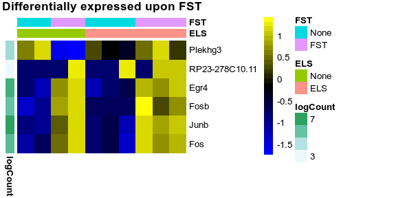
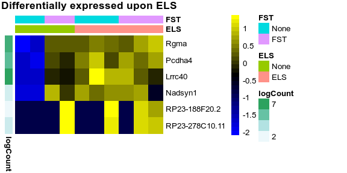

Here we reproduce the re-analysis of the data from [Marrocco J. et al. 2019](https://doi.org/10.3389/fnbeh.2019.00157) shown in the [readme](README.md), but using, like the authors, DESeq2 for the statistical analysis.

## Assessment of Marrocco et al. 2019 using DESeq2

Marrocco et al. 2019 were reporting changes in the acute stress response (forced-swim test, FST) depending on the prior exposure to early life stress (ELS). We reproduce this analysis using appropriate statistical models to handle interactions between groups:


```r
library(SEtools)
library(SummarizedExperiment)
library(plgINS)
library(DESeq2)
library(ggplot2)
source("misc.R")
se <- readRDS("data/AllData.kallisto.SE.rds")
```


```r
se <- se[,se$Set=="GSE131972"]
dds1 <- DESeqDataSetFromMatrix(round(assay(se)), colData=colData(se),
        design=~FST+ELS+FST:ELS )
```

```
## converting counts to integer mode
```

```r
dds1 <- DESeq(dds1)
```

```
## estimating size factors
```

```
## estimating dispersions
```

```
## gene-wise dispersion estimates
```

```
## mean-dispersion relationship
```

```
## final dispersion estimates
```

```
## fitting model and testing
```

```r
# so that we plot the DESeq-normalized counts:
dat1 <- se[row.names(dds1),]
assays(dat1)$lognorm <- log1p(counts(dds1, normalized=TRUE))
rowData(dat1)$logCount <- rowMeans(assays(dat1)$lognorm)
resultsNames(dds1)
```

```
## [1] "Intercept"       "FST_FST_vs_None" "ELS_ELS_vs_None" "FSTFST.ELSELS"
```

### Effects of FST


```r
res <- results(dds1, name = "FST_FST_vs_None")
res <- res[order(res$padj),]
dat1 <- dat1[,order(dat1$ELS, dat1$FST)]
sehm(dat1, row.names(res)[which(res$padj<0.05)], assayName = "lognorm", do.scale = TRUE, anno_row="logCount", anno_columns=c("ELS","FST"), main="Differentially expressed upon FST")
```

<!-- -->

We find a few genes which are significantly differentially expressed upon FST.


```r
res <- results(dds1, name = "ELS_ELS_vs_None")
res <- res[order(res$padj),]
dat1 <- dat1[,order(dat1$ELS, dat1$FST)]
sehm(dat1, row.names(res)[which(res$padj<0.05)], assayName = "lognorm", do.scale = TRUE, anno_row="logCount", anno_columns=c("ELS","FST"), main="Differentially expressed upon ELS")
```

<!-- -->

We find a few genes which are differentially expressed in the ELS group with respect to the non-exposed animals.


```r
res <- results(dds1, name = "FSTFST.ELSELS")
res <- res[order(res$padj),]
dat1 <- dat1[,order(dat1$ELS, dat1$FST)]
res[which(res$padj<0.05),]
```

```
## log2 fold change (MLE): FSTFST.ELSELS 
## Wald test p-value: FSTFST.ELSELS 
## DataFrame with 1 row and 6 columns
##                 baseMean   log2FoldChange             lfcSE
##                <numeric>        <numeric>         <numeric>
## Plekhg3 131.502209897826 2.83408077921916 0.510114609963253
##                     stat               pvalue                padj
##                <numeric>            <numeric>           <numeric>
## Plekhg3 5.55577261240041 2.76386481649543e-08 0.00051681508203648
```

```
## <numeric>

## 131.502209897826

## <numeric>

## 2.83408077921916

## <numeric>

## 0.510114609963253

## <numeric>

## 5.55577261240041

## <numeric>

## 2.76386481649543e-08

## <numeric>

## 0.00051681508203648
```

We find a single gene that is differentially expressed after FST in ELS vs non-ELS mice - considerably less than the hundreds reported by the authors.

