- [About this re-analysis](#about-this-re-analysis)
- [Re-analysis of published results](#re-analysis-of-published-results)
  * [Assessment of Marrocco et al. 2017](#assessment-of-marrocco-et-al-2017)
  * [Assessment of Gray et al. 2018](#assessment-of-gray-et-al-2018)
  * [Assessment of Marrocco et al. 2019](#assessment-of-marrocco-et-al-2019)
    + [Visualization of genes mentioned in the publication](#visualization-of-genes-mentioned-in-the-publication)
    + [Analysis using kallisto data and edgeR](#analysis-using-kallisto-data-and-edger)
    + [Using salmon data and edgeR](#using-salmon-data-and-edger)
    + [Using DESeq instead of EdgeR for statistical analysis](#using-deseq-instead-of-edger-for-statistical-analysis)
- [Meta-Analysis of all data](#meta-analysis-of-all-data)
  * [Additive model](#additive-model)
    + [Are genes differentially expressed following forces swim stress?](#are-genes-differentially-expressed-following-forces-swim-stress-)
    + [Are genes differentially expressed between males and females?](#are-genes-differentially-expressed-between-males-and-females-)
    + [Are genes differentially expressed in BDNF Val66Met mice?](#are-genes-differentially-expressed-in-bdnf-val66met-mice-)
    + [Are genes differentially expressed following early life stress?](#are-genes-differentially-expressed-following-early-life-stress-)
  * [Interactive models](#interactive-models)
    + [Are responses of FST genes altered by sex?](#are-responses-of-fst-genes-altered-by-sex-)
    + [Are responses of FST genes altered by BDNF Val66Met?](#are-responses-of-fst-genes-altered-by-bdnf-val66met-)
    + [are responses of FST genes altered by early life stress?](#are-responses-of-fst-genes-altered-by-early-life-stress-)

required r libraries

```r
library(edgeR)
library(SEtools)
library(SummarizedExperiment)
library(plgINS)
library(DESeq2)
library(sva)
```


# About this re-analysis

Here, we outline the re-analysis of two GEO datasets, GSE100579 and GSE131972, both of which are investigating the effect of acute stress on the translatome of CA3 pyramidal neurons in the mouse hippocampus.

This repositories were used for 3 seperate publications:

Marrocco J. et al. 2017; 
A sexually dimorphic pre-stressed translational signature in CA3 pyramidal neurons of BDNF Val66Met mice; Nature Communications volume 8, Article number: 808 (2017)

Gray J. D. et al. 2018; 
Translational profiling of stress-induced neuroplasticity in the CA3 pyramidal neurons of BDNF Val66Met mice; Molecular Psychiatry volume 23, pages 904–913

Marrocco J. et al. 2019; 
Early Life Stress Restricts Translational Reactivity in CA3 Neurons Associated With Altered Stress Responses in Adulthood; Front. Behav. Neurosci. https://doi.org/10.3389/fnbeh.2019.00157 


the reanalysis be performed on the quantification of two different alginment methods a genome alignment using xxx and salmon or a pseudoalignment to the transcriptome using kallisto

first, we are loading both the kallisto and the genome alignment data


```r
kallistodata <- readRDS("data/AllData.kallisto.SE.rds")
salmondata <- readRDS("data/GSE131972.salmonv2.SE.rds")
```

# Re-analysis of published results
## Assessment of Marrocco et al. 2017

In the 2017 publication the authors claim that numerous genes are differentially regulated between males and females after acute stress. Unfortunately, they do not include a list with all genes in the publication, but Table 1 contains a subsets of genes that are allegedly differentially regulated between males and females upon acute stress

First, we inspect these genes across the runs used in the original publication in WildType animals


```r
se <- kallistodata
se <- subset(se,select  = se$Set == "GSE100579" & se$Genotype == "WildType")
genes <- read.table("metadata/Marrocco2017SexStressGenes.csv", sep = ";", header = T)$genes
se <- se[,order(se$Sex,se$FST)]
sehm(se,genes,do.scale = T,anno_columns = c("FST","Sex"), cluster_rows = T, main = "Genes with male-female acute stress differences")
```

```
## Using assay logcpm
```

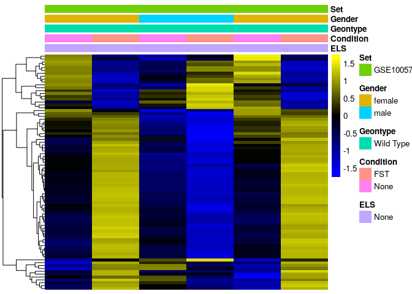<!-- -->

It looks as if there could be something to this, however unfortunately this finding is higly underpowered having only 6 replicates for a 4 group comparison

Let's inspect these genes across all sequencing runs and find out wheather the finding for male WildType mice in the second set GSE131972 holds up.


```r
se <- kallistodata
se <- subset(se,select  = se$ELS == "None" & se$Genotype == "WildType")
se <- se[,order(se$Set,se$Sex,se$FST)]
sehm(se,genes,do.scale = T,anno_columns = c("FST","Sex","Set"), gaps_at = "Set", cluster_rows = T, main =  "Same genes in the second data-set")
```

```
## Using assay logcpm
```

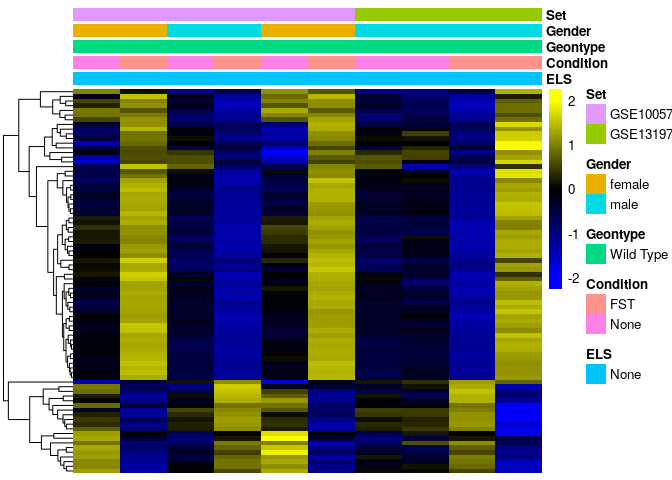<!-- -->

It becomes apparent that these genes seem to be co-expressed and highly variable across all samples. the finding that in females and males these genes react differently to stress seems inaccurate, with replicates from the second set demonstrating strong intra-group differences.

If we further visualize these genes across all samples, we find

```r
se <- kallistodata
se <- se[,order(se$Sex,se$FST)]
sehm(se,genes,do.scale = T,anno_columns = c("ELS","FST","Genotype","Sex","Set"), cluster_rows = T, gaps_at = "Set",   main =  "Same genes across all samples")
```

```
## Using assay logcpm
```

<!-- -->

The selected genes display a high co-expression and could possibly be highly variable due to technical reasons. Let's try to remove technical variability from our runs using SVA and re-visualize the same genes


```r
#function for SVA correction
dosvacor <- function(SE, form=NULL, form0=~1, ...){
  CD <- as.data.frame(colData(SE))
  mm <- model.matrix(form, data=CD)
  mm0 <- model.matrix(form0, data=CD)

  dds <- DESeqDataSetFromMatrix(round(assay(SE)), as.data.frame(colData(SE)), form)
  dds <- estimateSizeFactors(dds)
  en <- as.matrix(assay(vst(dds, blind=FALSE)))

  sv <- sva(en, mm, mm0, n.sv=NULL, ...)
  n.sv <- sv$n.sv
  sv <- sv$sv
  
  colnames(sv) <- paste0("SV",1:ncol(sv))
  X <- cbind(mm, sv)
  mm2 <- cbind(mm[,1,drop=F],sv,mm[,-1,drop=F])
  H <- solve(t(X)%*%X)%*%t(X)
  b <- (H%*%t(en))
  cn <- setdiff(colnames(X),setdiff(colnames(mm), colnames(mm0)))  
  cn <- setdiff(cn, "(Intercept)")
  encor <- en - t(as.matrix(X[,cn]) %*% b[cn,])
  SE <- SE[row.names(encor),]
  colData(SE) <- cbind(colData(SE), sv)
  assays(SE)$corrected <- encor
  return(SE)
}

se <- dosvacor(se, form = ~ Set + Sex * FST, form0 = ~Set)
```

```
## converting counts to integer mode
```

```
## Number of significant surrogate variables is:  2 
## Iteration (out of 5 ):1  2  3  4  5
```

```r
sehm(se,genes,do.scale = T,anno_columns =  c("ELS","FST","Genotype","Sex","Set"), cluster_rows = T,assayName = "corrected",  main =  "Same genes after correcting for technical variability")
```

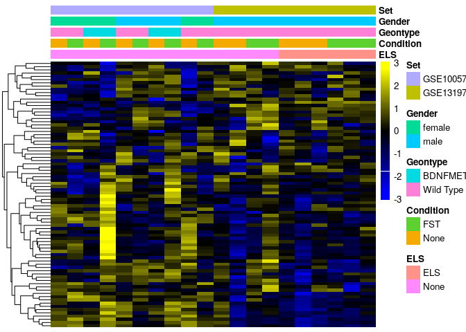<!-- -->

As we can see, removing technical variability abolishes the effects for the male-female stress difference seen in the single replicate comparisons. It becomes apparent, that these genes do not have any sex specific acute stress response across all samples

## Assessment of Gray et al. 2018

A complete assessment of the findings of Gray et al. 2018 is unfortunately not possible. the repository GSE100579 is missing crucial samples for the chronic stress model for the BDNF Val66Met genotype and only includes samples of acute stress.

However, the authors claim that many genes are differentially regulated between WildType and BDNF Val66Met animals at baseline. While no complete list of genes has been included in the publication, a subset can be found in Table 1.

We plot these genes in the GSE100579 data set.

```r
se <- kallistodata
genes <- read.table("metadata/Gray2018GenotypeGenes.csv", sep = ";", header = T)$genes
se <- subset(se,select  = se$Set == "GSE100579" & se$FST == "None")
se <- se[,order(se$Sex,se$Genotype)]
sehm(se,genes,do.scale = T,anno_columns = c("Genotype","Sex"), cluster_rows = T, main = "Genes differentially effected by BDNF Val66Met in males and females")
```

```
## Using assay logcpm
```

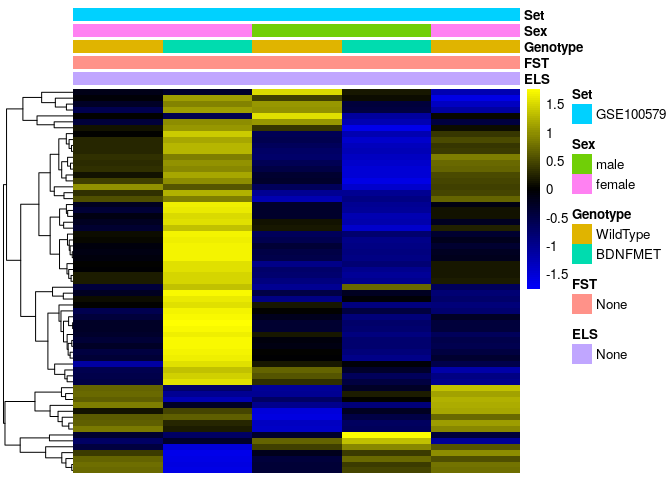<!-- -->

Again, we find that the experimental design was severly underpowered.
We investigate the expression of these genes across all samples from both datasets.

```r
se <- kallistodata
se <- se[,order(se$Sex,se$Genotype)]
sehm(se,genes,do.scale = T,anno_columns = c("ELS","FST","Genotype","Sex","Set"), cluster_rows = T, gaps_at = "Set", main = "Same genes across all samples")
```

```
## Using assay logcpm
```

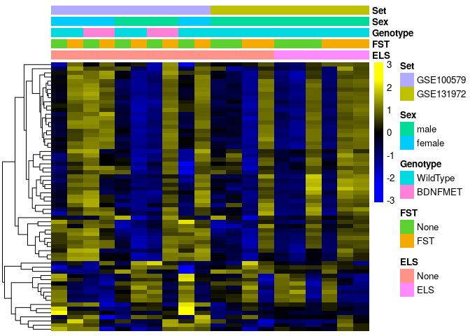<!-- -->

We see a similar pattern as in Marrocco et al 2017. The baseline difference does not reproduce in GSE 131972 which only includes male WildType mice and shows high inter-group variability for these genes.

Let's again try to eliminate technical variabilty and re-visualize the same genes


```r
se <- dosvacor(se, form = ~Set + Sex + Genotype + FST + ELS, form0 = ~Set)
```

```
## converting counts to integer mode
```

```
## Number of significant surrogate variables is:  2 
## Iteration (out of 5 ):1  2  3  4  5
```

```r
sehm(se,genes,do.scale = T,anno_columns = c("ELS","FST","Genotype","Sex","Set"), cluster_rows = T,assayName = "corrected", main = "Same genes after removing technical variabilty")
```

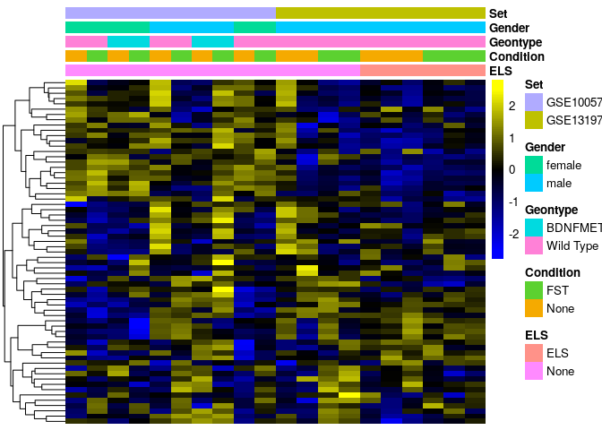<!-- -->

It becomes apparent, that these genes do not have any genotype specific baseline difference across all samples

## Assessment of Marrocco et al. 2019
Here we re-analyse Marrocco et al. 2019 checking for ELS dependent changes in the acute stress response. The same analysis will be performed three times, once using gene counts from a transcriptome alignment (kallisto) with edgeR, once using gene counts from a genome alignment with edgeR and once using gene counts from a transcriptome alignment (kallisto) with DESeq. All analyses had similar results, whereas DESeq produced most significant hits. However, the core message of the publication that ELS substantially impacts the transcriptional acute stress response could not be reproduced with any method.

### Visualization of genes mentioned in the publication 


```r
se <- kallistodata
se <- se[order(rownames(se)),]
se <- subset(se,select  = se$Set == "GSE131972")
se2 <- salmondata
se2 <- se2[order(rownames(se2)),]
```

In their publications the authors unfortunately do not upload a list with differentially expressed genes. However, in their discussion they mention a number of genes that they claim are differentially expressed between ELS and non-ELS mice after acute stress.
They claim that acute stress reduces the expression of Grin1, Grin2a, Gabbr2, and Gabra1 in CA3 neurons of non-ELS mice, but not ELS mice:

```r
sehm(se,c("Grin1","Grin2a","Gabbr2","Gabra1"),do.scale = T ,anno_columns = c("ELS","FST"),  main = "Selected genes with transcriptome alignment")
```

```
## Using assay logcpm
```

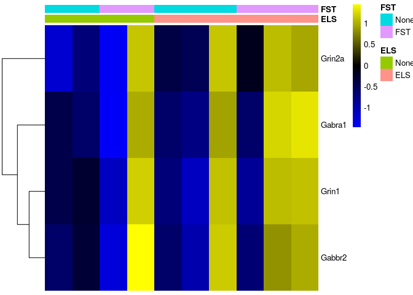<!-- -->

```r
sehm(se2,c("Grin1","Grin2a","Gabbr2","Gabra1"),do.scale = T,anno_columns = c("ELS","FST"), , assayName = "TPM",  main = "Selected genes with genome alignment")
```

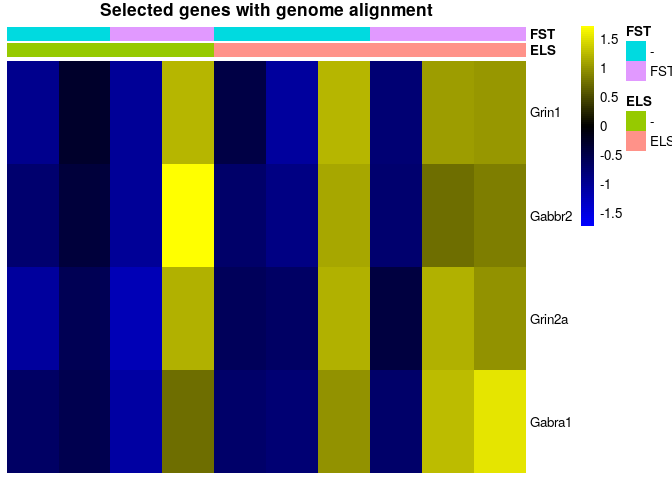<!-- -->

it becomes apparent, that this finding does not look robust

Further, they claim that there is restricted list of genes selectively induced by AS in ELS mice (Per1, Npy, Nfkbia, Penk,Dusp1, Cst3, Trib1, Htra1, Sdc4, Plekhf1) but not non-ELS mice.

```r
sehm(se,c("Per1", "Npy", "Nfkbia", "Penk","Dusp1", "Cst3", "Trib1", "Htra1", "Sdc4", "Plekhf1"),do.scale = T,anno_columns = c("ELS","FST"),  main = "Selected genes with transcriptome alignment")
```

```
## Using assay logcpm
```

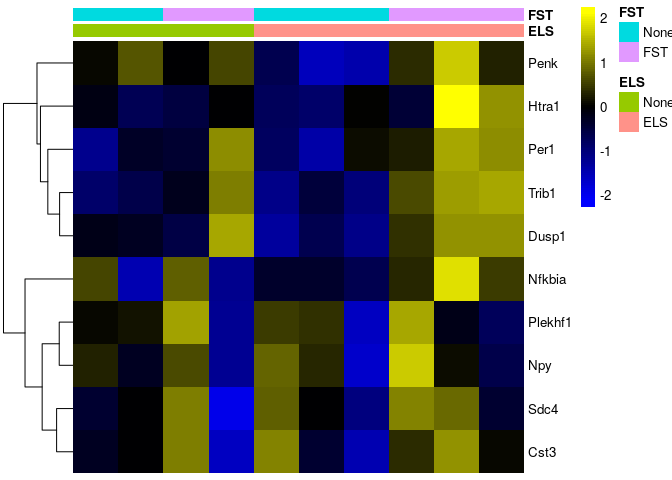<!-- -->

```r
sehm(se2,c("Per1", "Npy", "Nfkbia", "Penk","Dusp1", "Cst3", "Trib1", "Htra1", "Sdc4", "Plekhf1"),do.scale = T,anno_columns = c("ELS","FST"), assayName = "TPM",  main = "Selected genes with genome alignment")
```

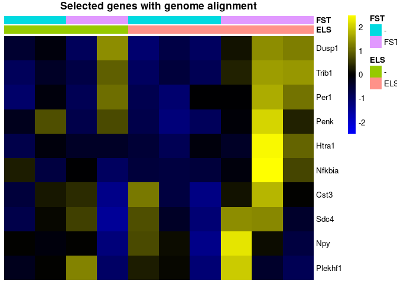<!-- -->

it becomes apparent, that this finding also does not look robust while these genes might be increased in expression in ELS mice it is hard to see this being a significant finding, especially, since the same effect can be observed for one replicate in the non-ELS group.

The authors claim that there are a number of genes that appear to be induced by AS in both ELS and non ELS mice. these include (Egr1/2/4, Arc, Fos, and Fosb)

```r
sehm(se,c("Egr1", "Egr2", "Egr4", "Arc","Fos", "Fosb"),do.scale = T,anno_columns = c("ELS","FST"), main = "Selected genes using transcriptome alignment")
```

```
## Using assay logcpm
```

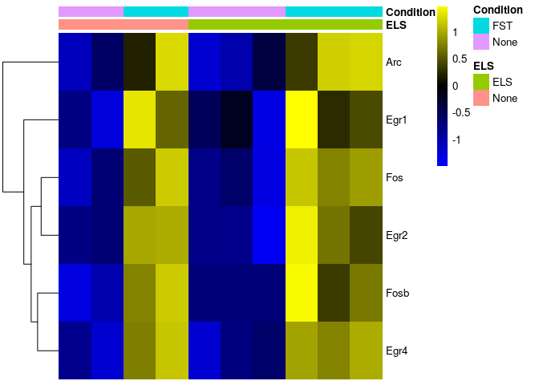<!-- -->

```r
sehm(se2,c("Egr1", "Egr2", "Egr4", "Arc","Fos", "Fosb"),do.scale = T,anno_columns = c("ELS","FST"), assayName = "TPM", main = "Selected genes using genome alignment")
```

<!-- -->

For these genes it looks as if the finding might be significant.

### Analysis using kallisto data and edgeR

Let's investigate the transcriptome alligned reads with a statistical approach using egeR and a GLM type of analysis for swim effects, early life effects and interactions

```r
#experimental design, interactive model
design <- model.matrix(~se$FST * se$ELS)

y <- DGEList(counts=assays(se)$counts)
y <- calcNormFactors(y)
y <- estimateDisp(y,design)

#filter out genes that are below 10 counts in more than 75% of samples
keep <- rowSums(y$counts>10) >= (ncol(y) * 0.25)
y <- y[keep, , keep.lib.sizes=FALSE]

Results <- list()
fit <- glmQLFit(y,design)
for(i in colnames(design)[-1]){
  Results[[i]] <- glmQLFTest(fit, i)
}
```

Les's investigate if there are any genes altered by acute stress

```r
topTags(Results$`se$FSTFST`)
```

```
## Coefficient:  se$FSTFST 
##              logFC     logCPM        F       PValue       FDR
## Egr4     1.6089492  5.8854438 43.91492 0.0001465869 0.9997081
## Plekhg3 -2.2029173  2.4615140 35.06762 0.0003193750 0.9997081
## Fosb     1.9003447  4.4234011 32.83394 0.0003989668 0.9997081
## Fos      2.0924630  5.1006405 29.10672 0.0005955404 0.9997081
## Nadsyn1  7.7891327 -0.1856326 24.56334 0.0015092674 0.9997081
## Junb     0.9951265  6.8068993 21.60919 0.0015382796 0.9997081
## Egr2     2.2334533  2.4233386 18.59817 0.0024210503 0.9997081
## Mill2    4.0302747 -1.3626955 15.96370 0.0037713143 0.9997081
## Afap1l1 -1.6622452  1.9910872 14.93112 0.0045508873 0.9997081
## Olfm1    0.7872690 10.1569427 13.86930 0.0055741224 0.9997081
```

Even though the data looked promising no genes pass mutliple testing correction. This indicates that this study might be severly underpowered, so in order to resolve FST specific effects more replicats would be needed

Are there any genes altered by early life stress?

```r
topTags(Results$`se$ELSELS`)
```

```
## Coefficient:  se$ELSELS 
##              logFC     logCPM        F       PValue       FDR
## Pcdha4   1.0791750  3.5528592 25.07045 0.0009656306 0.9998991
## Lrrc40   0.9782098  5.7617445 23.30135 0.0012169729 0.9998991
## Nadsyn1  7.7863077 -0.1856326 25.64462 0.0013329334 0.9998991
## Piga    -1.5789979  1.5385751 17.15631 0.0030671548 0.9998991
## Mill2    3.8132638 -1.3626955 15.51747 0.0040859475 0.9998991
## Il10ra  -7.3580442 -1.1359543 17.08739 0.0056834825 0.9998991
## Syt9    -1.4251390  1.2125522 12.81822 0.0068860877 0.9998991
## Ak7     -1.3777322  0.6610638 12.61589 0.0071814529 0.9998991
## Fut9     0.8415979  4.9188926 12.07298 0.0080560206 0.9998991
## Rgma     0.5823195  4.7429735 11.55274 0.0090225458 0.9998991
```

There are no genes that pass the multiple testing correction.

Let's investigate if there are genes with a significant interaction

```r
topTags(Results$`se$FSTFST:se$ELSELS`)
```

```
## Coefficient:  se$FSTFST:se$ELSELS 
##              logFC     logCPM        F      PValue       FDR
## Plekhg3  2.8250275  2.4615140 36.30672 0.000283712 0.9998581
## Piga     2.6242173  1.5385751 22.16459 0.001422287 0.9998581
## Nadsyn1 -8.1411065 -0.1856326 21.32271 0.002252620 0.9998581
## Stard9   5.7100942 -0.4341469 14.37339 0.005056005 0.9998581
## Mill2   -4.5346623 -1.3626955 14.29680 0.005130735 0.9998581
## Ctdspl2  1.3933425  3.7103135 11.61326 0.008902932 0.9998581
## Il10ra   8.2935183 -1.1359543 13.82403 0.009279340 0.9998581
## Gpr17    2.1180496  2.8256340 11.32226 0.009496970 0.9998581
## B3gat2  -0.9225619  4.8564532 11.24795 0.009656549 0.9998581
## Nnt     -1.7460846  3.4884480 10.80953 0.010669564 0.9998581
```

No genes have a altered acute stress response in ELS vs normal animals. This clearly fails to reproduce the findings of the original study, which claimed hundereds of genes being altered in their FST respons following ELS

### Using salmon data and edgeR

Let's investigate the genome alligned counts with a statistical approach using egeR and a GLM type of analysis for swim effects, early life effects and interactions

```r
#experimental design, interactive model
design <- model.matrix(~se$FST * se$ELS)

y <- DGEList(counts=assays(se)$counts)
y <- calcNormFactors(y)
y <- estimateDisp(y,design)

#filter out genes that are below 10 counts in more than 75% of samples
keep <- rowSums(y$counts>10) >= (ncol(y) * 0.25)
y <- y[keep, , keep.lib.sizes=FALSE]

Results <- list()
fit <- glmQLFit(y,design)
for(i in colnames(design)[-1]){
  Results[[i]] <- glmQLFTest(fit, i)
}
```

Les's investigate if there are any genes altered by acute stress

```r
topTags(Results$`se$FSTFST`)
```

```
## Coefficient:  se$FSTFST 
##              logFC     logCPM        F       PValue       FDR
## Egr4     1.6089492  5.8854438 43.91492 0.0001465869 0.9997081
## Plekhg3 -2.2029173  2.4615140 35.06762 0.0003193750 0.9997081
## Fosb     1.9003447  4.4234011 32.83394 0.0003989668 0.9997081
## Fos      2.0924630  5.1006405 29.10672 0.0005955404 0.9997081
## Nadsyn1  7.7891327 -0.1856326 24.56334 0.0015092674 0.9997081
## Junb     0.9951265  6.8068993 21.60919 0.0015382796 0.9997081
## Egr2     2.2334533  2.4233386 18.59817 0.0024210503 0.9997081
## Mill2    4.0302747 -1.3626955 15.96370 0.0037713143 0.9997081
## Afap1l1 -1.6622452  1.9910872 14.93112 0.0045508873 0.9997081
## Olfm1    0.7872690 10.1569427 13.86930 0.0055741224 0.9997081
```

No genes pass mutliple testing correction

Are there any genes altered by early life stress?

```r
topTags(Results$`se$ELSELS`)
```

```
## Coefficient:  se$ELSELS 
##              logFC     logCPM        F       PValue       FDR
## Pcdha4   1.0791750  3.5528592 25.07045 0.0009656306 0.9998991
## Lrrc40   0.9782098  5.7617445 23.30135 0.0012169729 0.9998991
## Nadsyn1  7.7863077 -0.1856326 25.64462 0.0013329334 0.9998991
## Piga    -1.5789979  1.5385751 17.15631 0.0030671548 0.9998991
## Mill2    3.8132638 -1.3626955 15.51747 0.0040859475 0.9998991
## Il10ra  -7.3580442 -1.1359543 17.08739 0.0056834825 0.9998991
## Syt9    -1.4251390  1.2125522 12.81822 0.0068860877 0.9998991
## Ak7     -1.3777322  0.6610638 12.61589 0.0071814529 0.9998991
## Fut9     0.8415979  4.9188926 12.07298 0.0080560206 0.9998991
## Rgma     0.5823195  4.7429735 11.55274 0.0090225458 0.9998991
```

There are no genes that pass the multiple testing correction

Let's investigate if there are genes with a significant interaction

```r
topTags(Results$`se$FSTFST:se$ELSELS`)
```

```
## Coefficient:  se$FSTFST:se$ELSELS 
##              logFC     logCPM        F      PValue       FDR
## Plekhg3  2.8250275  2.4615140 36.30672 0.000283712 0.9998581
## Piga     2.6242173  1.5385751 22.16459 0.001422287 0.9998581
## Nadsyn1 -8.1411065 -0.1856326 21.32271 0.002252620 0.9998581
## Stard9   5.7100942 -0.4341469 14.37339 0.005056005 0.9998581
## Mill2   -4.5346623 -1.3626955 14.29680 0.005130735 0.9998581
## Ctdspl2  1.3933425  3.7103135 11.61326 0.008902932 0.9998581
## Il10ra   8.2935183 -1.1359543 13.82403 0.009279340 0.9998581
## Gpr17    2.1180496  2.8256340 11.32226 0.009496970 0.9998581
## B3gat2  -0.9225619  4.8564532 11.24795 0.009656549 0.9998581
## Nnt     -1.7460846  3.4884480 10.80953 0.010669564 0.9998581
```

There are no genes have an altered acute stress response in ELS vs normal animals

### Using DESeq instead of EdgeR for statistical analysis

The authors of the orignial publication used DESeq for the statistical assessment. For completeness, we repeat the same analysis using this method on the transcriptome alligned data


```r
suppressPackageStartupMessages({
  library(DESeq2)
  library(sva)
  library(SEtools)
  library(RUVSeq)
})
```


```r
dat1 <- kallistodata
dat1 <- dat1[,dat1$Set=="GSE131972"]
dds1 <- DESeqDataSetFromMatrix(round(assay(dat1)), colData=colData(dat1),
        design=~FST+ELS+FST:ELS )
```

```
## converting counts to integer mode
```

```r
dds1 <- DESeq(dds1)
```

```
## estimating size factors
```

```
## estimating dispersions
```

```
## gene-wise dispersion estimates
```

```
## mean-dispersion relationship
```

```
## final dispersion estimates
```

```
## fitting model and testing
```

```r
# so that we plot the DESeq-normalized counts:
dat1 <- dat1[row.names(dds1),]
assays(dat1)$lognorm <- log1p(counts(dds1, normalized=TRUE))
rowData(dat1)$logCount <- rowMeans(assays(dat1)$lognorm)
resultsNames(dds1)
```

```
## [1] "Intercept"       "FST_FST_vs_None" "ELS_ELS_vs_None" "FSTFST.ELSELS"
```


```r
res <- results(dds1, name = "FST_FST_vs_None")
DESeq2::plotMA(res)
```

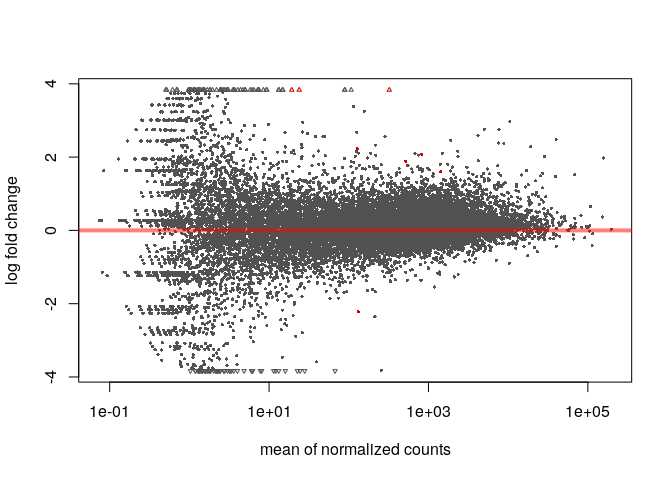<!-- -->

```r
res <- res[order(res$padj),]
dat1 <- dat1[,order(dat1$ELS, dat1$FST)]
sehm(dat1, row.names(res)[which(res$padj<0.05)], assayName = "lognorm", do.scale = TRUE, anno_row="logCount", anno_columns=c("ELS","FST"), main="Differentially expressed upon FST")
```

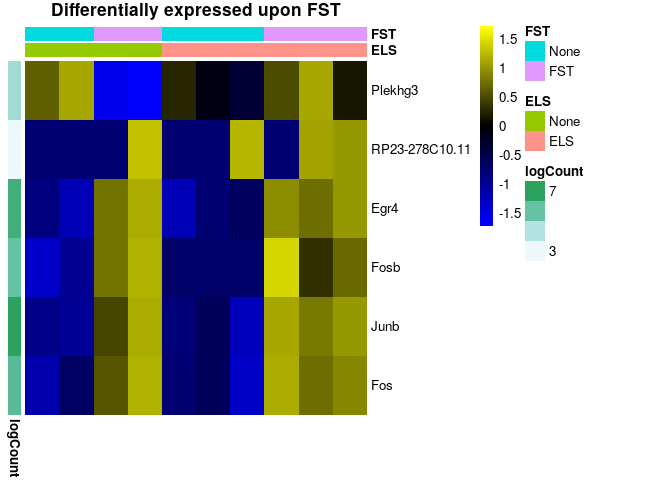<!-- -->

We find a few genes which are differentially expressed after FST


```r
res <- results(dds1, name = "ELS_ELS_vs_None")
DESeq2::plotMA(res)
```

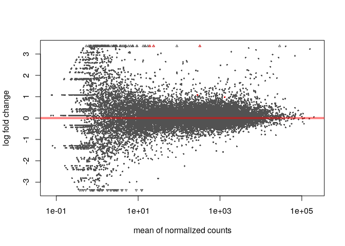<!-- -->

```r
res <- res[order(res$padj),]
dat1 <- dat1[,order(dat1$ELS, dat1$FST)]
sehm(dat1, row.names(res)[which(res$padj<0.05)], assayName = "lognorm", do.scale = TRUE, anno_row="logCount", anno_columns=c("ELS","FST"), main="Differentially expressed upon ELS")
```

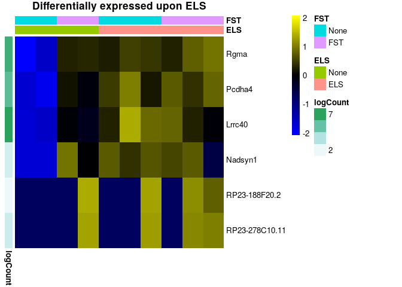<!-- -->

We find a few genes which are differentially expressed after ELS


```r
res <- results(dds1, name = "FSTFST.ELSELS")
DESeq2::plotMA(res)
```

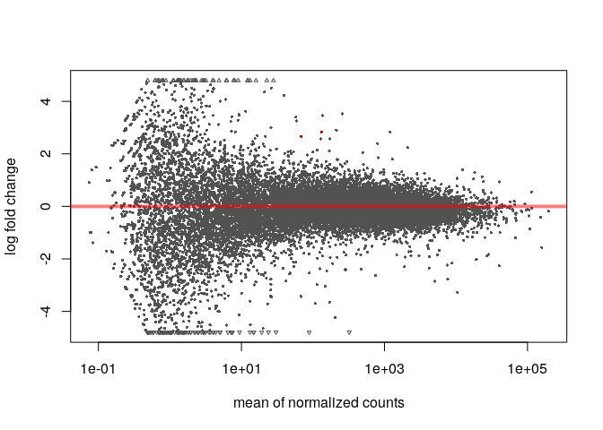<!-- -->

```r
res <- res[order(res$padj),]
dat1 <- dat1[,order(dat1$ELS, dat1$FST)]
res[which(res$padj<0.05),]
```

```
## log2 fold change (MLE): FSTFST.ELSELS 
## Wald test p-value: FSTFST.ELSELS 
## DataFrame with 1 row and 6 columns
##                 baseMean   log2FoldChange             lfcSE             stat
##                <numeric>        <numeric>         <numeric>        <numeric>
## Plekhg3 131.502209897826 2.83408077921916 0.510114609963253 5.55577261240041
##                       pvalue                 padj
##                    <numeric>            <numeric>
## Plekhg3 2.76386481649546e-08 0.000516815082036485
```
We find a single gene that is differentially expressed after FST in ELS vs non-ELS mice. Still, this clearly fails to reproduce the findings of the original study, which claimed thousands of genes being altered in their FST respons following ELS

# Meta-Analysis of all data
Since we were unable to reproduce many of the findigs from the original publications we re-assess the combined data from both repositiories to investigate a number of questions:

1. are genes differentially expressed following forces swim stress?
2. are genes differentially expressed following males and females?
3. are genes differentially expressed in BDNF Val66Met mice?
4. are genes differentially expressed following early life stress
5. are responses of FST genes altered by sex?
6. are responses of FST genes altered by BDNF Val66Met?
7. are responses of FST genes altered by early life stress?

## Additive model
Let's run an overarching analysis over all data to determine if there are any significant effects for forces swim stress (=FST), Sex, Genotype or early life stress (=ELS). In the process we also remove technical variabilty to increase the chance of successfully find candidate genes.

```r
se <- kallistodata
se <- dosvacor(se, form = ~FST + Sex + Genotype + Set + ELS, form0 = ~Set)
```

```
## converting counts to integer mode
```

```
## Number of significant surrogate variables is:  3 
## Iteration (out of 5 ):1  2  3  4  5
```

```r
#experimental design, full additive model
design <- model.matrix(~ se$SV1 + se$SV2 + se$SV3 + se$FST + se$Sex + se$Genotype + se$Set + se$ELS)

y <- DGEList(counts=assays(se)$counts)
y <- calcNormFactors(y)
y <- estimateDisp(y,design)

#filter out genes that are below 10 counts in more than 75% of samples
keep <- rowSums(y$counts>10) >= (ncol(y) * 0.25)
y <- y[keep, , keep.lib.sizes=FALSE]

Results <- list()
fit <- glmQLFit(y,design)
for(i in colnames(design)[-1]){
  Results[[i]] <- glmQLFTest(fit, i)
}
```

### Are genes differentially expressed following forces swim stress?

```r
se <- se[,order(se$FST)]
sehm(se, rownames(topTags(Results$`se$FSTFST`,p.value = 0.05, n = 1000)), assayName = "corrected", do.scale = TRUE, anno_columns=c("ELS","FST","Genotype","Sex","Set"), main="Significant FST genes with corrected data")
```

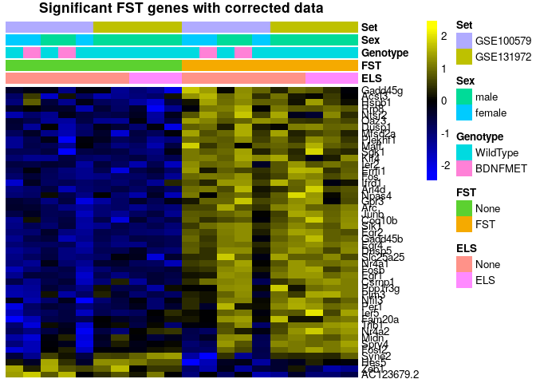<!-- -->

```r
sehm(se, rownames(topTags(Results$`se$FSTFST`,p.value = 0.05, n = 1000)), do.scale = TRUE, anno_columns=c("ELS","FST","Genotype","Sex","Set"), main="Significant FST genes with uncorrected data")
```

```
## Using assay logcpm
```

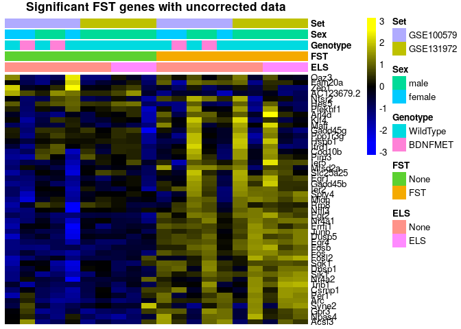<!-- -->

```r
topTags(Results$`se$FSTFST`,p.value = 0.05, n = 1000)
```

```
## Coefficient:  se$FSTFST 
##                 logFC      logCPM         F       PValue          FDR
## Egr4        1.3763026  5.69996696 271.21649 2.780822e-11 3.990479e-07
## Fosb        1.5939654  4.22512087 202.66650 2.361196e-10 1.281310e-06
## Egr2        2.5188907  2.25835614 199.18062 2.678696e-10 1.281310e-06
## Sik1        1.0841965  3.49087999 186.79528 4.266734e-10 1.530691e-06
## Fos         2.1424241  4.90675828 157.47295 1.455914e-09 4.178473e-06
## Dusp5       0.9301829  5.63293521 135.29594 4.271288e-09 1.021550e-05
## Nr4a1       1.0908784  6.53490701 111.44951 1.650329e-08 3.383174e-05
## Egr1        0.9829302  8.09783506 107.42624 2.125580e-08 3.438504e-05
## Arc         1.1542211  7.61316750 107.20017 2.156553e-08 3.438504e-05
## Gadd45b     0.7056463  4.63279778  74.25019 2.527653e-07 3.407056e-04
## Junb        0.9275646  6.61596306  73.87871 2.611681e-07 3.407056e-04
## Fosl2       0.4243474  5.91927337  67.20994 4.814926e-07 5.757849e-04
## Midn        0.4719116  5.65211023  62.91801 7.333648e-07 7.600822e-04
## Arl4d       0.9392403  4.17043954  62.80799 7.415436e-07 7.600822e-04
## Ier5        0.4552448  6.35415703  54.28151 1.844986e-06 1.705066e-03
## Maff        1.5235697 -0.09340333  54.01777 1.901119e-06 1.705066e-03
## Per1        0.5599088  6.23132349  51.44699 2.562027e-06 2.162652e-03
## Ier2        0.7774716  3.39046862  50.26812 2.949218e-06 2.351182e-03
## Ppp1r3g     0.8944070  2.92435435  45.69459 5.222937e-06 3.944692e-03
## Spry4       0.4622404  4.09595448  43.07283 7.394307e-06 5.305416e-03
## AC123679.2 -0.6517287  3.46271975  39.56487 1.208142e-05 8.255638e-03
## Sgk1        0.6525506  6.67172638  37.49724 1.638417e-05 1.068695e-02
## Mfsd2a      1.1623544  1.61247631  37.12334 1.733467e-05 1.081533e-02
## Npas4       1.2249717  3.30406700  36.44919 1.921011e-05 1.148604e-02
## Errfi1      0.5098045  6.04496283  35.54511 2.209560e-05 1.268288e-02
## Klf4        1.2172892 -0.05173331  35.03695 2.393067e-05 1.320789e-02
## Oaz3        1.2249670 -0.90753304  34.13056 2.764767e-05 1.469422e-02
## Pim3        0.3712467  5.48950727  32.53232 3.590539e-05 1.840151e-02
## Coq10b      0.3509736  4.95274256  31.99580 3.927699e-05 1.943534e-02
## Trib1       0.6941302  3.45398865  31.50278 4.269339e-05 1.954494e-02
## Nfil3       0.4293288  4.01318075  31.30745 4.413876e-05 1.954494e-02
## Csrnp1      0.4992627  3.68636670  31.14000 4.542199e-05 1.954494e-02
## Syne2      -0.6200803  2.66970778  31.10110 4.572604e-05 1.954494e-02
## Gadd45g     0.6386870  4.77344727  31.02739 4.630858e-05 1.954494e-02
## Plekhf1     1.1148732  2.14988868  30.15768 5.385456e-05 2.208037e-02
## Acsl3       0.4130952  6.03813928  28.91433 6.717918e-05 2.677837e-02
## Ntsr2       0.6467020  4.47503153  28.70942 6.971494e-05 2.703809e-02
## Hspb1       1.0584729  0.88634540  28.11212 7.774564e-05 2.935921e-02
## Zeb1       -0.2375546  5.49082055  26.90253 9.742455e-05 3.544383e-02
## Slc25a25    0.2490804  6.02849005  26.82864 9.879812e-05 3.544383e-02
## Hes5       -0.5220674  2.99800848  26.55452 1.040884e-04 3.643094e-02
## Nr4a2       0.4342296  6.29485753  25.67359 1.233848e-04 4.215648e-02
## Gpr3        0.5861471  1.54333739  25.55209 1.263509e-04 4.216595e-02
## Ifrd1       0.3162608  5.58527872  25.18087 1.359242e-04 4.432981e-02
## Fam20a      0.7550449  2.10975623  24.83055 1.457163e-04 4.646732e-02
## Dusp1       0.7528894  4.61954737  24.54790 1.542004e-04 4.764202e-02
## Rrp8        0.3653438  3.31051979  24.48893 1.560401e-04 4.764202e-02
```

There are multiple candidate genes that are significantly altered by acute stress across other condition

### Are genes differentially expressed between males and females?

```r
se <- se[,order(se$Sex)]
sehm(se, rownames(topTags(Results$`se$Sexfemale`,p.value = 0.05, n = 1000)), assayName = "corrected", do.scale = TRUE, anno_columns=c("ELS","FST","Genotype","Sex","Set"), main="Significant sex genes with corrected data")
```

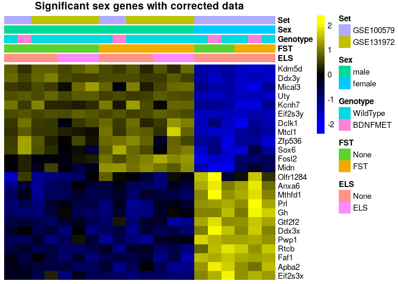<!-- -->

```r
sehm(se, rownames(topTags(Results$`se$Sexfemale`,p.value = 0.05, n = 1000)), do.scale = TRUE, anno_columns=c("ELS","FST","Genotype","Sex","Set"), main="Significant Sex genes with uncorrected data")
```

```
## Using assay logcpm
```

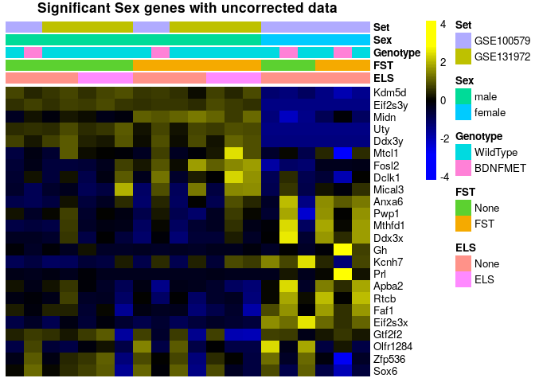<!-- -->

```r
topTags(Results$`se$FSTFST`,p.value = 0.05, n = 1000)
```

```
## Coefficient:  se$FSTFST 
##                 logFC      logCPM         F       PValue          FDR
## Egr4        1.3763026  5.69996696 271.21649 2.780822e-11 3.990479e-07
## Fosb        1.5939654  4.22512087 202.66650 2.361196e-10 1.281310e-06
## Egr2        2.5188907  2.25835614 199.18062 2.678696e-10 1.281310e-06
## Sik1        1.0841965  3.49087999 186.79528 4.266734e-10 1.530691e-06
## Fos         2.1424241  4.90675828 157.47295 1.455914e-09 4.178473e-06
## Dusp5       0.9301829  5.63293521 135.29594 4.271288e-09 1.021550e-05
## Nr4a1       1.0908784  6.53490701 111.44951 1.650329e-08 3.383174e-05
## Egr1        0.9829302  8.09783506 107.42624 2.125580e-08 3.438504e-05
## Arc         1.1542211  7.61316750 107.20017 2.156553e-08 3.438504e-05
## Gadd45b     0.7056463  4.63279778  74.25019 2.527653e-07 3.407056e-04
## Junb        0.9275646  6.61596306  73.87871 2.611681e-07 3.407056e-04
## Fosl2       0.4243474  5.91927337  67.20994 4.814926e-07 5.757849e-04
## Midn        0.4719116  5.65211023  62.91801 7.333648e-07 7.600822e-04
## Arl4d       0.9392403  4.17043954  62.80799 7.415436e-07 7.600822e-04
## Ier5        0.4552448  6.35415703  54.28151 1.844986e-06 1.705066e-03
## Maff        1.5235697 -0.09340333  54.01777 1.901119e-06 1.705066e-03
## Per1        0.5599088  6.23132349  51.44699 2.562027e-06 2.162652e-03
## Ier2        0.7774716  3.39046862  50.26812 2.949218e-06 2.351182e-03
## Ppp1r3g     0.8944070  2.92435435  45.69459 5.222937e-06 3.944692e-03
## Spry4       0.4622404  4.09595448  43.07283 7.394307e-06 5.305416e-03
## AC123679.2 -0.6517287  3.46271975  39.56487 1.208142e-05 8.255638e-03
## Sgk1        0.6525506  6.67172638  37.49724 1.638417e-05 1.068695e-02
## Mfsd2a      1.1623544  1.61247631  37.12334 1.733467e-05 1.081533e-02
## Npas4       1.2249717  3.30406700  36.44919 1.921011e-05 1.148604e-02
## Errfi1      0.5098045  6.04496283  35.54511 2.209560e-05 1.268288e-02
## Klf4        1.2172892 -0.05173331  35.03695 2.393067e-05 1.320789e-02
## Oaz3        1.2249670 -0.90753304  34.13056 2.764767e-05 1.469422e-02
## Pim3        0.3712467  5.48950727  32.53232 3.590539e-05 1.840151e-02
## Coq10b      0.3509736  4.95274256  31.99580 3.927699e-05 1.943534e-02
## Trib1       0.6941302  3.45398865  31.50278 4.269339e-05 1.954494e-02
## Nfil3       0.4293288  4.01318075  31.30745 4.413876e-05 1.954494e-02
## Csrnp1      0.4992627  3.68636670  31.14000 4.542199e-05 1.954494e-02
## Syne2      -0.6200803  2.66970778  31.10110 4.572604e-05 1.954494e-02
## Gadd45g     0.6386870  4.77344727  31.02739 4.630858e-05 1.954494e-02
## Plekhf1     1.1148732  2.14988868  30.15768 5.385456e-05 2.208037e-02
## Acsl3       0.4130952  6.03813928  28.91433 6.717918e-05 2.677837e-02
## Ntsr2       0.6467020  4.47503153  28.70942 6.971494e-05 2.703809e-02
## Hspb1       1.0584729  0.88634540  28.11212 7.774564e-05 2.935921e-02
## Zeb1       -0.2375546  5.49082055  26.90253 9.742455e-05 3.544383e-02
## Slc25a25    0.2490804  6.02849005  26.82864 9.879812e-05 3.544383e-02
## Hes5       -0.5220674  2.99800848  26.55452 1.040884e-04 3.643094e-02
## Nr4a2       0.4342296  6.29485753  25.67359 1.233848e-04 4.215648e-02
## Gpr3        0.5861471  1.54333739  25.55209 1.263509e-04 4.216595e-02
## Ifrd1       0.3162608  5.58527872  25.18087 1.359242e-04 4.432981e-02
## Fam20a      0.7550449  2.10975623  24.83055 1.457163e-04 4.646732e-02
## Dusp1       0.7528894  4.61954737  24.54790 1.542004e-04 4.764202e-02
## Rrp8        0.3653438  3.31051979  24.48893 1.560401e-04 4.764202e-02
```

There are multiple candidate genes that are significantly altered by sex across other conditions


### Are genes differentially expressed in BDNF Val66Met mice?

```r
se <- se[,order(se$Genotype)]
sehm(se, rownames(topTags(Results$`se$GenotypeBDNFMET`)), assayName = "corrected", do.scale = TRUE, anno_columns=c("ELS","FST","Genotype","Sex","Set"), main="Top10 Genotype genes (not significant!)")
```

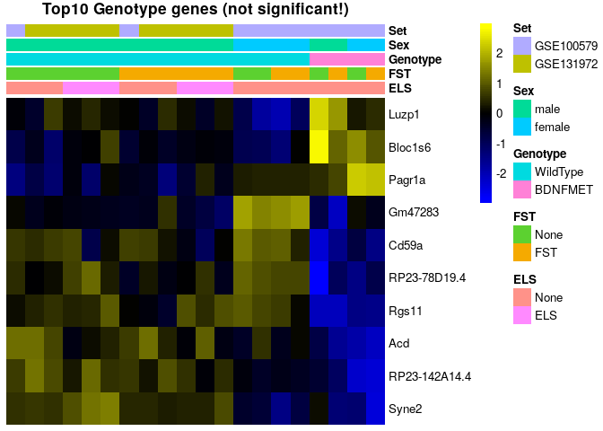<!-- -->

```r
topTags(Results$`se$GenotypeBDNFMET`)
```

```
## Coefficient:  se$GenotypeBDNFMET 
##                    logFC     logCPM        F       PValue        FDR
## Rgs11         -4.6510924  0.2104091 48.23230 3.783925e-06 0.05429933
## RP23-142A14.4 -1.8072217  3.4790589 42.03481 8.523070e-06 0.06115302
## Bloc1s6        1.5936072  3.6062060 35.30644 2.293690e-05 0.08548886
## Acd           -1.3564036  2.5652668 35.06376 2.382965e-05 0.08548886
## Cd59a         -1.7811223  1.9488758 32.65504 3.518088e-05 0.10096913
## RP23-78D19.4  -3.5828279 -0.0953865 28.28152 7.536659e-05 0.18025177
## Pagr1a         0.9420580  4.3777579 26.77875 9.973806e-05 0.20446303
## Luzp1          0.4153548  7.1665120 25.04753 1.395610e-04 0.25033763
## Syne2         -0.8338052  2.6697078 23.96782 1.734202e-04 0.25531238
## Gm47283       -1.0136825  4.6338862 23.84255 1.779180e-04 0.25531238
```

No genes pass multiple testing correction

### Are genes differentially expressed following early life stress?

```r
se <- se[,order(se$ELS)]
sehm(se, rownames(topTags(Results$`se$ELSELS`)), assayName = "corrected", do.scale = TRUE, anno_columns=c("ELS","FST","Genotype","Sex","Set"), main="Top10 ELS genes (not significant!)")
```

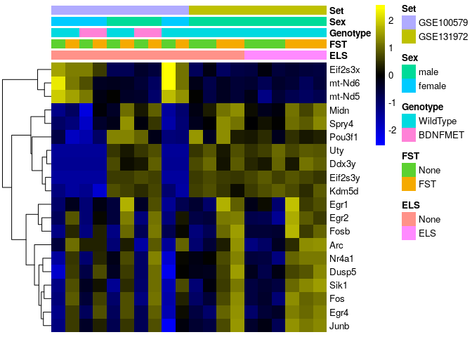<!-- -->

```r
topTags(Results$`se$ELSELS`)
```

```
## Coefficient:  se$ELSELS 
##            logFC     logCPM        F       PValue       FDR
## Lenep  9.1124999 -0.1873914 55.59593 9.317835e-06 0.1337109
## Ppia   0.4174134  8.7140180 26.75532 1.001827e-04 0.4846906
## Preb  -0.3007684  6.0293637 24.84474 1.453048e-04 0.4846906
## Prl    4.9369704  3.3207763 24.16574 1.665737e-04 0.4846906
## Gh     8.1881964  3.4292305 25.07952 1.688817e-04 0.4846906
## Cic   -0.4087211  5.8799801 21.97790 2.632036e-04 0.6294954
## Srsf3  0.3134597  7.3648071 20.29518 3.816134e-04 0.7462279
## Mfn1  -0.3214549  5.3104408 19.91579 4.160155e-04 0.7462279
## Nrsn1 -0.4523122  7.6124562 18.97022 5.181178e-04 0.7632441
## Fnip1  0.3458774  5.2989450 18.61929 5.630105e-04 0.7632441
```

No genes pass multiple testing correction

## Interactive models

To futher investigate if across all samples there is any variable that interacts with acute stress we will run a series of models that incorporate an interaction term between acute stress and any of the variables

### Are responses of FST genes altered by sex?

```r
se <- kallistodata
se <- dosvacor(se, form = ~FST + Sex + Genotype + Set + ELS + FST:Sex, form0 = ~Set)
```

```
## converting counts to integer mode
```

```
## Number of significant surrogate variables is:  2 
## Iteration (out of 5 ):1  2  3  4  5
```

```r
#experimental design, full additive model
design <- model.matrix(~ se$SV1 + se$SV2 + se$FST + se$Sex + se$Genotype + se$Set + se$ELS + se$FST:se$Sex)

y <- DGEList(counts=assays(se)$counts)
y <- calcNormFactors(y)
y <- estimateDisp(y,design)

#filter out genes that are below 10 counts in more than 75% of samples
keep <- rowSums(y$counts>10) >= (ncol(y) * 0.25)
y <- y[keep, , keep.lib.sizes=FALSE]

Results <- list()
fit <- glmQLFit(y,design)
for(i in colnames(design)[-1]){
  Results[[i]] <- glmQLFTest(fit, i)
}

se <- se[,order(se$Sex,se$FST)]
sehm(se, rownames(topTags(Results$`se$FSTFST:se$Sexfemale`)), assayName = "corrected", do.scale = TRUE, anno_columns=c("FST","Sex"), main="Top10 Sex:FST interaction genes (not significant!)")
```

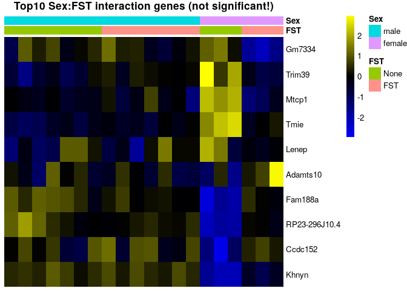<!-- -->

```r
topTags(Results$`se$FSTFST:se$Sexfemale`)
```

```
## Coefficient:  se$FSTFST:se$Sexfemale 
##                     logFC      logCPM        F       PValue       FDR
## Lenep         -14.5883696 -0.21707800 67.95974 9.769124e-06 0.1401869
## Khnyn          10.2531985 -0.29759350 35.30808 5.080357e-05 0.3645156
## Gm7334         -6.6346935  2.11309779 24.65856 1.733302e-04 0.8290961
## Fam188a         1.3811943  4.39136092 21.64629 3.192479e-04 1.0000000
## Ccdc152         3.2698393  1.26834716 20.60036 3.996474e-04 1.0000000
## Adamts10       28.6566901 -1.75378988 24.61199 5.903179e-04 1.0000000
## Trim39         -0.9019892  4.10040278 17.51771 8.092119e-04 1.0000000
## Mtcp1          -2.5681791 -0.08676799 17.29284 8.543269e-04 1.0000000
## Tmie           -1.5318995  1.15159324 16.82454 9.577851e-04 1.0000000
## RP23-296J10.4   2.6998855  0.34660420 16.68387 9.915976e-04 1.0000000
```

No genes pass multiple testing correction

### Are responses of FST genes altered by BDNF Val66Met?

```r
se <- kallistodata
se <- dosvacor(se, form = ~FST + Sex + Genotype + Set + ELS + FST:Genotype, form0 = ~Set)
```

```
## converting counts to integer mode
```

```
## Number of significant surrogate variables is:  2 
## Iteration (out of 5 ):1  2  3  4  5
```

```r
#experimental design, full additive model
design <- model.matrix(~se$SV1 + se$SV2 + se$FST + se$Sex + se$Genotype + se$Set + se$ELS + se$FST:se$Genotype)

y <- DGEList(counts=assays(se)$counts)
y <- calcNormFactors(y)
y <- estimateDisp(y,design)

#filter out genes that are below 10 counts in more than 75% of samples
keep <- rowSums(y$counts>10) >= (ncol(y) * 0.25)
y <- y[keep, , keep.lib.sizes=FALSE]

Results <- list()
fit <- glmQLFit(y,design)
for(i in colnames(design)[-1]){
  Results[[i]] <- glmQLFTest(fit, i)
}
se <- se[,order(se$Genotype,se$FST)]
sehm(se, rownames(topTags(Results$`se$FSTFST:se$GenotypeBDNFMET`, p.value = 0.05, n = 1000)), assayName = "corrected", do.scale = TRUE, anno_columns=c("FST","Genotype"), main="Significant FST:Genotype interaction genes with corrected data")
```

<!-- -->

```r
sehm(se, rownames(topTags(Results$`se$FSTFST:se$GenotypeBDNFMET`, p.value = 0.05, n = 1000)), do.scale = TRUE, anno_columns=c("FST","Genotype"), main="Significant FST:Genotype interaction genes with uncorrected data")
```

```
## Using assay logcpm
```

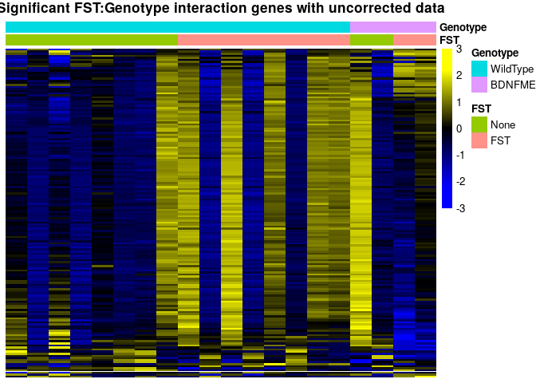<!-- -->

```r
topTags(Results$`se$FSTFST:se$GenotypeBDNFMET`, p.value = 0.05, n = 20)
```

```
## Coefficient:  se$FSTFST:se$GenotypeBDNFMET 
##                 logFC    logCPM        F       PValue        FDR
## Sema5b       1.588548 3.1002784 53.24962 2.662972e-06 0.02403047
## Setx        -1.611389 6.2614094 41.74096 1.087896e-05 0.02403047
## Ylpm1       -1.678523 4.8383262 40.33525 1.317750e-05 0.02403047
## Nav2        -1.827693 4.9077345 40.28594 1.326761e-05 0.02403047
## RP23-35L3.1 -1.501014 5.8201102 39.10525 1.564865e-05 0.02403047
## Gprasp1     -2.168632 8.7920819 38.51319 1.702281e-05 0.02403047
## Synm        -1.206630 5.6141911 36.55746 2.263665e-05 0.02403047
## Tjp1        -1.142088 5.6323974 36.44127 2.303125e-05 0.02403047
## Helz        -1.126084 5.2411186 36.35749 2.332062e-05 0.02403047
## Lman2l       1.521457 4.9305295 35.84783 2.517251e-05 0.02403047
## Arid1a      -1.635752 6.3824389 35.68834 2.578588e-05 0.02403047
## Nefm        -1.389739 8.3417690 35.51969 2.645304e-05 0.02403047
## Akap8       -1.064858 5.1655985 35.18482 2.783659e-05 0.02403047
## Ryr2        -2.204206 7.5287385 35.00896 2.859591e-05 0.02403047
## Lrrcc1      -1.369778 3.8476296 34.86735 2.922449e-05 0.02403047
## Unc13a      -1.711643 8.3814262 34.41837 3.132353e-05 0.02403047
## Hecw1       -1.026990 5.3451303 33.77323 3.464608e-05 0.02403047
## Mdn1        -2.744704 4.5352993 33.71526 3.496373e-05 0.02403047
## Dync1h1     -4.204113 9.2112791 33.60950 3.555178e-05 0.02403047
## Cfap54      -2.707328 0.4676222 33.49407 3.620650e-05 0.02403047
```

There are multiple genes that pass multiple testing correction. However, the data for these still looks noisy and genes that show up are highly co-expressed. The low replicate number might have impaired the ability to remove technical variability sufficiently for the Genotype:FST assessment, so the results should be interpreted with caution and more replicates would be needed.

### are responses of FST genes altered by early life stress?

```r
se <- kallistodata
se <- dosvacor(se, form = ~FST + Sex + Genotype + Set + ELS + FST:ELS, form0 = ~Set)
```

```
## converting counts to integer mode
```

```
## Number of significant surrogate variables is:  2 
## Iteration (out of 5 ):1  2  3  4  5
```

```r
#experimental design, full additive model
design <- model.matrix(~se$SV1 + se$SV2 + se$FST + se$Sex + se$Genotype + se$Set + se$ELS + se$FST:se$ELS)

y <- DGEList(counts=assays(se)$counts)
y <- calcNormFactors(y)
y <- estimateDisp(y,design)

#filter out genes that are below 10 counts in more than 75% of samples
keep <- rowSums(y$counts>10) >= (ncol(y) * 0.25)
y <- y[keep, , keep.lib.sizes=FALSE]

Results <- list()
fit <- glmQLFit(y,design)
for(i in colnames(design)[-1]){
  Results[[i]] <- glmQLFTest(fit, i)
}

se <- se[,order(se$ELS,se$FST)]
sehm(se, rownames(topTags(Results$`se$FSTFST:se$ELSELS`)), assayName = "corrected", do.scale = TRUE, anno_columns=c("ELS","FST"), main="Significant FST:ELS interaction genes")
```

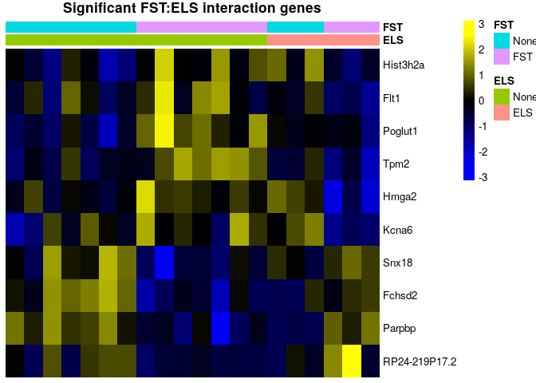<!-- -->

```r
topTags(Results$`se$FSTFST:se$ELSELS`)
```

```
## Coefficient:  se$FSTFST:se$ELSELS 
##                    logFC     logCPM        F      PValue      FDR
## Parpbp         1.9365236 -0.8136012 14.03922 0.001980876 0.999636
## Snx18          0.6895744  3.8035501 13.98978 0.002007667 0.999636
## Flt1          -1.8155195  0.8068678 13.90719 0.002053347 0.999636
## Poglut1       -0.7827210  4.3601521 12.11405 0.003409125 0.999636
## Hmga2         -1.4548055 -0.7556480 12.10016 0.003423034 0.999636
## Hist3h2a      -0.4795374  6.0135226 11.79106 0.003750112 0.999636
## Fchsd2         0.4525127  5.0380511 11.58952 0.003982603 0.999636
## RP24-219P17.2  4.2291995 -0.7538250 11.30166 0.004343829 0.999636
## Tpm2          -0.8442881  2.1901200 11.13040 0.004576468 0.999636
## Kcna6         -3.2689198  2.8552846 11.04148 0.004702859 0.999636
```

No genes pass multiple testing correction
