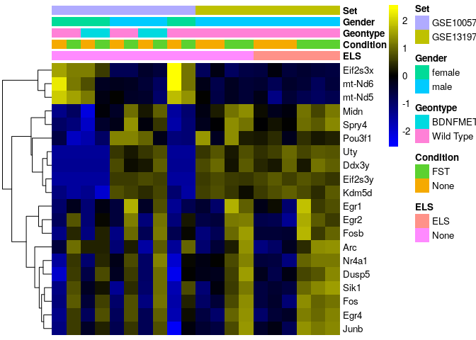

required r libraries

```r
library(edgeR)
library(SEtools)
library(SummarizedExperiment)
library(plgINS)
```


# About this re-analysis

Here, we outline the re-analysis of two GEO datasets, GSE100579 and GSE131972, both of which are investigating the effect of acute stress on the translatome of CA3 pyramidal neurons in the mouse hippocampus.

This repositories were used for 3 seperate publications:

Marrocco J. et al. 2017; 
A sexually dimorphic pre-stressed translational signature in CA3 pyramidal neurons of BDNF Val66Met mice; Nature Communications volume 8, Article number: 808 (2017)

Gray J. D. et al. 2018; 
Translational profiling of stress-induced neuroplasticity in the CA3 pyramidal neurons of BDNF Val66Met mice; Molecular Psychiatry volume 23, pages 904–913

Marrocco J. et al. 2019; 
Early Life Stress Restricts Translational Reactivity in CA3 Neurons Associated With Altered Stress Responses in Adulthood; Front. Behav. Neurosci. https://doi.org/10.3389/fnbeh.2019.00157 


the reanalysis be performed on the quantification of two different alginment methods a genome alignment using xxx and salmon or a pseudoalignment to the transcriptome using kallisto

first, we are loading both the kallisto and the genome alignment data


```r
kallistodata <- readRDS("data/TRAPReanalysis.SE.rds")
salmondata <- readRDS("data/GSE131972.salmon.SE.rds")
```

# Re-analysis of published results
## Assessment of Marrocco et al. 2017

Concerning the 2017 publication the authors claim that numerous genes are differentially regulated between males and females after acute stress. Unfortunately, they do not include a list with all genes in the publication, but Table 1 contains a subsets of genes that are allegedly differentially regulated between males and females upon acute stress

Let's inspect these genes across the runs used for the original publication in wild type animals


```r
se <- kallistodata
se <- subset(se,select  = se$Set == "GSE100579" & se$Geontype == "Wild Type")
genes <- read.table("metadata/Marrocco2017SexStressGenes.csv", sep = ";", header = T)$genes
sehm(se,genes,do.scale = T,anno_columns = c("ELS","Condition","Geontype","Gender","Set"), cluster_rows = T)
```

```
## Using assay logcpm
```

<!-- -->

It looks as if there could be something to this, however unfortunately this finding is higly underpowered having only 6 replicates for a 4 group comparison

Let's inspect these genes across all sequencing runs and find out wheather the finding for male wild type mice in the second set GSE131972 holds up.


```r
se <- kallistodata
se <- subset(se,select  = se$ELS == "None" & se$Geontype == "Wild Type")
sehm(se,genes,do.scale = T,anno_columns = c("ELS","Condition","Geontype","Gender","Set"), cluster_rows = T)
```

```
## Using assay logcpm
```

<!-- -->

it becomes apparent that these genes seem to be co-expressed and highly variable across all samples. the finding that in females and males these genes react differently to stress seems inaccurate. It highlights the danger of applying single run sequencing.

If we further visualize these genes across all samples, we find

```r
se <- kallistodata
sehm(se,genes,do.scale = T,anno_columns = c("ELS","Condition","Geontype","Gender","Set"), cluster_rows = T)
```

```
## Using assay logcpm
```

<!-- -->

The selected genes display a high co-expression and could possibly be highly variable due to technical reasons. Let's try to remove technical variability from our runs using SVA and re-visualize the same genes


```r
se <- svacor(se, form = ~Set + Gender + Geontype + Condition + ELS)
```

```
## Loading required package: mgcv
```

```
## Loading required package: nlme
```

```
## 
## Attaching package: 'nlme'
```

```
## The following object is masked from 'package:IRanges':
## 
##     collapse
```

```
## This is mgcv 1.8-31. For overview type 'help("mgcv-package")'.
```

```
## Loading required package: genefilter
```

```
## 
## Attaching package: 'genefilter'
```

```
## The following objects are masked from 'package:matrixStats':
## 
##     rowSds, rowVars
```

```
## Using variance-stabilizing transformation
```

```
## converting counts to integer mode
```

```
##   Note: levels of factors in the design contain characters other than
##   letters, numbers, '_' and '.'. It is recommended (but not required) to use
##   only letters, numbers, and delimiters '_' or '.', as these are safe characters
##   for column names in R. [This is a message, not an warning or error]
##   Note: levels of factors in the design contain characters other than
##   letters, numbers, '_' and '.'. It is recommended (but not required) to use
##   only letters, numbers, and delimiters '_' or '.', as these are safe characters
##   for column names in R. [This is a message, not an warning or error]
```

```
## Number of significant surrogate variables is:  2 
## Iteration (out of 5 ):1  2  3  4  5
```

```r
sehm(se,genes,do.scale = T,anno_columns = c("ELS","Condition","Geontype","Gender","Set"), cluster_rows = T,assayName = "corrected")
```

<!-- -->

As we can see, removing technical variability abolishes the effects for the male-female stress effects seen in the single replicate comparisons. It becomes apparent, that these genes do not have any sex specific acute stress response across all samples

## Assessment of Gray et al. 2018

A complete assessment of the findings of Gray et al. 2018 is unfortunately not possible. the repository GSE100579 is missing crucial samples for the chronic stress model for the BDNF Val66Met genotype and only includes samples of acute stress.

However, the authors claim that many genes are differentially regulated between wild type and BDNF Val66Met animals at baseline. While no complete list of genes has been included in the publication, a subset can be found in Table 1


```r
se <- kallistodata
genes <- read.table("metadata/Gray2018GenotypeGenes.csv", sep = ";", header = T)$genes
se <- subset(se,select  = se$Set == "GSE100579" & se$Condition == "None")
sehm(se,genes,do.scale = T,anno_columns = c("ELS","Condition","Geontype","Gender","Set"), cluster_rows = T)
```

```
## Using assay logcpm
```

<!-- -->

Let's investigate these genes across all samples

```r
se <- kallistodata
sehm(se,genes,do.scale = T,anno_columns = c("ELS","Condition","Geontype","Gender","Set"), cluster_rows = T)
```

```
## Using assay logcpm
```

<!-- -->

We see a similar pattern as in Marrocco et al 2017. The baseline difference does not reproduce in GSE 131972 which only includes wild type mice.

Let's again try to eliminate technical variabilty and re-visualize the same genes


```r
se <- svacor(se, form = ~Set + Gender + Geontype + Condition + ELS)
```

```
## Using variance-stabilizing transformation
```

```
## converting counts to integer mode
```

```
##   Note: levels of factors in the design contain characters other than
##   letters, numbers, '_' and '.'. It is recommended (but not required) to use
##   only letters, numbers, and delimiters '_' or '.', as these are safe characters
##   for column names in R. [This is a message, not an warning or error]
##   Note: levels of factors in the design contain characters other than
##   letters, numbers, '_' and '.'. It is recommended (but not required) to use
##   only letters, numbers, and delimiters '_' or '.', as these are safe characters
##   for column names in R. [This is a message, not an warning or error]
```

```
## Number of significant surrogate variables is:  3 
## Iteration (out of 5 ):1  2  3  4  5
```

```r
sehm(se,genes,do.scale = T,anno_columns = c("ELS","Condition","Geontype","Gender","Set"), cluster_rows = T,assayName = "corrected")
```

<!-- -->

It becomes apparent, that these genes do not have any genotype specific baseline difference across all samples

## Assessment of Marrocco et al. 2019

Let's run a re-analysis of Marrocco et al. 2019 checking for ELS dependent changes in the acute stress response

```r
se <- kallistodata
se <- subset(se,select  = se$Set == "GSE131972")
```

In their Publications the authors unfortunately do not upload a list with differentially expressed genes. However, in their discussion they mention a number of genes that they claim are differentially expressed between ELS and non-ELS mice after acute stress.
They claim that acute stress reduces the expression of Grin1, Grin2a, Gabbr2, and Gabra1 in CA3 neurons of non-ELS mice, but not ELS mice:

```r
sehm(se,c("Grin1","Grin2a","Gabbr2","Gabra1"),do.scale = T,anno_columns = c("ELS","Condition"), cluster_rows = T)
```

```
## Using assay logcpm
```

<!-- -->

it becomes apparent, that this finding does not look very solid

Further, they claim that there is restricted list of genes selectively induced by AS in ELS mice (Per1, Npy, Nfkbia, Penk,Dusp1, Cst3, Trib1, Htra1, Sdc4, Plekhf1) but not non-ELS mice.

```r
sehm(se,c("Per1", "Npy", "Nfkbia", "Penk","Dusp1", "Cst3", "Trib1", "Htra1", "Sdc4", "Plekhf1"),do.scale = T,anno_columns = c("ELS","Condition"), cluster_rows = T)
```

```
## Using assay logcpm
```

<!-- -->

it becomes apparent, that this finding also does not look very solid. while these genes might be increased in expression in ELS mice it is hard to see this being a significant finding, especially, since the same effect can be observed for one replicate in the non-ELS group.

The authors claim that there are a number of genes that appear to be induced by AS in both ELS and non ELS mice. these include (Egr1/2/4, Arc, Fos, and Fosb)

```r
sehm(se,c("Egr1", "Egr2", "Egr4", "Arc","Fos", "Fosb"),do.scale = T,anno_columns = c("ELS","Condition"), cluster_rows = T)
```

```
## Using assay logcpm
```

<!-- -->

For these genes it looks as if their finding might be significant.

Let's investigate the whole data with a statistical approach using egeR and a GLM type of analysis for swim effects, early life effects and interactions

```r
#experimental design, interactive model
design <- model.matrix(~se$Condition * se$ELS)

y <- DGEList(counts=assays(se)$counts)
y <- calcNormFactors(y)
y <- estimateDisp(y,design)

#filter out genes that are below 10 counts in more than 75% of samples
keep <- rowSums(y$counts>10) >= 3
y <- y[keep, , keep.lib.sizes=FALSE]

Results <- list()
fit <- glmQLFit(y,design)
for(i in colnames(design)[-1]){
  Results[[i]] <- glmQLFTest(fit, i)
}
```

Les's investigate if there are any genes altered by acute stress

```r
topTags(Results$`se$ConditionNone`)
```

```
## Coefficient:  se$ConditionNone 
##            logFC   logCPM        F       PValue       FDR
## Egr4  -1.4403405 5.885444 53.26253 7.366511e-05 0.6397289
## Nr4a1 -1.3308764 6.692671 49.36148 9.681327e-05 0.6397289
## Fos   -2.1307567 5.100641 45.14032 1.330274e-04 0.6397289
## Egr2  -2.6011381 2.423339 36.51426 2.782330e-04 0.8744991
## Junb  -1.0440860 6.806899 35.61133 3.030773e-04 0.8744991
## Fosb  -1.4051175 4.423401 27.72609 6.981470e-04 0.9843760
## Sik1  -1.1741066 3.640998 26.05440 8.536970e-04 0.9843760
## Arc   -1.5191907 7.690720 20.90101 1.703817e-03 0.9843760
## Trib1 -1.0700034 3.599083 19.38456 2.139942e-03 0.9843760
## Dusp5 -0.9521124 5.808549 18.05644 2.641813e-03 0.9843760
```

Indeed, there are two candidate genes that pass the multiple testing correction, Fos and Egr4


Are there any genes altered by early life stress?

```r
topTags(Results$`se$ELSNone`)
```

```
## Coefficient:  se$ELSNone 
##              logFC     logCPM        F       PValue       FDR
## Plekhg3 -1.9967921  2.4615140 32.28299 0.0004222831 0.9996194
## Itgb8   -0.9937680  3.5789149 19.23668 0.0021895669 0.9996194
## Trpc6   -1.7023306  2.7981601 16.34132 0.0035283596 0.9996194
## Igfbp5  -0.9692028  5.7252455 15.51154 0.0040903459 0.9996194
## Sft2d1  -1.3952806  2.0899822 14.30578 0.0051219008 0.9996194
## Galnt4  -1.6777129 -0.2792201 14.24235 0.0051846914 0.9996194
## Grm2    -0.7297558  4.5540417 13.93444 0.0055035518 0.9996194
## Ctdspl2 -1.0900578  3.7103135 13.35386 0.0061743225 0.9996194
## Fgfr3   -1.0389808  3.9430810 12.14425 0.0079339010 0.9996194
## Gabrg1  -1.2811709  1.8892472 11.61273 0.0089039549 0.9996194
```

Unfortunately, there are no genes that pass the multiple testing correction

Let's investigate if there are genes with a significant interaction

```r
topTags(Results$`se$ConditionNone:se$ELSNone`)
```

```
## Coefficient:  se$ConditionNone:se$ELSNone 
##              logFC     logCPM        F      PValue       FDR
## Plekhg3  2.8250275  2.4615140 36.30672 0.000283712 0.9998581
## Piga     2.6242173  1.5385751 22.16459 0.001422287 0.9998581
## Nadsyn1 -8.1411065 -0.1856326 21.32271 0.002252620 0.9998581
## Stard9   5.7100942 -0.4341469 14.37339 0.005056005 0.9998581
## Mill2   -4.5346623 -1.3626955 14.29680 0.005130735 0.9998581
## Ctdspl2  1.3933425  3.7103135 11.61326 0.008902932 0.9998581
## Il10ra   8.2935183 -1.1359543 13.82403 0.009279340 0.9998581
## Gpr17    2.1180496  2.8256340 11.32226 0.009496970 0.9998581
## B3gat2  -0.9225619  4.8564532 11.24795 0.009656549 0.9998581
## Nnt     -1.7460846  3.4884480 10.80953 0.010669564 0.9998581
```

Unfortunately, no genes have a altered acute stress response in ELS vs normal animals


# Meta-Analysis of all data

## Additive model
Let's run an overarching analysis over all data to determine if there are any significant effects for acute stress (=Condition), Genotype, GEOdataset or early life stress

```r
se <- kallistodata

#experimental design, full additive model
design <- model.matrix(~se$Condition + se$Gender + se$Geontype + se$Set + se$ELS)

y <- DGEList(counts=assays(se)$counts)
y <- calcNormFactors(y)
y <- estimateDisp(y,design)

#filter out genes that are below 10 counts in more than 75% of samples
keep <- rowSums(y$counts>10) >= 5
y <- y[keep, , keep.lib.sizes=FALSE]

Results <- list()
fit <- glmQLFit(y,design)
for(i in colnames(design)[-1]){
  Results[[i]] <- glmQLFTest(fit, i)
}
```

Les's investigate if there are any genes altered by acute stress

```r
topTags(Results$`se$ConditionNone`)
```

```
## Coefficient:  se$ConditionNone 
##            logFC   logCPM         F       PValue          FDR
## Egr4  -1.4504092 5.700383 214.14618 5.534782e-11 7.942412e-07
## Fos   -2.1211555 4.906998 149.96297 8.624405e-10 6.188011e-06
## Egr2  -2.3426004 2.247529 134.08514 2.007587e-09 9.602956e-06
## Fosb  -1.4963321 4.223948 110.24820 8.589276e-09 3.081403e-05
## Nr4a1 -1.1486927 6.534812  87.33636 4.627058e-08 1.327966e-04
## Sik1  -1.1092486 3.493908  77.98207 1.028066e-07 2.458792e-04
## Junb  -0.9520758 6.615866  67.02760 2.918232e-07 5.982375e-04
## Dusp5 -1.1245332 5.633421  57.96897 7.723457e-07 1.385395e-03
## Arc   -1.3361997 7.613828  49.21993 2.232716e-06 3.559942e-03
## Egr1  -0.8278663 8.097496  34.85452 1.828138e-05 2.623379e-02
```
Indeed, there are multiple candidate genes that are significantly altered by acute stress across other conditions

Are there any genes altered by sex

```r
topTags(Results$`se$Gendermale`)
```

```
## Coefficient:  se$Gendermale 
##              logFC   logCPM          F       PValue          FDR
## Eif2s3y 11.3972639 3.455656 1281.93513 2.172442e-13 3.117454e-09
## Uty     10.3866137 2.653583  432.75005 1.184239e-10 8.496914e-07
## Kdm5d    2.8606312 1.942235  128.78858 2.715137e-09 1.298741e-05
## Ddx3y   11.8469936 4.146537  125.85803 1.215087e-07 4.359125e-04
## mt-Nd5  -3.0704215 5.319974   47.54160 2.782169e-06 7.984825e-03
## Eif2s3x -0.8739168 7.331434   39.41080 8.845076e-06 2.115447e-02
## Pou3f1   1.2923702 6.737009   35.91281 1.535610e-05 3.148001e-02
## Midn     0.6843066 5.651226   33.51025 2.293767e-05 4.114445e-02
## mt-Nd6  -3.3953597 4.653982   32.61893 2.675486e-05 4.265914e-02
## Spry4    0.7043658 4.093567   28.19129 6.014896e-05 8.631376e-02
```
Indeed, there are multiple candidate genes that are significantly altered by sex across other conditions


Are there any genes altered by BDNF Val66Met phenotype?

```r
topTags(Results$`se$GeontypeWild Type`)
```

```
## Coefficient:  se$GeontypeWild Type 
##                   logFC     logCPM        F       PValue       FDR
## Bloc1s6      -1.6845415  3.6033657 31.83990 3.068073e-05 0.2304958
## Cd59a         1.7142445  1.9530726 31.58108 3.212485e-05 0.2304958
## Tcp11l1      -1.4606140  2.8547082 23.37359 1.606079e-04 0.4938836
## Luzp1        -0.6417807  7.1666383 18.10729 5.481632e-04 0.4938836
## Prl          -7.0088172  3.3317522 18.10258 5.488134e-04 0.4938836
## Alg3         -1.3060785  2.0287865 17.24838 6.823469e-04 0.4938836
## RP23-78D19.4  3.6049972 -0.1249779 16.74718 7.775085e-04 0.4938836
## Strc          1.3320817  0.4421829 16.53116 8.230530e-04 0.4938836
## Fyttd1       -0.5620122  6.8522505 16.01712 9.439905e-04 0.4938836
## Reps2        -0.5554824  8.6385483 15.48113 1.091807e-03 0.4938836
```

Unfortunately, there are no genes that pass the multiple testing correction

Are there any genes altered early life stress?

```r
topTags(Results$`se$ELSNone`)
```

```
## Coefficient:  se$ELSNone 
##                   logFC     logCPM         F      PValue       FDR
## RP23-445H7.1 -0.7291894 2.74282804 15.428622 0.001107636 0.9997824
## Scel         -0.8256697 0.06239698 12.354656 0.002700464 0.9997824
## Rrp15         0.7312827 3.30166498 11.562444 0.003456599 0.9997824
## Gm2163       -1.6578356 0.62733604  9.331060 0.007248642 0.9997824
## Map2k5        0.5565325 5.51777906  8.849308 0.008589268 0.9997824
## Psip1        -0.4244342 8.26355564  8.842136 0.008611244 0.9997824
## Serbp1       -0.4102638 8.22281402  8.387176 0.010144829 0.9997824
## Atpaf2        0.4073688 4.44786602  8.224273 0.010767483 0.9997824
## Rsl1d1       -0.3888628 6.32758454  8.186028 0.010919874 0.9997824
## Wipf3         0.4153641 9.72897807  7.749044 0.012846573 0.9997824
```

Unfortunately, there are no genes that pass the multiple testing correction

Let's plot the top 10 genes for both sex and acute stress

```r
genes <- append(rownames(topTags(Results$`se$ConditionNone`)),rownames(topTags(Results$`se$Gendermale`)))
sehm(se,genes,do.scale = T,anno_columns = c("ELS","Condition","Geontype","Gender","Set"), cluster_rows = T,assayName = "logcpm")
```

<!-- -->

## Interactive models

To futher investigate if across all samples there is any variable that interacts with acute stress we will run a series of models that incorporate an interaction term between acute stress and any of the variables


Interaction between acute stress and sex

```r
se <- kallistodata

#experimental design, full additive model
design <- model.matrix(~se$Condition + se$Gender + se$Geontype + se$Set + se$ELS + se$Condition:se$Gender)

y <- DGEList(counts=assays(se)$counts)
y <- calcNormFactors(y)
y <- estimateDisp(y,design)

#filter out genes that are below 10 counts in more than 75% of samples
keep <- rowSums(y$counts>10) >= 5
y <- y[keep, , keep.lib.sizes=FALSE]

Results <- list()
fit <- glmQLFit(y,design)
for(i in colnames(design)[-1]){
  Results[[i]] <- glmQLFTest(fit, i)
}
topTags(Results$`se$ConditionNone:se$Gendermale`)
```

```
## Coefficient:  se$ConditionNone:se$Gendermale 
##                     logFC   logCPM        F       PValue       FDR
## Gm7334         -6.0223741 2.107368 34.53506 2.563838e-05 0.3679107
## Kif21b        -10.8360015 2.714365 29.82917 5.653189e-05 0.4056163
## Fam188a         2.1019997 4.390972 22.96818 2.117413e-04 0.4086247
## Ubn2           -1.6943395 4.736426 21.86337 2.679811e-04 0.4086247
## Prl             8.8870115 3.331719 21.32279 3.015273e-04 0.4086247
## Pank2           0.9957106 5.171426 20.13491 3.933115e-04 0.4086247
## Senp3           1.0344960 6.345719 20.04882 4.011061e-04 0.4086247
## Lpp            -1.9584555 2.549406 19.05491 5.049718e-04 0.4086247
## RP23-296J10.4   2.7487142 0.354647 19.01561 5.096644e-04 0.4086247
## Gabra2         -1.8827833 6.049112 18.89101 5.248717e-04 0.4086247
```

Interaction between acute stress and genotype

```r
se <- kallistodata

#experimental design, full additive model
design <- model.matrix(~se$Condition + se$Gender + se$Geontype + se$Set + se$ELS + se$Condition:se$Geontype)

y <- DGEList(counts=assays(se)$counts)
y <- calcNormFactors(y)
y <- estimateDisp(y,design)

#filter out genes that are below 10 counts in more than 75% of samples
keep <- rowSums(y$counts>10) >= 5
y <- y[keep, , keep.lib.sizes=FALSE]

Results <- list()
fit <- glmQLFit(y,design)
for(i in colnames(design)[-1]){
  Results[[i]] <- glmQLFTest(fit, i)
}
topTags(Results$`se$ConditionNone:se$GeontypeWild Type`)
```

```
## Coefficient:  se$ConditionNone:se$GeontypeWild Type 
##              logFC     logCPM        F      PValue FDR
## Ewsr1   -1.7706958  7.6500141 22.37867 0.000237697   1
## Gm21887  9.3253759 -0.7827305 15.64275 0.001172237   1
## Col16a1 -3.1179239  0.3005901 15.40221 0.001249282   1
## Fus     -1.6877873  7.5408160 14.86476 0.001443066   1
## Dock8   -1.5024701  1.0548835 14.35271 0.001659922   1
## Akap8l  -1.4276762  5.3688279 13.49152 0.002113366   1
## Odf2    -0.6483425  5.6624578 12.47768 0.002837640   1
## Zfp326  -1.1320009  4.6578121 12.01198 0.003262035   1
## Tcerg1  -0.6953703  6.3125474 11.80832 0.003469940   1
## Zfhx2   -0.8132302  5.7165769 11.30815 0.004047556   1
```

Interaction between acute stress and early life stress

```r
se <- kallistodata

#experimental design, full additive model
design <- model.matrix(~se$Condition + se$Gender + se$Geontype + se$Set + se$ELS + se$Condition:se$ELS)

y <- DGEList(counts=assays(se)$counts)
y <- calcNormFactors(y)
y <- estimateDisp(y,design)

#filter out genes that are below 10 counts in more than 75% of samples
keep <- rowSums(y$counts>10) >= 5
y <- y[keep, , keep.lib.sizes=FALSE]

Results <- list()
fit <- glmQLFit(y,design)
for(i in colnames(design)[-1]){
  Results[[i]] <- glmQLFTest(fit, i)
}
topTags(Results$`se$ConditionNone:se$ELSNone`)
```

```
## Coefficient:  se$ConditionNone:se$ELSNone 
##                   logFC     logCPM         F      PValue       FDR
## Tle6         -8.3838132 -2.0619858 15.927420 0.004290684 0.9998963
## Rnf17         2.1829788 -1.1268002  9.996751 0.006147753 0.9998963
## RP23-350C1.3 -0.7432265  3.3888494  7.777253 0.013302994 0.9998963
## Sft2d1        1.5111840  2.1036793  7.709440 0.013639248 0.9998963
## Il10ra        7.4729952 -1.0775602  8.569959 0.014090639 0.9998963
## Hmga2        -1.2740607 -0.7474069  7.614444 0.014126765 0.9998963
## Lpxn          1.6385444 -0.4100400  7.585094 0.014281399 0.9998963
## Cpne9        -1.0049819  3.7046973  7.483760 0.014830367 0.9998963
## Klk6          2.6615497 -1.0843417  7.366486 0.015496087 0.9998963
## Zfp184       -1.2712686  1.1947448  7.364628 0.015506904 0.9998963
```
