- [About this re-analysis](#about-this-re-analysis)
- [Re-analysis of published results](#re-analysis-of-published-results)
  * [Assessment of Marrocco et al. 2017](#assessment-of-marrocco-et-al-2017)
  * [Assessment of Gray et al. 2018](#assessment-of-gray-et-al-2018)
  * [Assessment of Marrocco et al. 2019](#assessment-of-marrocco-et-al-2019)
    + [Using kallisto data](#using-kallisto-data)
    + [Using salmon data](#using-salmon-data)
- [Meta-Analysis of all data](#meta-analysis-of-all-data)
  * [Additive model](#additive-model)
  * [Interactive models](#interactive-models)
- [DESeq2 analysis](#deseq2-analysis)
  * [GSE100579](#gse100579)
    + [Gender](#gender)
    + [FST](#fst)
    + [Genotype](#genotype)
    + [Gender:FST](#gender-fst)
- [DESeq2 analysis with randomized variable reassignments](#deseq2-analysis-with-randomized-variable-reassignments)
  * [GSE100579](#gse100579-1)
    + [Gender](#gender-1)
    + [FST](#fst-1)
    + [Genotype](#genotype-1)
    + [Gender:FST](#gender-fst-1)


required r libraries

```r
library(edgeR)
library(SEtools)
library(SummarizedExperiment)
library(plgINS)
library(DESeq2)
library(sva)
```


# About this re-analysis

Here, we outline the re-analysis of two GEO datasets, GSE100579 and GSE131972, both of which are investigating the effect of acute stress on the translatome of CA3 pyramidal neurons in the mouse hippocampus.

This repositories were used for 3 seperate publications:

Marrocco J. et al. 2017; 
A sexually dimorphic pre-stressed translational signature in CA3 pyramidal neurons of BDNF Val66Met mice; Nature Communications volume 8, Article number: 808 (2017)

Gray J. D. et al. 2018; 
Translational profiling of stress-induced neuroplasticity in the CA3 pyramidal neurons of BDNF Val66Met mice; Molecular Psychiatry volume 23, pages 904–913

Marrocco J. et al. 2019; 
Early Life Stress Restricts Translational Reactivity in CA3 Neurons Associated With Altered Stress Responses in Adulthood; Front. Behav. Neurosci. https://doi.org/10.3389/fnbeh.2019.00157 


the reanalysis be performed on the quantification of two different alginment methods a genome alignment using xxx and salmon or a pseudoalignment to the transcriptome using kallisto

first, we are loading both the kallisto and the genome alignment data


```r
kallistodata <- readRDS("data/AllData.kallisto.SE.rds")
salmondata <- readRDS("data/GSE131972.salmonv2.SE.rds")
```

# Re-analysis of published results
## Assessment of Marrocco et al. 2017

Concerning the 2017 publication the authors claim that numerous genes are differentially regulated between males and females after acute stress. Unfortunately, they do not include a list with all genes in the publication, but Table 1 contains a subsets of genes that are allegedly differentially regulated between males and females upon acute stress

Let's inspect these genes across the runs used for the original publication in WildType animals


```r
se <- kallistodata
se <- subset(se,select  = se$Set == "GSE100579" & se$Genotype == "WildType")
genes <- read.table("metadata/Marrocco2017SexStressGenes.csv", sep = ";", header = T)$genes
sehm(se,genes,do.scale = T,anno_columns = c("ELS","FST","Genotype","Sex","Set"), cluster_rows = T)
```

```
## Using assay logcpm
```

<!-- -->

It looks as if there could be something to this, however unfortunately this finding is higly underpowered having only 6 replicates for a 4 group comparison

Let's inspect these genes across all sequencing runs and find out wheather the finding for male WildType mice in the second set GSE131972 holds up.


```r
se <- kallistodata
se <- subset(se,select  = se$ELS == "None" & se$Genotype == "WildType")
sehm(se,genes,do.scale = T,anno_columns = c("ELS","FST","Genotype","Sex","Set"), cluster_rows = T)
```

```
## Using assay logcpm
```

<!-- -->

it becomes apparent that these genes seem to be co-expressed and highly variable across all samples. the finding that in females and males these genes react differently to stress seems inaccurate. It highlights the danger of applying single run sequencing.

If we further visualize these genes across all samples, we find

```r
se <- kallistodata
sehm(se,genes,do.scale = T,anno_columns = c("ELS","FST","Genotype","Sex","Set"), cluster_rows = T)
```

```
## Using assay logcpm
```

<!-- -->

The selected genes display a high co-expression and could possibly be highly variable due to technical reasons. Let's try to remove technical variability from our runs using SVA and re-visualize the same genes


```r
#function for SVA correction
dosvacor <- function(SE, form=NULL, form0=~1, ...){
  CD <- as.data.frame(colData(SE))
  mm <- model.matrix(form, data=CD)
  mm0 <- model.matrix(form0, data=CD)

  dds <- DESeqDataSetFromMatrix(round(assay(SE)), as.data.frame(colData(SE)), form)
  dds <- estimateSizeFactors(dds)
  en <- as.matrix(assay(vst(dds, blind=FALSE)))

  sv <- sva(en, mm, mm0, n.sv=NULL, ...)
  n.sv <- sv$n.sv
  sv <- sv$sv
  
  colnames(sv) <- paste0("SV",1:ncol(sv))
  X <- cbind(mm, sv)
  mm2 <- cbind(mm[,1,drop=F],sv,mm[,-1,drop=F])
  H <- solve(t(X)%*%X)%*%t(X)
  b <- (H%*%t(en))
  cn <- setdiff(colnames(X),setdiff(colnames(mm), colnames(mm0)))  
  cn <- setdiff(cn, "(Intercept)")
  encor <- en - t(as.matrix(X[,cn]) %*% b[cn,])
  SE <- SE[row.names(encor),]
  colData(SE) <- cbind(colData(SE), sv)
  assays(SE)$corrected <- encor
  return(SE)
}

se <- dosvacor(se, form = ~ Set + Sex * FST, form0 = ~Set)
```

```
## converting counts to integer mode
```

```
## Number of significant surrogate variables is:  2 
## Iteration (out of 5 ):1  2  3  4  5
```

```r
sehm(se,genes,do.scale = T,anno_columns = c("ELS","FST","Genotype","Sex","Set"), cluster_rows = T,assayName = "corrected")
```

<!-- -->

As we can see, removing technical variability abolishes the effects for the male-female stress effects seen in the single replicate comparisons. It becomes apparent, that these genes do not have any sex specific acute stress response across all samples

## Assessment of Gray et al. 2018

A complete assessment of the findings of Gray et al. 2018 is unfortunately not possible. the repository GSE100579 is missing crucial samples for the chronic stress model for the BDNF Val66Met genotype and only includes samples of acute stress.

However, the authors claim that many genes are differentially regulated between WildType and BDNF Val66Met animals at baseline. While no complete list of genes has been included in the publication, a subset can be found in Table 1


```r
se <- kallistodata
genes <- read.table("metadata/Gray2018GenotypeGenes.csv", sep = ";", header = T)$genes
se <- subset(se,select  = se$Set == "GSE100579" & se$FST == "None")
sehm(se,genes,do.scale = T,anno_columns = c("ELS","FST","Genotype","Sex","Set"), cluster_rows = T)
```

```
## Using assay logcpm
```

<!-- -->

Let's investigate these genes across all samples

```r
se <- kallistodata
sehm(se,genes,do.scale = T,anno_columns = c("ELS","FST","Genotype","Sex","Set"), cluster_rows = T)
```

```
## Using assay logcpm
```

<!-- -->

We see a similar pattern as in Marrocco et al 2017. The baseline difference does not reproduce in GSE 131972 which only includes WildType mice.

Let's again try to eliminate technical variabilty and re-visualize the same genes


```r
se <- dosvacor(se, form = ~Set + Sex + Genotype + FST + ELS, form0 = ~Set)
```

```
## converting counts to integer mode
```

```
## Number of significant surrogate variables is:  3 
## Iteration (out of 5 ):1  2  3  4  5
```

```r
sehm(se,genes,do.scale = T,anno_columns = c("ELS","FST","Genotype","Sex","Set"), cluster_rows = T,assayName = "corrected")
```

<!-- -->

It becomes apparent, that these genes do not have any genotype specific baseline difference across all samples

## Assessment of Marrocco et al. 2019
Here we re-analyse Marrocco et al. 2019 checking for ELS dependent changes in the acute stress response. The same analysis will be performed twice, once using gene counts from a transcriptome alignment, and once using gene counts from a genome alignment. Both analyses had similar results

### Using kallisto data

```r
se <- kallistodata
se <- subset(se,select  = se$Set == "GSE131972")
```

In their publications the authors unfortunately do not upload a list with differentially expressed genes. However, in their discussion they mention a number of genes that they claim are differentially expressed between ELS and non-ELS mice after acute stress.
They claim that acute stress reduces the expression of Grin1, Grin2a, Gabbr2, and Gabra1 in CA3 neurons of non-ELS mice, but not ELS mice:

```r
sehm(se,c("Grin1","Grin2a","Gabbr2","Gabra1"),do.scale = T,anno_columns = c("ELS","FST"), cluster_rows = T)
```

```
## Using assay logcpm
```

<!-- -->

it becomes apparent, that this finding does not look significant

Further, they claim that there is restricted list of genes selectively induced by AS in ELS mice (Per1, Npy, Nfkbia, Penk,Dusp1, Cst3, Trib1, Htra1, Sdc4, Plekhf1) but not non-ELS mice.

```r
sehm(se,c("Per1", "Npy", "Nfkbia", "Penk","Dusp1", "Cst3", "Trib1", "Htra1", "Sdc4", "Plekhf1"),do.scale = T,anno_columns = c("ELS","FST"), cluster_rows = T)
```

```
## Using assay logcpm
```

<!-- -->

it becomes apparent, that this finding also does not look sigificant. while these genes might be increased in expression in ELS mice it is hard to see this being a significant finding, especially, since the same effect can be observed for one replicate in the non-ELS group.

The authors claim that there are a number of genes that appear to be induced by AS in both ELS and non ELS mice. these include (Egr1/2/4, Arc, Fos, and Fosb)

```r
sehm(se,c("Egr1", "Egr2", "Egr4", "Arc","Fos", "Fosb"),do.scale = T,anno_columns = c("ELS","FST"), cluster_rows = T)
```

```
## Using assay logcpm
```

<!-- -->

For these genes it looks as if their finding might be significant.

Let's investigate the whole data with a statistical approach using egeR and a GLM type of analysis for swim effects, early life effects and interactions

```r
#experimental design, interactive model
design <- model.matrix(~se$FST * se$ELS)

y <- DGEList(counts=assays(se)$counts)
y <- calcNormFactors(y)
y <- estimateDisp(y,design)

#filter out genes that are below 10 counts in more than 75% of samples
keep <- rowSums(y$counts>10) >= 3
y <- y[keep, , keep.lib.sizes=FALSE]

Results <- list()
fit <- glmQLFit(y,design)
for(i in colnames(design)[-1]){
  Results[[i]] <- glmQLFTest(fit, i)
}
```

Les's investigate if there are any genes altered by acute stress

```r
topTags(Results$`se$FSTFST`)
```

```
## Coefficient:  se$FSTFST 
##              logFC     logCPM        F       PValue       FDR
## Egr4     1.6089492  5.8854438 43.91492 0.0001465869 0.9997081
## Plekhg3 -2.2029173  2.4615140 35.06762 0.0003193750 0.9997081
## Fosb     1.9003447  4.4234011 32.83394 0.0003989668 0.9997081
## Fos      2.0924630  5.1006405 29.10672 0.0005955404 0.9997081
## Nadsyn1  7.7891327 -0.1856326 24.56334 0.0015092674 0.9997081
## Junb     0.9951265  6.8068993 21.60919 0.0015382796 0.9997081
## Egr2     2.2334533  2.4233386 18.59817 0.0024210503 0.9997081
## Mill2    4.0302747 -1.3626955 15.96370 0.0037713143 0.9997081
## Afap1l1 -1.6622452  1.9910872 14.93112 0.0045508873 0.9997081
## Olfm1    0.7872690 10.1569427 13.86930 0.0055741224 0.9997081
```

Even though the data looked promising unfortunately nothing survives mutliple testing correction. This indicates that this study might be severly underpowered, so in order to resolve FST specific effects more replicats would be needed


Are there any genes altered by early life stress?

```r
topTags(Results$`se$ELSELS`)
```

```
## Coefficient:  se$ELSELS 
##              logFC     logCPM        F       PValue       FDR
## Pcdha4   1.0791750  3.5528592 25.07045 0.0009656306 0.9998991
## Lrrc40   0.9782098  5.7617445 23.30135 0.0012169729 0.9998991
## Nadsyn1  7.7863077 -0.1856326 25.64462 0.0013329334 0.9998991
## Piga    -1.5789979  1.5385751 17.15631 0.0030671548 0.9998991
## Mill2    3.8132638 -1.3626955 15.51747 0.0040859475 0.9998991
## Il10ra  -7.3580442 -1.1359543 17.08739 0.0056834825 0.9998991
## Syt9    -1.4251390  1.2125522 12.81822 0.0068860877 0.9998991
## Ak7     -1.3777322  0.6610638 12.61589 0.0071814529 0.9998991
## Fut9     0.8415979  4.9188926 12.07298 0.0080560206 0.9998991
## Rgma     0.5823195  4.7429735 11.55274 0.0090225458 0.9998991
```

Unfortunately, there are no genes that pass the multiple testing correction

Let's investigate if there are genes with a significant interaction

```r
topTags(Results$`se$FSTFST:se$ELSELS`)
```

```
## Coefficient:  se$FSTFST:se$ELSELS 
##              logFC     logCPM        F      PValue       FDR
## Plekhg3  2.8250275  2.4615140 36.30672 0.000283712 0.9998581
## Piga     2.6242173  1.5385751 22.16459 0.001422287 0.9998581
## Nadsyn1 -8.1411065 -0.1856326 21.32271 0.002252620 0.9998581
## Stard9   5.7100942 -0.4341469 14.37339 0.005056005 0.9998581
## Mill2   -4.5346623 -1.3626955 14.29680 0.005130735 0.9998581
## Ctdspl2  1.3933425  3.7103135 11.61326 0.008902932 0.9998581
## Il10ra   8.2935183 -1.1359543 13.82403 0.009279340 0.9998581
## Gpr17    2.1180496  2.8256340 11.32226 0.009496970 0.9998581
## B3gat2  -0.9225619  4.8564532 11.24795 0.009656549 0.9998581
## Nnt     -1.7460846  3.4884480 10.80953 0.010669564 0.9998581
```

Unfortunately, no genes have a altered acute stress response in ELS vs normal animals

### Using salmon data

To demonstrate that alignment to the genome results in similar results in this section we repeat the same analysis with the salmon data

```r
se <- salmondata
```

In their Publications the authors unfortunately do not upload a list with differentially expressed genes. However, in their discussion they mention a number of genes that they claim are differentially expressed between ELS and non-ELS mice after acute stress.
They claim that acute stress reduces the expression of Grin1, Grin2a, Gabbr2, and Gabra1 in CA3 neurons of non-ELS mice, but not ELS mice:

```r
sehm(se,c("Grin1","Grin2a","Gabbr2","Gabra1"),do.scale = T,anno_columns = c("ELS","FST"), cluster_rows = T)
```

```
## Assay unspecified, and multiple assays present - will use the first one.
```

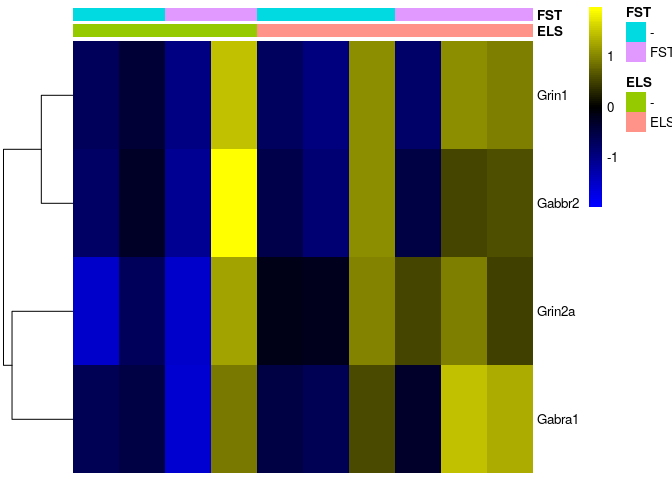<!-- -->

it becomes apparent, that this finding does not look significant

Further, they claim that there is restricted list of genes selectively induced by AS in ELS mice (Per1, Npy, Nfkbia, Penk,Dusp1, Cst3, Trib1, Htra1, Sdc4, Plekhf1) but not non-ELS mice.

```r
sehm(se,c("Per1", "Npy", "Nfkbia", "Penk","Dusp1", "Cst3", "Trib1", "Htra1", "Sdc4", "Plekhf1"),do.scale = T,anno_columns = c("ELS","FST"), cluster_rows = T)
```

```
## Assay unspecified, and multiple assays present - will use the first one.
```

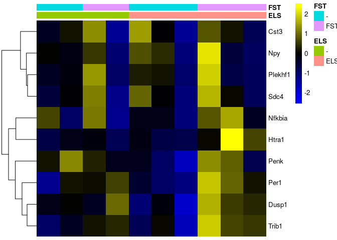<!-- -->

it becomes apparent, that this finding also does not look significant. while these genes might be increased in expression in ELS mice it is hard to see this being a significant finding, especially, since the same effect can be observed for one replicate in the non-ELS group.

The authors claim that there are a number of genes that appear to be induced by AS in both ELS and non ELS mice. these include (Egr1/2/4, Arc, Fos, and Fosb)

```r
sehm(se,c("Egr1", "Egr2", "Egr4", "Arc","Fos", "Fosb"),do.scale = T,anno_columns = c("ELS","FST"), cluster_rows = T)
```

```
## Assay unspecified, and multiple assays present - will use the first one.
```

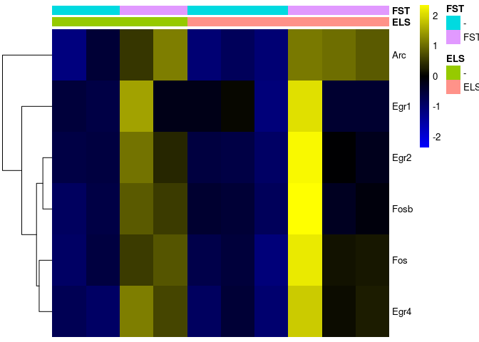<!-- -->

For these genes it looks as if their finding might be significant.

Let's investigate the whole data with a statistical approach using egeR and a GLM type of analysis for swim effects, early life effects and interactions

```r
#experimental design, interactive model
design <- model.matrix(~se$FST * se$ELS)

y <- DGEList(counts=assays(se)$counts)
y <- calcNormFactors(y)
y <- estimateDisp(y,design)

#filter out genes that are below 10 counts in more than 75% of samples
keep <- rowSums(y$counts>10) >= 3
y <- y[keep, , keep.lib.sizes=FALSE]

Results <- list()
fit <- glmQLFit(y,design)
for(i in colnames(design)[-1]){
  Results[[i]] <- glmQLFTest(fit, i)
}
```

Les's investigate if there are any genes altered by acute stress

```r
topTags(Results$`se$FSTFST`)
```

```
## Coefficient:  se$FSTFST 
##                    logFC     logCPM        F       PValue       FDR
## Egr4           1.6038991  5.7505595 36.18535 0.0002791774 0.9998789
## Fosb           1.8118578  4.3293570 33.42274 0.0003661358 0.9998789
## Fos            2.0432109  5.0034903 28.88731 0.0005964378 0.9998789
## Gm5512        -8.2595235  0.3448037 25.38270 0.0013409953 0.9998789
## Junb           0.9982473  6.6687879 20.91143 0.0016709411 0.9998789
## Egr2           2.1916348  2.3019725 20.19281 0.0018594674 0.9998789
## 1700097M23Rik  4.1301489 -1.6566493 19.11199 0.0021957540 0.9998789
## Malat1         1.5995184  5.4088881 17.39563 0.0029015784 0.9998789
## Chd9           0.7398438  7.8604379 16.35602 0.0034689102 0.9998789
## Gm37913        3.9608591 -1.3931293 16.12495 0.0036132968 0.9998789
```

Even though the data looked promising unfortunately nothing survives mutliple testing correction. This indicates that this study might be severly underpowered, so in order to resolve FST specific effects more replicats would be needed.


Are there any genes altered by early life stress?

```r
topTags(Results$`se$ELSELS`)
```

```
## Coefficient:  se$ELSELS 
##                   logFC    logCPM        F       PValue FDR
## Pcdha4        1.0550815  3.491070 24.65741 0.0009972708   1
## Gm44509       0.9347748  4.396180 18.33232 0.0024862780   1
## 1700097M23Rik 3.7971411 -1.656649 17.24489 0.0029762659   1
## Sh2d1a        1.6618069  1.240767 16.86243 0.0031767861   1
## Gm13302       6.3582552 -1.672472 18.48583 0.0032719111   1
## Dzip1         0.6468568  5.017980 15.29639 0.0041967298   1
## Gm37913       3.5470981 -1.393129 13.84946 0.0055273749   1
## Itgbl1        0.9479914  4.132365 12.30185 0.0075884522   1
## Gm43031       1.4902439 -1.213452 11.03839 0.0100263389   1
## Tram1         0.7534935  3.750666 10.67911 0.0108927795   1
```

Unfortunately, there are no genes that pass the multiple testing correction

Let's investigate if there are genes with a significant interaction

```r
topTags(Results$`se$FSTFST:se$ELSELS`)
```

```
## Coefficient:  se$FSTFST:se$ELSELS 
##                    logFC     logCPM        F      PValue       FDR
## Gm3005        -7.4613928 -0.6372222 31.57015 0.001171354 0.9999542
## Gm26592       -2.1051747  0.5447415 20.76917 0.001706304 0.9999542
## Gm5512         8.1621366  0.3448037 19.57411 0.002798595 0.9999542
## Malat1        -1.9776831  5.4088881 16.37696 0.003456181 0.9999542
## 1700097M23Rik -4.3883648 -1.6566493 15.38290 0.004130573 0.9999542
## Gm37913       -4.5854714 -1.3931293 14.99473 0.004437983 0.9999542
## Grm2           0.8844781  4.4224252 12.57166 0.007167494 0.9999542
## Zfp422-ps     14.1592327 -1.3494508 18.07735 0.007195695 0.9999542
## Gpr17          2.2463061  2.6906550 12.52967 0.007231057 0.9999542
## Unc5b          2.1885071  2.7225580 12.01537 0.008069776 0.9999542
```

Unfortunately, no genes have a altered acute stress response in ELS vs normal animals

# Meta-Analysis of all data

## Additive model
Let's run an overarching analysis over all data to determine if there are any significant effects for acute stress (=FST), Genotype, GEOdataset or early life stress

```r
se <- kallistodata

#experimental design, full additive model
design <- model.matrix(~se$FST + se$Sex + se$Genotype + se$Set + se$ELS)

y <- DGEList(counts=assays(se)$counts)
y <- calcNormFactors(y)
y <- estimateDisp(y,design)

#filter out genes that are below 10 counts in more than 75% of samples
keep <- rowSums(y$counts>10) >= 5
y <- y[keep, , keep.lib.sizes=FALSE]

Results <- list()
fit <- glmQLFit(y,design)
for(i in colnames(design)[-1]){
  Results[[i]] <- glmQLFTest(fit, i)
}
```

Les's investigate if there are any genes altered by acute stress

```r
topTags(Results$`se$FSTFST`)
```

```
## Coefficient:  se$FSTFST 
##           logFC   logCPM         F       PValue          FDR
## Egr4  1.4504092 5.700383 214.14618 5.534782e-11 7.942412e-07
## Fos   2.1211555 4.906998 149.96297 8.624405e-10 6.188011e-06
## Egr2  2.3426004 2.247529 134.08514 2.007587e-09 9.602956e-06
## Fosb  1.4963321 4.223948 110.24820 8.589276e-09 3.081403e-05
## Nr4a1 1.1486927 6.534812  87.33636 4.627058e-08 1.327966e-04
## Sik1  1.1092486 3.493908  77.98207 1.028066e-07 2.458792e-04
## Junb  0.9520758 6.615866  67.02760 2.918232e-07 5.982375e-04
## Dusp5 1.1245332 5.633421  57.96897 7.723457e-07 1.385395e-03
## Arc   1.3361997 7.613828  49.21993 2.232716e-06 3.559942e-03
## Egr1  0.8278663 8.097496  34.85452 1.828139e-05 2.623379e-02
```
Indeed, there are multiple candidate genes that are significantly altered by acute stress across other Conditions

Are there any genes altered by sex

```r
topTags(Results$`se$Sexfemale`)
```

```
## Coefficient:  se$Sexfemale 
##               logFC   logCPM          F       PValue          FDR
## Eif2s3y -11.3972639 3.455656 1281.93513 2.172442e-13 3.117454e-09
## Uty     -10.3866137 2.653583  432.75005 1.184239e-10 8.496914e-07
## Kdm5d    -2.8606312 1.942235  128.78858 2.715137e-09 1.298741e-05
## Ddx3y   -11.8469936 4.146537  125.85803 1.215087e-07 4.359125e-04
## mt-Nd5    3.0704215 5.319974   47.54160 2.782169e-06 7.984825e-03
## Eif2s3x   0.8739168 7.331434   39.41080 8.845076e-06 2.115447e-02
## Pou3f1   -1.2923702 6.737009   35.91281 1.535610e-05 3.148001e-02
## Midn     -0.6843066 5.651226   33.51025 2.293767e-05 4.114445e-02
## mt-Nd6    3.3953597 4.653982   32.61893 2.675486e-05 4.265914e-02
## Spry4    -0.7043658 4.093567   28.19129 6.014896e-05 8.631376e-02
```
Indeed, there are multiple candidate genes that are significantly altered by sex across other FSTs


Are there any genes altered by BDNF Val66Met phenotype?

```r
topTags(Results$`se$GenotypeBDNFMET`)
```

```
## Coefficient:  se$GenotypeBDNFMET 
##                   logFC     logCPM        F       PValue       FDR
## Bloc1s6       1.6845415  3.6033657 31.83990 3.068073e-05 0.2304958
## Cd59a        -1.7142445  1.9530726 31.58108 3.212485e-05 0.2304958
## Tcp11l1       1.4606140  2.8547082 23.37359 1.606079e-04 0.4938836
## Luzp1         0.6417807  7.1666383 18.10729 5.481633e-04 0.4938836
## Prl           7.0088172  3.3317522 18.10258 5.488134e-04 0.4938836
## Alg3          1.3060785  2.0287865 17.24838 6.823469e-04 0.4938836
## RP23-78D19.4 -3.6049972 -0.1249779 16.74718 7.775085e-04 0.4938836
## Strc         -1.3320817  0.4421829 16.53116 8.230530e-04 0.4938836
## Fyttd1        0.5620122  6.8522505 16.01712 9.439905e-04 0.4938836
## Reps2         0.5554824  8.6385483 15.48113 1.091807e-03 0.4938836
```

Unfortunately, there are no genes that pass the multiple testing correction

Are there any genes altered early life stress?

```r
topTags(Results$`se$ELSELS`)
```

```
## Coefficient:  se$ELSELS 
##                   logFC     logCPM         F      PValue       FDR
## RP23-445H7.1  0.7291894 2.74282804 15.428622 0.001107636 0.9997824
## Scel          0.8256697 0.06239698 12.354656 0.002700464 0.9997824
## Rrp15        -0.7312827 3.30166498 11.562444 0.003456599 0.9997824
## Gm2163        1.6578356 0.62733603  9.331060 0.007248642 0.9997824
## Map2k5       -0.5565325 5.51777906  8.849308 0.008589268 0.9997824
## Psip1         0.4244342 8.26355564  8.842136 0.008611245 0.9997824
## Serbp1        0.4102638 8.22281402  8.387176 0.010144830 0.9997824
## Atpaf2       -0.4073688 4.44786602  8.224273 0.010767483 0.9997824
## Rsl1d1        0.3888628 6.32758454  8.186028 0.010919874 0.9997824
## Wipf3        -0.4153641 9.72897807  7.749044 0.012846572 0.9997824
```

Unfortunately, there are no genes that pass the multiple testing correction

Let's plot the top 10 genes for both sex and acute stress

```r
genes <- append(rownames(topTags(Results$`se$FSTFST`)),rownames(topTags(Results$`se$Sexfemale`)))
sehm(se,genes,do.scale = T,anno_columns = c("ELS","FST","Genotype","Sex","Set"), cluster_rows = T,assayName = "logcpm")
```

<!-- -->

## Interactive models

To futher investigate if across all samples there is any variable that interacts with acute stress we will run a series of models that incorporate an interaction term between acute stress and any of the variables

Interaction between acute stress and sex

```r
se <- kallistodata

#experimental design, full additive model
design <- model.matrix(~se$FST + se$Sex + se$Genotype + se$Set + se$ELS + se$FST:se$Sex)

y <- DGEList(counts=assays(se)$counts)
y <- calcNormFactors(y)
y <- estimateDisp(y,design)

#filter out genes that are below 10 counts in more than 75% of samples
keep <- rowSums(y$counts>10) >= 5
y <- y[keep, , keep.lib.sizes=FALSE]

Results <- list()
fit <- glmQLFit(y,design)
for(i in colnames(design)[-1]){
  Results[[i]] <- glmQLFTest(fit, i)
}
topTags(Results$`se$FSTFST:se$Sexfemale`)
```

```
## Coefficient:  se$FSTFST:se$Sexfemale 
##                     logFC   logCPM        F       PValue       FDR
## Gm7334         -6.0223741 2.107368 34.53506 2.563838e-05 0.3679107
## Kif21b        -10.8360015 2.714365 29.82917 5.653189e-05 0.4056163
## Fam188a         2.1019997 4.390972 22.96818 2.117413e-04 0.4086247
## Ubn2           -1.6943395 4.736426 21.86337 2.679811e-04 0.4086247
## Prl             8.8870114 3.331719 21.32279 3.015273e-04 0.4086247
## Pank2           0.9957106 5.171426 20.13491 3.933115e-04 0.4086247
## Senp3           1.0344960 6.345719 20.04882 4.011061e-04 0.4086247
## Lpp            -1.9584555 2.549406 19.05491 5.049718e-04 0.4086247
## RP23-296J10.4   2.7487142 0.354647 19.01561 5.096644e-04 0.4086247
## Gabra2         -1.8827833 6.049112 18.89101 5.248717e-04 0.4086247
```

Interaction between acute stress and genotype

```r
se <- kallistodata

#experimental design, full additive model
design <- model.matrix(~se$FST + se$Sex + se$Genotype + se$Set + se$ELS + se$FST:se$Genotype)

y <- DGEList(counts=assays(se)$counts)
y <- calcNormFactors(y)
y <- estimateDisp(y,design)

#filter out genes that are below 10 counts in more than 75% of samples
keep <- rowSums(y$counts>10) >= 5
y <- y[keep, , keep.lib.sizes=FALSE]

Results <- list()
fit <- glmQLFit(y,design)
for(i in colnames(design)[-1]){
  Results[[i]] <- glmQLFTest(fit, i)
}
topTags(Results$`se$FSTFST:se$GenotypeBDNFMET`)
```

```
## Coefficient:  se$FSTFST:se$GenotypeBDNFMET 
##              logFC     logCPM        F      PValue FDR
## Ewsr1   -1.7706958  7.6500141 22.37867 0.000237697   1
## Gm21887  9.3253759 -0.7827304 15.64275 0.001172237   1
## Col16a1 -3.1179239  0.3005901 15.40221 0.001249282   1
## Fus     -1.6877873  7.5408160 14.86476 0.001443066   1
## Dock8   -1.5024701  1.0548835 14.35271 0.001659922   1
## Akap8l  -1.4276762  5.3688279 13.49152 0.002113366   1
## Odf2    -0.6483425  5.6624578 12.47768 0.002837640   1
## Zfp326  -1.1320009  4.6578121 12.01198 0.003262035   1
## Tcerg1  -0.6953703  6.3125474 11.80832 0.003469940   1
## Zfhx2   -0.8132302  5.7165769 11.30815 0.004047556   1
```

Interaction between acute stress and early life stress

```r
se <- kallistodata

#experimental design, full additive model
design <- model.matrix(~se$FST + se$Sex + se$Genotype + se$Set + se$ELS + se$FST:se$ELS)

y <- DGEList(counts=assays(se)$counts)
y <- calcNormFactors(y)
y <- estimateDisp(y,design)

#filter out genes that are below 10 counts in more than 75% of samples
keep <- rowSums(y$counts>10) >= 5
y <- y[keep, , keep.lib.sizes=FALSE]

Results <- list()
fit <- glmQLFit(y,design)
for(i in colnames(design)[-1]){
  Results[[i]] <- glmQLFTest(fit, i)
}
topTags(Results$`se$FSTFST:se$ELSELS`)
```

```
## Coefficient:  se$FSTFST:se$ELSELS 
##                   logFC     logCPM         F      PValue       FDR
## Tle6         -8.3838132 -2.0619858 15.927420 0.004290684 0.9998963
## Rnf17         2.1829788 -1.1268002  9.996751 0.006147753 0.9998963
## RP23-350C1.3 -0.7432265  3.3888494  7.777253 0.013302994 0.9998963
## Sft2d1        1.5111840  2.1036793  7.709440 0.013639248 0.9998963
## Il10ra        7.4729952 -1.0775602  8.569959 0.014090639 0.9998963
## Hmga2        -1.2740607 -0.7474069  7.614444 0.014126765 0.9998963
## Lpxn          1.6385444 -0.4100400  7.585094 0.014281399 0.9998963
## Cpne9        -1.0049819  3.7046973  7.483760 0.014830367 0.9998963
## Klk6          2.6615497 -1.0843417  7.366486 0.015496087 0.9998963
## Zfp184       -1.2712686  1.1947448  7.364628 0.015506905 0.9998963
```

# DESeq2 analysis


```r
suppressPackageStartupMessages({
  library(DESeq2)
  library(sva)
  library(SEtools)
  library(RUVSeq)
})
```

## GSE100579


```r
dat1 <- readRDS("data/TRAPReanalysis.SE.rds")
dat1 <- dat1[,dat1$Set=="GSE100579"]
dat1$Genotype <- factor(gsub(" ","",dat1$Geontype), c("WildType","BDNFMET"))
dat1$Geontype <- NULL
dat1$Condition <- relevel(dat1$Condition, "None")
dds1 <- DESeqDataSetFromMatrix( round(assay(dat1)), colData=colData(dat1),
        design=~Gender+Genotype+Condition+Gender:Condition )
```

```
## converting counts to integer mode
```

```r
dds1 <- DESeq(dds1)
```

```
## estimating size factors
```

```
## estimating dispersions
```

```
## gene-wise dispersion estimates
```

```
## mean-dispersion relationship
```

```
## final dispersion estimates
```

```
## fitting model and testing
```

```r
# so that we plot the DESeq-normalized counts:
dat1 <- dat1[row.names(dds1),]
assays(dat1)$lognorm <- log1p(counts(dds1, normalized=TRUE))
rowData(dat1)$logCount <- rowMeans(assays(dat1)$lognorm)
resultsNames(dds1)
```

```
## [1] "Intercept"                    "Gender_male_vs_female"       
## [3] "Genotype_BDNFMET_vs_WildType" "Condition_FST_vs_None"       
## [5] "Gendermale.ConditionFST"
```

### Gender


```r
res <- results(dds1, name = "Gender_male_vs_female")
DESeq2::plotMA(res)
```

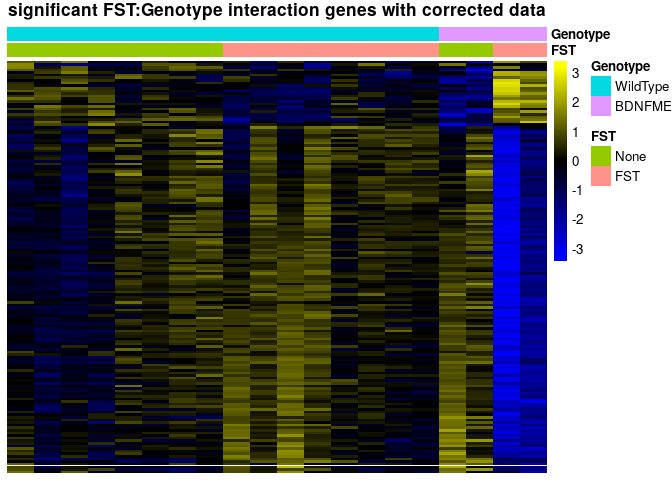<!-- -->

```r
res <- res[order(res$padj),]
res[1:10,c(1,2,6)]
```

```
## log2 fold change (MLE): Gender male vs female 
##  
## DataFrame with 10 rows and 3 columns
##                      baseMean    log2FoldChange                 padj
##                     <numeric>         <numeric>            <numeric>
## Eif2s3y      122.791182786686  10.5552973730317 1.36633873845082e-12
## Uty          63.3430109663942  9.51227575491639 5.09910378833115e-09
## mt-Nd6       1028.98753574723 -4.04837754404466 2.01562842939399e-08
## mt-Nd5       1530.78741798555 -3.13560948784148 1.52739978526259e-06
## mt-Nd4l      114.913743497368 -3.35354502970457 2.44749607206237e-06
## RP23-79J21.3 170.482380512494 -9.35051954513531 1.07903233626343e-05
## mt-Cytb      3264.72233986684 -3.16657443595393 9.15561008912049e-05
## Isoc1        220.063533276626  1.54518563271461 0.000981816928782544
## Kdm5d        51.1779535718484  2.34778349930873  0.00159609056146675
## mt-Nd4       3621.04369384629 -3.02972930610121  0.00159609056146675
```

```r
dat1 <- dat1[,order(dat1$Gender, dat1$Condition, dat1$Genotype, dat1$Estrodiol)]
sehm(dat1, row.names(res)[which(res$padj<0.05)], assayName = "lognorm", do.scale = TRUE, anno_row="logCount", anno_columns=c("Gender","Genotype","Condition"), main="Differentially-expressed across sex")
```

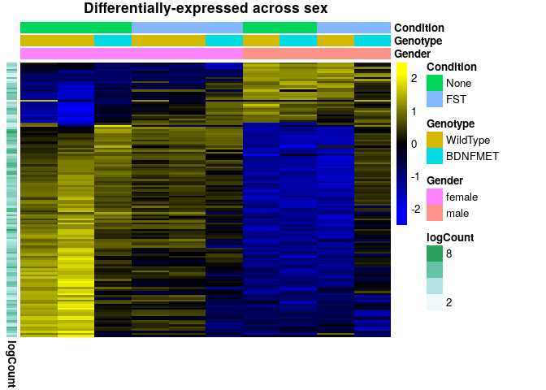<!-- -->

### FST


```r
res <- results(dds1, name = "Condition_FST_vs_None")
DESeq2::plotMA(res)
```

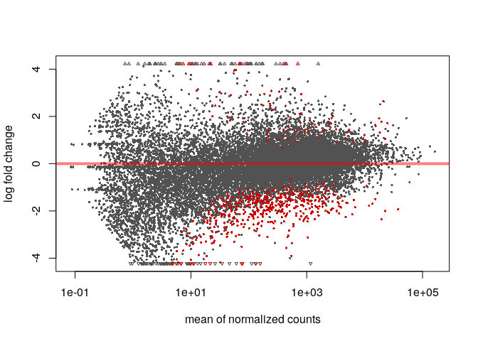<!-- -->

```r
res <- res[order(res$padj),]
dat1 <- dat1[,order(dat1$Condition, dat1$Gender, dat1$Genotype, dat1$Estrodiol)]
sehm(dat1, row.names(res)[which(res$padj<0.05)], assayName = "lognorm", do.scale = TRUE, anno_row="logCount", anno_columns=c("Gender","Genotype","Condition"), main="Differentially-expressed upon FST")
```

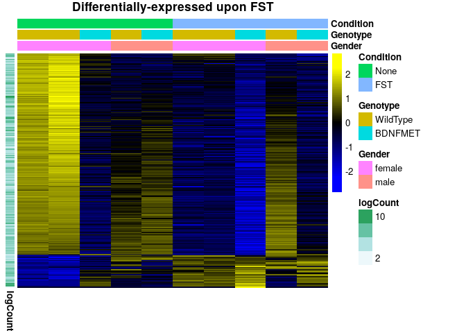<!-- -->

Here you see exactly why I don't use DESeq: it gives significance even when there are large intra-group differences...

### Genotype


```r
res <- results(dds1, name = "Genotype_BDNFMET_vs_WildType")
DESeq2::plotMA(res)
```

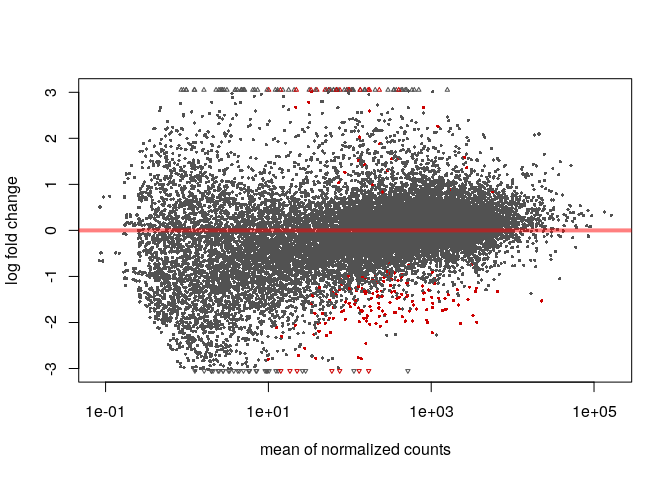<!-- -->

```r
res <- res[order(res$padj),]
dat1 <- dat1[,order(dat1$Genotype, dat1$Gender, dat1$Condition, dat1$Estrodiol)]
sehm(dat1, row.names(res)[which(res$padj<0.05)], assayName = "lognorm", do.scale = TRUE, anno_row="logCount", anno_columns=c("Gender","Genotype","Condition"), main="Differentially-expressed between genotypes")
```

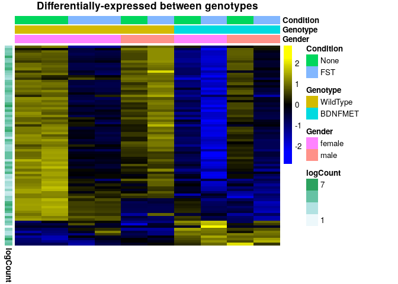<!-- -->

### Gender:FST


```r
res <- results(dds1, name = "Gendermale.ConditionFST")
DESeq2::plotMA(res)
```

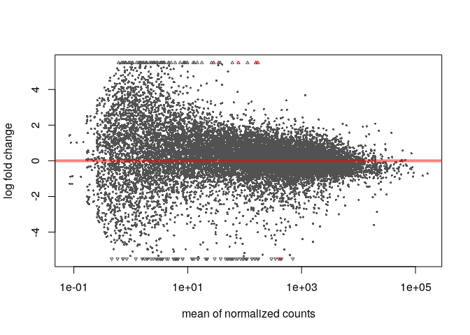<!-- -->

```r
res <- res[order(res$padj),]
res[1:10,c(1,2,6)]
```

```
## log2 fold change (MLE): Gendermale.ConditionFST 
##  
## DataFrame with 10 rows and 3 columns
##                        baseMean    log2FoldChange                padj
##                       <numeric>         <numeric>           <numeric>
## Kif21b         157.254888395985  11.5416001406442  8.327045552865e-12
## Prl            399.300466506735 -27.2086386398503  8.327045552865e-12
## RP23-79J21.3   170.482380512494    9.400259764053 0.00368315797411733
## Adam17         28.6208852519238  29.1638341433759 0.00740642594517875
## Gm7334         77.7361628931088  6.97708958416607 0.00740642594517875
## RP23-383I16.10 2.27583992822997  23.4598166549847   0.100031864734813
## RP23-296J10.4  26.4159281854754 -3.53835156662938   0.153154133700006
## Rgs3           142.768625912451  2.12445972549454   0.208686485228906
## Gm26602         49.284269495508 -4.16816452045699   0.227847707579368
## Sync           4.22945093339104 -10.0425261654646   0.408606744931254
```

```r
dat1 <- dat1[,order(dat1$Gender, dat1$Condition, dat1$Genotype, dat1$Estrodiol)]
sehm(dat1, row.names(res)[which(res$padj<0.05)], assayName = "lognorm", do.scale = TRUE,  anno_row="logCount", anno_columns=c("Gender","Genotype","Condition"), main="Sex-dependent effects of FST")
```

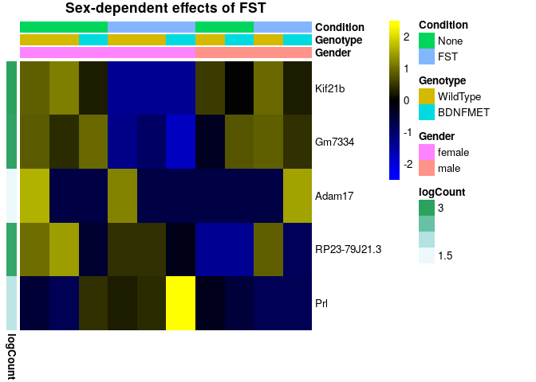<!-- -->

The MA-plot shows a suspicious trend. Adam17 and Prl are clearly artefacts of low counts (filtering improves both edgeR and DESeq2), especially given the trend shown by the MA-plot. RP23 is another of these weird DESeq2 calls. Kif21b and Gm7334 could be something (but see below).

# DESeq2 analysis with randomized variable reassignments

Out of interest, lets see what happens if we randomly shuffle samples and re-run the analysis


```r
suppressPackageStartupMessages({
  library(DESeq2)
  library(sva)
  library(SEtools)
  library(RUVSeq)
})
```

## GSE100579


```r
dat1 <- readRDS("data/TRAPReanalysis.SE.rds")
dat1 <- dat1[,dat1$Set=="GSE100579"]
dat1$Genotype <- factor(gsub(" ","",dat1$Geontype), c("WildType","BDNFMET"))
dat1$Geontype <- NULL
dat1$Condition <- relevel(dat1$Condition, "None")

shuffle <- sample(1:length(dat1$Condition))
dat1$Condition <- dat1$Condition[shuffle]
dat1$Genotype <- dat1$Genotype[shuffle]
dat1$Gender <- dat1$Gender[shuffle]

dds1 <- DESeqDataSetFromMatrix( round(assay(dat1)), colData=colData(dat1),
        design=~Gender+Genotype+Condition+Gender:Condition )
```

```
## converting counts to integer mode
```

```r
dds1 <- DESeq(dds1)
```

```
## estimating size factors
```

```
## estimating dispersions
```

```
## gene-wise dispersion estimates
```

```
## mean-dispersion relationship
```

```
## final dispersion estimates
```

```
## fitting model and testing
```

```r
# so that we plot the DESeq-normalized counts:
dat1 <- dat1[row.names(dds1),]
assays(dat1)$lognorm <- log1p(counts(dds1, normalized=TRUE))
rowData(dat1)$logCount <- rowMeans(assays(dat1)$lognorm)
resultsNames(dds1)
```

```
## [1] "Intercept"                    "Gender_male_vs_female"       
## [3] "Genotype_BDNFMET_vs_WildType" "Condition_FST_vs_None"       
## [5] "Gendermale.ConditionFST"
```

### Gender


```r
res <- results(dds1, name = "Gender_male_vs_female")
DESeq2::plotMA(res)
```

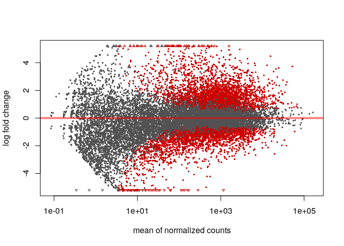<!-- -->

```r
res <- res[order(res$padj),]
res[1:10,c(1,2,6)]
```

```
## log2 fold change (MLE): Gender male vs female 
##  
## DataFrame with 10 rows and 3 columns
##                  baseMean    log2FoldChange                 padj
##                 <numeric>         <numeric>            <numeric>
## Iqck     134.536842830702 -5.34181312537072 5.36189209887193e-09
## Nfrkb    301.712117404272  5.21339143258891 8.00362580937105e-08
## Pcdha7   91.8239688297354  10.3220568633567 2.67489880756925e-07
## Gm10273  112.252657527773 -9.25757345678779 1.14191374249326e-06
## Kpna2    497.992513740069  2.51364475019637 1.14191374249326e-06
## Supt5    1090.98675384226  3.78116094994428 1.14191374249326e-06
## Dzip3    427.025320222989  4.36582637502582 1.35861286004781e-06
## Arhgef11 1042.80332563619  4.86244787258805 1.68362745964393e-06
## Cacna1d  75.6159063387564  9.73869527349512 1.68362745964393e-06
## Tbc1d1   219.062080331342  3.84253512915614 1.68362745964393e-06
```

```r
dat1 <- dat1[,order(dat1$Gender, dat1$Condition, dat1$Genotype, dat1$Estrodiol)]
sehm(dat1, row.names(res)[which(res$padj<0.05)], assayName = "lognorm", do.scale = TRUE, anno_row="logCount", anno_columns=c("Gender","Genotype","Condition"), main="Differentially-expressed across sex")
```

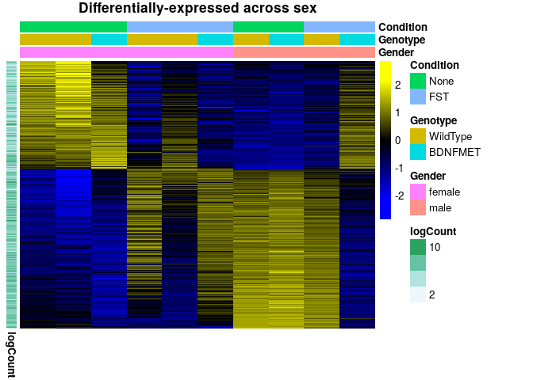<!-- -->

### FST


```r
res <- results(dds1, name = "Condition_FST_vs_None")
DESeq2::plotMA(res)
```

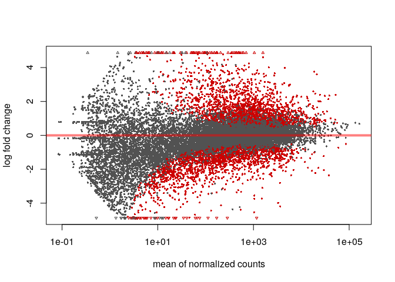<!-- -->

```r
res <- res[order(res$padj),]
dat1 <- dat1[,order(dat1$Condition, dat1$Gender, dat1$Genotype, dat1$Estrodiol)]
sehm(dat1, row.names(res)[which(res$padj<0.05)], assayName = "lognorm", do.scale = TRUE, anno_row="logCount", anno_columns=c("Gender","Genotype","Condition"), main="Differentially-expressed upon FST")
```

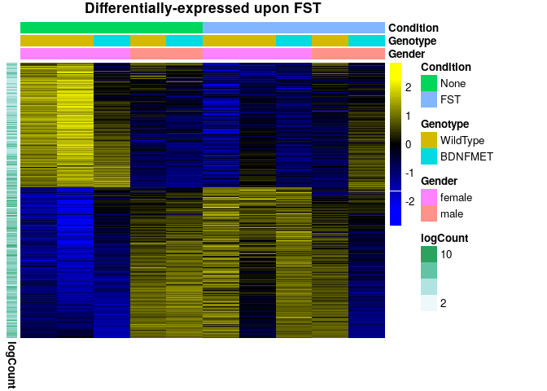<!-- -->

Here you see exactly why I don't use DESeq: it gives significance even when there are large intra-group differences...

### Genotype


```r
res <- results(dds1, name = "Genotype_BDNFMET_vs_WildType")
DESeq2::plotMA(res)
```

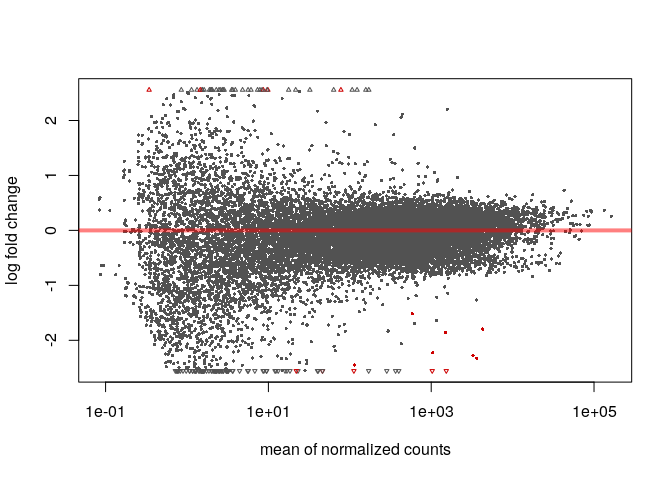<!-- -->

```r
res <- res[order(res$padj),]
dat1 <- dat1[,order(dat1$Genotype, dat1$Gender, dat1$Condition, dat1$Estrodiol)]
sehm(dat1, row.names(res)[which(res$padj<0.05)], assayName = "lognorm", do.scale = TRUE, anno_row="logCount", anno_columns=c("Gender","Genotype","Condition"), main="Differentially-expressed between genotypes")
```

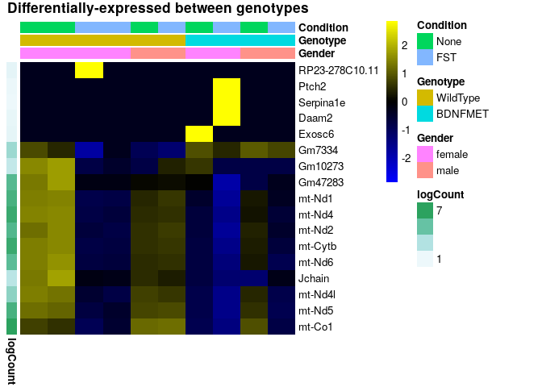<!-- -->

### Gender:FST


```r
res <- results(dds1, name = "Gendermale.ConditionFST")
DESeq2::plotMA(res)
```

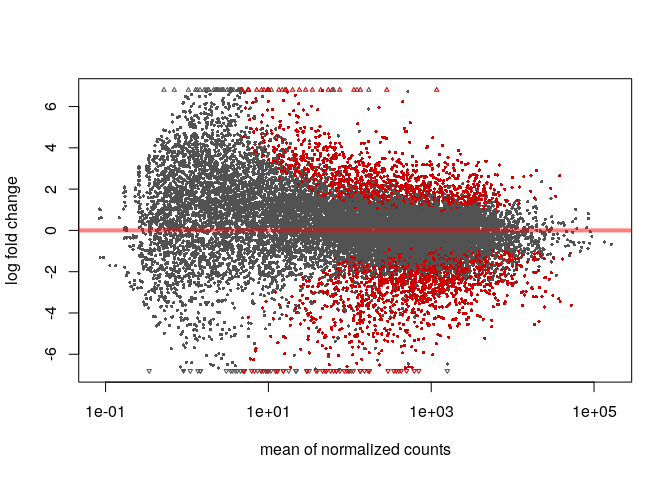<!-- -->

```r
res <- res[order(res$padj),]
res[1:10,c(1,2,6)]
```

```
## log2 fold change (MLE): Gendermale.ConditionFST 
##  
## DataFrame with 10 rows and 3 columns
##                       baseMean    log2FoldChange                 padj
##                      <numeric>         <numeric>            <numeric>
## Wnk3          38.5737971641753 -9.89062437824008 3.11594996442549e-10
## Iqck          134.536842830702  6.87868909828731 8.59868401331285e-09
## Gm10273       112.252657527773  13.4782669026697 2.56539251059517e-08
## Zfp202        12.9807374364723 -14.4805977959014 1.75924340093075e-07
## RP23-355G16.1 29.8088523324639  -13.543821045657 1.15762132347755e-06
## Cd72           228.44259518783  5.95277657325758 1.40447157070274e-06
## Slx4ip        68.6917814413568 -10.7279197506822 3.54356693794027e-06
## Ppp4r1        63.1791292904814 -8.86896153315933 4.89956467417618e-06
## Kpna2         497.992513740069 -3.23774738816984 1.27553431694308e-05
## Pcdha7        91.8239688297354 -10.7920569385428 1.27553431694308e-05
```

```r
dat1 <- dat1[,order(dat1$Gender, dat1$Condition, dat1$Genotype, dat1$Estrodiol)]
sehm(dat1, row.names(res)[which(res$padj<0.05)], assayName = "lognorm", do.scale = TRUE,  anno_row="logCount", anno_columns=c("Gender","Genotype","Condition"), main="Sex-dependent effects of FST")
```

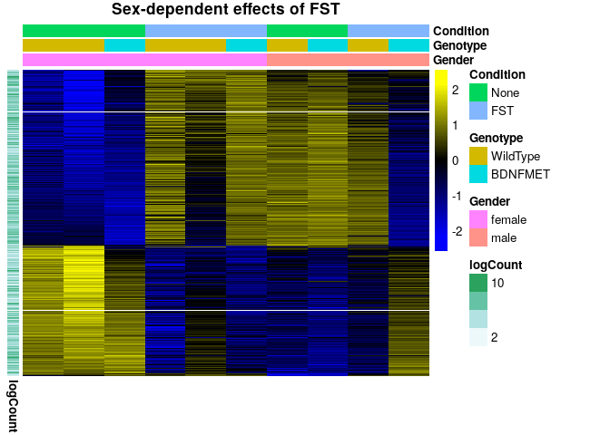<!-- -->

The MA-plot shows a suspicious trend. Adam17 and Prl are clearly artefacts of low counts (filtering improves both edgeR and DESeq2), especially given the trend shown by the MA-plot. RP23 is another of these weird DESeq2 calls. Kif21b and Gm7334 could be something (but see below).


