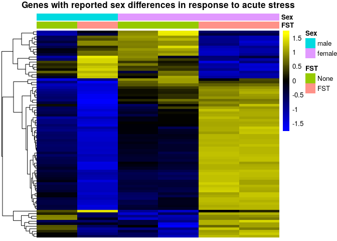
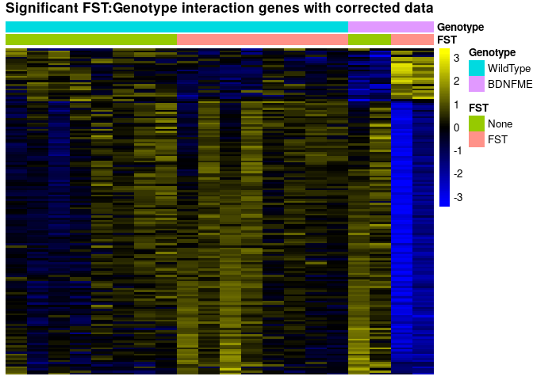
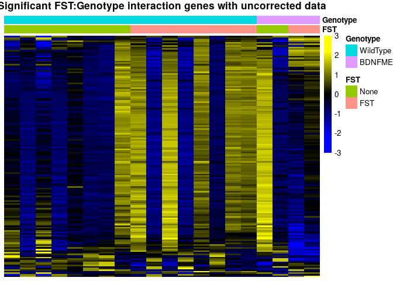

# Reassessing the effects of acute stress on the translatome of hippocampal neurons

## About this re-analysis

Here, we outline the re-analysis of two GEO datasets, [GSE100579](https://www.ncbi.nlm.nih.gov/geo/query/acc.cgi?acc=GSE100579) and [GSE131972](www.ncbi.nlm.nih.gov/geo/query/acc.cgi?acc=GSE131972), both of which are investigating the effect of acute stress on the translatome (TRAP-seq) of CA3 pyramidal neurons in the mouse hippocampus. The exact annotation of the samples is available at [here](metadata/s2c.csv).

These datasets were used for three separate publications:

* [Marrocco J. et al. 2017](https://doi.org/10.1038/s41467-017-01014-4); 
A sexually dimorphic pre-stressed translational signature in CA3 pyramidal neurons of BDNF Val66Met mice; Nature Communications volume 8, Article number: 808 (2017)
* [Gray J. D. et al. 2018](https://dx.doi.org/10.1038%2Fmp.2016.219); 
Translational profiling of stress-induced neuroplasticity in the CA3 pyramidal neurons of BDNF Val66Met mice; Molecular Psychiatry volume 23, pages 904–913
* [Marrocco J. et al. 2019](https://doi.org/10.3389/fnbeh.2019.00157); 
Early Life Stress Restricts Translational Reactivity in CA3 Neurons Associated With Altered Stress Responses in Adulthood; Front. Behav. Neurosci. 

We show that a number of the analyses and claims made in these publications are well not supported by the data and not reproducible across the two datasets. The use of appropriate statistical methods to uncover interactions fails to demonstrate significant sexually dimorphic or early-life-dependent responses to stress, highlighting the fact that these studies were underpowered to address such questions.


***

# Methods

We acquired the deposited raw sequencing fastq files from the online repositories GSE100579 (10 sequencing runs for (Marrocco et al. 2017, Gray et al. 2018) and GSE131972 (sequencing 10 runs for (Marrocco et al. 2019)) and used kallisto (DOI:10.1038/nbt.3519, version 0.44.0) for the pseudoalignment of reads on the GENCODE M17 transcriptome, with an estimated fragment length of 200 ±20. However, we also reproduced the analysis using a [different quantification](salmonBased.Rmd).

# Re-analysis of published results

We first load the necessary packages and the data:


```r
library(edgeR)
library(SEtools)
library(SummarizedExperiment)
library(sva)
library(DESeq2)
source("misc.R")
kallistodata <- readRDS("data/AllData.kallisto.SE.rds")
set.seed(12345)
```

Because we later provide a meta-analysis of the datasets, we will work on a uniform, [kallisto](https://pachterlab.github.io/kallisto/about)-based quantification.
However, the re-assessment of the authors' original claims were also reproduced using an alternative quantification method (see [salmonBased.md](salmonBased.md)).

## Assessment of the reported sex-specific responses from Marrocco et al. 2017

In the 2017 publication the authors report that numerous genes are differentially regulated between males and females after acute stress. Unfortunately, they do not include a list with all genes in the publication, but [Table 1](https://www.nature.com/articles/s41467-017-01014-4/tables/1) contains a subsets of genes that are reported as differentially regulated between males and females upon acute stress (forced swim test - FST). First, we inspect the expression pattern of these genes across the runs used in the original publication in WildType animals:


```r
se <- kallistodata
se <- subset(se,select  = se$Set == "GSE100579" & se$Genotype == "WildType")
genes <- read.table("metadata/Marrocco2017GenderStressGenes.csv", sep = ";", header = T)$genes
se <- se[,order(se$Sex,se$FST)]
sehm(se, genes, do.scale=T, assayName="logcpm", anno_columns=c("FST","Sex"),
     cluster_rows = T, main = "Genes with reported sex differences in response to acute stress")
```

<!-- -->

Rows in the plot represent the reported genes, while the columns are samples, and the colors represent variance-scaled log-normalized expression values (i.e. row z-scores). From this plot, it indeed looks like these genes have a very different response to FST in males and females. However, 6 independent samples is insufficient to investigate 4 experimental groups.

The same study also includes males and females from a different genotype (BDNF mutants) exposed to stress, and we can inspect the behavior of those genes in these additional samples: 


```r
se <- kallistodata
se <- subset(se,select  = se$Set == "GSE100579")
se <- se[,order(se$Genotype,se$Sex,se$FST)]
sehm(se, genes, do.scale=T, assayName="logcpm", anno_columns=c("FST","Sex","Genotype"),
     cluster_rows = T, main = "Genes with reported sex differences in response to acute stress",
     gaps_at = "Genotype")
```

<!-- -->

We here observe that the BDNF mutant males appear to have an expression pattern, for the reported genes, which mimics the wildtype females, while the mutant females not exposed to stress have an expression pattern, for those genes, which resembles that of stressed wildtype females. While it is possible that the mutation entirely reverses the expression pattern of thoses genes, most groups are represented by a single sample, and an arguably more likely explanation would be that these co-expressed genes are the result of random variation unrelated to the experimental variables. To test this, we can include the second dataset ([GSE131972](www.ncbi.nlm.nih.gov/geo/query/acc.cgi?acc=GSE131972)):


```r
se <- kallistodata
se <- subset(se,select  = se$ELS == "None" & se$Genotype == "WildType")
se <- se[,order(se$Set,se$Sex,se$FST)]
sehm(se,genes,do.scale = T,anno_columns = c("FST","Sex","Set"), gaps_at = "Set", cluster_rows = T, main =  "Same genes in wild-type samples, including the dataset")
```

```
## Using assay logcpm
```

<!-- -->

Although the second dataset includes only males, one can immediately notice that, upon stress and with respect to the aforementioned genes, some of the males behave exactly like the males of the first dataset, while others behave exactly like females. It becomes clear, therefore, that these genes are co-expressed and highly variable across all samples, independently of sex.

If we further visualize these genes across all samples, we find

```r
se <- kallistodata
se <- se[,order(se$Sex,se$FST)]
sehm(se, genes, do.scale=T, assayName="logcpm", cluster_rows = T, gaps_at = "Set",
     anno_columns=c("ELS","FST","Genotype","Sex","Set"), main="Same genes across all samples")
```

<!-- -->

The high co-expression of the reported genes suggests that the variability is the result of a single vector of variation, which could be technical, but is in any case unrelated to the experimental design. To investigate this, we attempt to model this vector of variation using Surrogate Variable Analysis ([SVA](https://www.bioconductor.org/packages/release/bioc/html/sva.html) - see the [exact implementation here](misc.R)), and to visualize the reported genes in the corrected data:


```r
se <- dosvacor(se, form = ~ Set + Sex * FST, form0 = ~Set)
```

```
## converting counts to integer mode
```

```
## Number of significant surrogate variables is:  2 
## Iteration (out of 5 ):1  2  3  4  5
```

```r
sehm(se, genes, do.scale=T, assayName="corrected", anno_columns=c("ELS","FST","Genotype","Sex","Set"), 
     cluster_rows=T, main="Same genes after correcting for technical variability")
```

<!-- -->

As we can see, removing technical variability abolishes the effects for the male-female stress difference seen in the single replicate comparisons.

Together, this re-analysis indicates that the reported sex-specific transcriptional responses to stress are not supported by the data.

<br/><br/>

## Assessment of the reported genotype-dependent sex differences from Gray et al. 2018

A complete assessment of the findings of Gray et al. 2018 is unfortunately not possible since the repository [GSE100579](https://www.ncbi.nlm.nih.gov/geo/query/acc.cgi?acc=GSE100579) is missing critical samples for the chronic stress model for the BDNF Val66Met genotype and only includes samples of acute stress.

However, the authors claim that many genes are differentially regulated between WildType and BDNF Val66Met animals at baseline, a regulation which is dependent on sex. While no complete list of genes has been included in the publication, a subset can be found in the publication's [Table 1](https://www.nature.com/articles/mp2016219/tables/1).

We plot these genes in the GSE100579 data set:


```r
se <- kallistodata
genes <- read.table("metadata/Gray2018GenotypeGenes.csv", sep = ";", header = T)$genes
se <- subset(se,select  = se$Set == "GSE100579" & se$FST == "None")
se <- se[,order(se$Sex,se$Genotype)]
sehm(se, genes, do.scale=T, assayName="logcpm", anno_columns=c("Genotype","Sex"), cluster_rows=T, 
     main="Genes differentially effected by BDNF Val66Met in males and females")
```

<!-- -->

Again, we find that the experimental design was severly underpowered.
We investigate the expression of these genes across all samples from both datasets.

```r
se <- kallistodata
se <- se[,order(se$Sex,se$Genotype,se$FST)]
sehm(se, genes, do.scale=T, assayName="logcpm", anno_columns=c("FST","Genotype","Sex"), cluster_rows=T, 
     main="Same genes across all samples")
```

<!-- -->

We see a similar pattern as for the differences reported in Marrocco et al 2017: the baseline difference cannot be reproduced in the additional samples, where these genes instead show high intra-group variability.

As described above, we again eliminate technical variabilty and re-visualize the same genes:


```r
se <- dosvacor(se, form = ~Set + Sex + Genotype + FST + ELS, form0 = ~Set)
```

```
## converting counts to integer mode
```

```
## Number of significant surrogate variables is:  3 
## Iteration (out of 5 ):1  2  3  4  5
```

```r
sehm(se, genes, do.scale = T,anno_columns = c("FST","Genotype","Sex","Set"), cluster_rows = T,assayName = "corrected", main = "Same genes after removing technical variabilty")
```

<!-- -->

It becomes apparent that these genes were again the result of variation unrelated to the experimental groups, and that the vast majority of them do not show genotype-dependent differences between males and females at baseline.

<br/><br/>

## Assessment of Marrocco et al. 2019

Here we re-analyse Marrocco et al. 2019 checking for early life stress (ELS) -dependent changes in the acute stress (AS) response. The results presented here are also largely reproduced using a [different quantification](salmonBased.Rmd) and using [DESeq2 instead of edgeR](DESeq2.Rmd). Although DESeq2 produced more hits, all analyses had similar results, and the core message of the original publication, namely that ELS substantially impacts the transcriptional acute stress response, could not be reproduced with either method.

### Visualization of genes reported in the publication 


```r
se <- kallistodata
se <- se[order(rownames(se)),]
se <- subset(se,select  = se$Set == "GSE131972")
```

In their publications the authors unfortunately do not upload a list with differentially expressed genes. However, in their discussion they mention a number of genes that they thought to be differentially expressed between ELS and non-ELS mice after acute stress. We look at the expression of these genes across the very samples used in their study. They claim that selected genes are only induced in non-ELS mice following FST:


```r
sehm(se, c("Grin1","Grin2a","Gabbr2","Gabra1"), do.scale=T, assayName="logcpm",
     anno_columns = c("ELS","FST"),  main = "Reported genes")
```

<!-- -->

In light of the very large intra-group variability of these genes, it appears unlikely that these genes are indeed only induced in non-ELS treated mice.

Further, they claim that a restricted set of genes is selectively induced by FST in ELS mice but not non-ELS mice.


```r
sehm(se, c("Per1", "Npy", "Nfkbia", "Penk","Dusp1", "Cst3", "Trib1", "Htra1", "Sdc4", "Plekhf1"), do.scale=T, assayName="logcpm", anno_columns = c("ELS","FST"),  main = "Reported genes")
```

<!-- -->

While these genes might be increased in expression in ELS mice upon stress, the variability across samples of the same group prevents strong claims. In particular, the claim that these genes are not activated in the non-ELS group appears questionable, as one of the two non-ELS samples shows an activation of these genes. More refined analysis (see below), as well as a larger sample size, would be needed to address this question with confidence.

Finally, the authors claim that there are a number of genes that appear to be induced by AS in both ELS and non ELS mice, including the following:

```r
sehm(se, c("Egr1", "Egr2", "Egr4", "Arc","Fos", "Fosb"), do.scale=T, assayName="logcpm", anno_columns = c("ELS","FST"),  main = "Reported genes")
```

<!-- -->

For these well-known genes, indeed, all samples show a consistent increase in response to AS.

### Interaction analysis

To establish whether ELS does impact the translational response to acute stress, the authors analyzed the two response separately and substracted the sets of significant genes. While this practice is widespread, the appropriate analysis is a linear regression using an interaction term, which is fortunately possible using edgeR's generalized linear models. Here we use the standard `glmLRT` which is less stringent and more susceptible to type 1 errors, but has a better sensitivity in low replicate experiments (an analysis with a glmQL model did not yield any significant results).


```r
#experimental design, interactive model
design <- model.matrix(~se$FST * se$ELS) # identicial to ~FST+ELS+FST:ELS

y <- DGEList(counts=assays(se)$counts)
y <- calcNormFactors(y)
y <- estimateDisp(y,design)
y <- y[filterByExpr(y, design),]

Results <- list()
fit <- glmFit(y,design)
for(i in colnames(design)[-1]){
  Results[[i]] <- glmLRT(fit, i)
}
```

We first ask whether that are genes altered by acute stress:


```r
topTags(Results$`se$FSTFST`)
```

```
## Coefficient:  se$FSTFST 
##                 logFC     logCPM       LR       PValue        FDR
## Nadsyn1      7.788697 -0.1856326 23.30605 1.381649e-06 0.02027432
## Fos          2.092030  5.1006405 18.81602 1.439529e-05 0.06223390
## Egr4         1.608956  5.8854438 18.63037 1.586727e-05 0.06223390
## Plekhg3     -2.202026  2.4615140 18.50292 1.696440e-05 0.06223390
## Fosb         1.899855  4.4234011 17.92003 2.303836e-05 0.06761298
## Stard9      -4.217794 -0.4341469 14.86158 1.156958e-04 0.28295333
## Mill2        4.024261 -1.3626955 14.07301 1.758488e-04 0.36862931
## Egr2         2.233255  2.4233386 13.55050 2.322299e-04 0.42596774
## RP23-62O7.9 -7.148746 -1.2582485 13.13874 2.892520e-04 0.47160925
## Ushbp1      -6.790005 -1.5724706 12.53551 3.992913e-04 0.58592012
```

Even though the data looked promising only one gene passes mutliple testing correction, most likely owing to the insufficient sample size.

We next ask whether there are genes altered by early life stress?

```r
topTags(Results$`se$ELSELS`)
```

```
## Coefficient:  se$ELSELS 
##                  logFC     logCPM        LR       PValue        FDR
## Nadsyn1       7.786364 -0.1856326 24.327310 8.127852e-07 0.01192681
## Il10ra       -7.357688 -1.1359543 20.922603 4.782183e-06 0.03508688
## Tec          -4.488194 -2.3191622 19.189000 1.183937e-05 0.05791029
## Mill2         3.827833 -1.3626955 13.872101 1.956818e-04 0.71785853
## Piga         -1.592914  1.5385751 11.174924 8.291030e-04 0.99997057
## RP23-45E20.3  6.234163 -1.4397776  9.676333 1.866568e-03 0.99997057
## Ecel1        -1.884815 -0.1093226  8.877256 2.887451e-03 0.99997057
## Pcdha4        1.080423  3.5528592  8.774824 3.054166e-03 0.99997057
## Lrrc40        0.978220  5.7617445  8.714893 3.156209e-03 0.99997057
## Syt9         -1.434765  1.2125522  8.685376 3.207734e-03 0.99997057
```

Again, only two genes passe the multiple testing correction.

We finally investigate whether there are genes with a significant interaction:


```r
topTags(Results$`se$FSTFST:se$ELSELS`)
```

```
## Coefficient:  se$FSTFST:se$ELSELS 
##                   logFC     logCPM       LR       PValue        FDR
## Nadsyn1       -8.140952 -0.1856326 20.23596 6.845398e-06 0.07496231
## Plekhg3        2.821723  2.4615140 19.21165 1.169970e-05 0.07496231
## Stard9         5.692110 -0.4341469 18.69660 1.532554e-05 0.07496231
## Il10ra         8.307574 -1.1359543 16.67533 4.435416e-05 0.16271322
## Piga           2.638569  1.5385751 14.23779 1.611024e-04 0.47280344
## Ushbp1         7.918531 -1.5724706 13.18878 2.816307e-04 0.68877487
## Mill2         -4.526715 -1.3626955 12.81546 3.437665e-04 0.72063280
## Tle6          -9.289217 -1.9395041 11.65911 6.388886e-04 0.99984358
## RP23-45E20.3  -7.905188 -1.4397776 11.19965 8.181289e-04 0.99984358
## Rpl9-ps6     -12.073767 -2.0080711 11.01066 9.058948e-04 0.99984358
```

No genes have a altered acute stress response in ELS vs normal animals. This is stark contrast with the authors' conclusions, reporting that hundereds of genes show altered expression in response to FST in ELS vs non-ELS groups.

A similar analysis using [DESeq2 instead of edgeR](DESeq2.Rmd) reaches similar conclusions.

<br/><br/>

***

# Meta-Analysis of all data

Given that the original studies were underpowere, we combined the data from both accessions to try to give more robust answers to the questions raised by the authors, in particular:

1. are genes differentially translated following forces swim stress?
2. are genes differentially translated following males and females?
3. are genes differentially translated in BDNF Val66Met mice?
4. are genes differentially translated following early life stress
5. are responses of FST genes altered by sex?
6. are responses of FST genes altered by BDNF Val66Met?
7. are responses of FST genes altered by early life stress?

<br/><br/>

## Additive model

We first ran an analysis over all data to determine if there are any significant effects for forces swim stress (=FST), Sex, Genotype or early life stress (=ELS). In the process we also remove technical variabilty to increase the chance of successfully finding candidate genes. Here, we use a glmQL model in order to better correct for type I errors.


```r
se <- kallistodata
se <- dosvacor(se, form = ~FST + Sex + Genotype + Set + ELS, form0 = ~Set)
```

```
## converting counts to integer mode
```

```
## Number of significant surrogate variables is:  3 
## Iteration (out of 5 ):1  2  3  4  5
```

```r
#experimental design, full additive model
design <- model.matrix(~ se$SV1 + se$SV2 + se$SV3 + se$FST + se$Sex + 
                         se$Genotype + se$Set + se$ELS )

y <- DGEList(counts=assays(se)$counts)
y <- calcNormFactors(y)
y <- estimateDisp(y,design)
y <- y[filterByExpr(y, design),]

Results <- list()
fit <- glmQLFit(y,design)
for(i in colnames(design)[-1]){
  Results[[i]] <- glmQLFTest(fit, i)
}
```

### Are genes differentially translated following forced swim stress?

```r
se <- se[,order(se$FST)]
sehm(se, rownames(topTags(Results$`se$FSTFST`,p.value = 0.05, n = 1000)), assayName = "corrected", do.scale = TRUE, anno_columns=c("ELS","FST","Genotype","Sex","Set"), main="Significant FST genes with corrected data")
```

<!-- -->

```r
sehm(se, rownames(topTags(Results$`se$FSTFST`,p.value = 0.05, n = 1000)), assayName = "logcpm", do.scale = TRUE, anno_columns=c("ELS","FST","Genotype","Sex","Set"), main="Significant FST genes with uncorrected data")
```

<!-- -->

```r
topTags(Results$`se$FSTFST`, p.value = 0.05, n = 30)
```

```
## Coefficient:  se$FSTFST 
##                 logFC      logCPM         F       PValue          FDR
## Egr4        1.3763325  5.69996696 271.17725 2.613587e-11 3.884575e-07
## Fosb        1.5939943  4.22512087 203.03955 2.204849e-10 1.230608e-06
## Egr2        2.5189229  2.25835614 199.75180 2.483902e-10 1.230608e-06
## Sik1        1.0842277  3.49087999 186.74653 4.054620e-10 1.506595e-06
## Fos         2.1424546  4.90675828 157.94276 1.357847e-09 4.036337e-06
## Dusp5       0.9302143  5.63293521 135.24829 4.095570e-09 1.014541e-05
## Nr4a1       1.0909105  6.53490701 111.61093 1.570281e-08 3.334154e-05
## Egr1        0.9829610  8.09783506 107.57296 2.025511e-08 3.381751e-05
## Arc         1.1542530  7.61316750 107.40265 2.047753e-08 3.381751e-05
## Gadd45b     0.7056771  4.63279778  74.25750 2.450426e-07 3.388438e-04
## Junb        0.9275956  6.61596306  73.99547 2.507759e-07 3.388438e-04
## Fosl2       0.4243778  5.91927337  66.78176 4.877095e-07 6.040689e-04
## Arl4d       0.9392704  4.17043954  62.95242 7.114124e-07 7.759527e-04
## Midn        0.4719433  5.65211023  62.68537 7.308980e-07 7.759527e-04
## Ier5        0.4552744  6.35415703  54.11106 1.836552e-06 1.810796e-03
## Maff        1.5236033 -0.09340333  53.59057 1.949320e-06 1.810796e-03
## Per1        0.5599399  6.23132349  51.41371 2.513724e-06 2.197734e-03
## Ier2        0.7775034  3.39046862  50.36234 2.850832e-06 2.353995e-03
## Ppp1r3g     0.8944428  2.92435435  45.80922 5.039660e-06 3.942340e-03
## Spry4       0.4622725  4.09595448  43.02060 7.301071e-06 5.425791e-03
## AC123679.2 -0.6516973  3.46271975  39.62031 1.176666e-05 8.327997e-03
## Sgk1        0.6525801  6.67172638  37.56730 1.593096e-05 1.076281e-02
## Mfsd2a      1.1623871  1.61247631  37.20411 1.682922e-05 1.087533e-02
## Npas4       1.2249991  3.30406700  36.57144 1.853392e-05 1.147790e-02
## Errfi1      0.5098346  6.04496283  35.55216 2.170654e-05 1.290497e-02
## Klf4        1.2173273 -0.05173331  34.75216 2.462893e-05 1.407922e-02
## Oaz3        1.2250014 -0.90753304  33.21588 3.157592e-05 1.738196e-02
## Pim3        0.3712780  5.48950727  32.45968 3.579055e-05 1.899839e-02
## Coq10b      0.3510045  4.95274256  31.89618 3.934544e-05 1.973784e-02
## Trib1       0.6941620  3.45398865  31.57881 4.152221e-05 1.973784e-02
```

There are multiple candidate genes that are significantly altered by acute stress. Reassuringly, these genes contain many of the well-characterized immediate early genes known to be reliably induced by acute stress challenges (e.g. Egr4, Fos, Dusp1, JunB, Per1, Npas4 etc.).

### Are genes differentially translated between males and females?

```r
se <- se[,order(se$Sex)]
sehm(se, rownames(topTags(Results$`se$Sexfemale`,p.value = 0.05, n = 1000)), assayName = "corrected", do.scale = TRUE, anno_columns=c("ELS","FST","Genotype","Sex","Set"), main="Significant sex genes with corrected data")
```

<!-- -->

```r
sehm(se, rownames(topTags(Results$`se$Sexfemale`,p.value = 0.05, n = 1000)), do.scale = TRUE, anno_columns=c("ELS","FST","Genotype","Sex","Set"), main="Significant Sex genes with uncorrected data")
```

```
## Using assay logcpm
```

<!-- -->

```r
topTags(Results$`se$Sexfemale`,p.value = 0.05, n = 30)
```

```
## Coefficient:  se$Sexfemale 
##                logFC    logCPM          F       PValue          FDR
## Ddx3y    -12.2457032  4.145685 1279.09472 1.872375e-12 2.782911e-08
## Eif2s3y  -11.9705761  3.472145  684.16227 5.086900e-11 3.780330e-07
## Uty      -11.2448719  2.663029  414.66507 7.000105e-10 3.468085e-06
## Kdm5d     -3.4445982  1.963235  139.38949 3.308488e-09 1.111362e-05
## Prl       14.0460151  3.320776  137.00361 3.738688e-09 1.111362e-05
## Gh        17.7719374  3.429231   87.81891 1.408628e-07 3.489406e-04
## Mthfd1     0.8049886  5.046165   50.59195 2.773064e-06 5.888007e-03
## Fosl2     -0.6841784  5.919273   45.18028 5.470748e-06 1.016397e-02
## Rtcb       1.0271902  6.783180   42.23899 8.126773e-06 1.342091e-02
## Mical3    -2.1683938  5.652877   40.15179 1.089951e-05 1.619994e-02
## Apba2      1.4954387  7.025591   39.43381 1.208921e-05 1.633472e-02
## Midn      -0.6880297  5.652110   36.30490 1.930981e-05 2.391681e-02
## Anxa6      0.5930852  7.233996   35.08858 2.334902e-05 2.522080e-02
## Gtf2f2     0.9030931  4.609061   34.65444 2.501541e-05 2.522080e-02
## Ddx3x      0.7210282  7.954373   34.54577 2.545327e-05 2.522080e-02
## Sox6      -0.9920554  3.502974   32.83303 3.363522e-05 3.124502e-02
## Kcnh7     -1.0514389  4.889268   31.08051 4.521984e-05 3.953544e-02
## Faf1       0.5628047  4.972084   30.12935 5.335815e-05 4.401968e-02
## Mtcl1     -0.7383166  4.807732   29.48639 5.979548e-05 4.401968e-02
## Olfr1284   6.6872344 -1.357971   29.34094 6.137065e-05 4.401968e-02
## Eif2s3x    0.5629175  7.330806   29.03862 6.479691e-05 4.401968e-02
## Dclk1     -0.6567687  9.539226   29.00787 6.515730e-05 4.401968e-02
## Zfp536    -1.0426489  3.795336   28.39023 7.289872e-05 4.626965e-02
## Pwp1       0.5485033  4.371487   28.25612 7.471382e-05 4.626965e-02
```

There are multiple candidate genes that are significantly different between sexes.

### Are genes differentially translated in BDNF Val66Met mice?

```r
se <- se[,order(se$Genotype)]
sehm(se, rownames(topTags(Results$`se$GenotypeBDNFMET`)), assayName = "corrected", do.scale = TRUE, anno_columns=c("ELS","FST","Genotype","Sex","Set"), main="Top10 Genotype genes (not significant!)")
```

<!-- -->

```r
topTags(Results$`se$GenotypeBDNFMET`)
```

```
## Coefficient:  se$GenotypeBDNFMET 
##                    logFC     logCPM        F       PValue        FDR
## Rgs11         -4.6511215  0.2104091 48.21259 3.711469e-06 0.05516356
## RP23-142A14.4 -1.8071962  3.4790589 42.16552 8.209665e-06 0.06101012
## Bloc1s6        1.5936424  3.6062060 35.41432 2.218087e-05 0.08591861
## Acd           -1.3563730  2.5652668 35.15020 2.312282e-05 0.08591861
## Cd59a         -1.7810995  1.9488758 32.74488 3.413058e-05 0.10145656
## RP23-78D19.4  -3.5828154 -0.0953865 28.23119 7.505694e-05 0.18592854
## Pagr1a         0.9420877  4.3777579 26.83422 9.745092e-05 0.20691615
## Luzp1          0.4153836  7.1665120 24.92725 1.412671e-04 0.25865392
## Syne2         -0.8337838  2.6697078 23.99343 1.705811e-04 0.25865392
## Gm47283       -1.0136483  4.6338862 23.89576 1.740254e-04 0.25865392
```

No genes pass multiple testing correction.

### Are genes differentially translated following early life stress?

```r
se <- se[,order(se$ELS)]
sehm(se, rownames(topTags(Results$`se$ELSELS`)), assayName = "corrected", do.scale = TRUE, anno_columns=c("ELS","FST","Genotype","Sex","Set"), main="Top10 ELS genes (not significant!)")
```

<!-- -->

```r
topTags(Results$`se$ELSELS`)
```

```
## Coefficient:  se$ELSELS 
##                    logFC     logCPM        F       PValue       FDR
## Lenep          9.1125460 -0.1873914 55.50044 9.109365e-06 0.1353925
## Ppia           0.4174777  8.7140180 26.71247 9.973610e-05 0.4865339
## Preb          -0.3007035  6.0293637 24.57269 1.516694e-04 0.4865339
## Prl            4.9369977  3.3207763 24.23936 1.622442e-04 0.4865339
## Gh             8.1879717  3.4292305 25.17719 1.636728e-04 0.4865339
## Cic           -0.4086550  5.8799801 21.90940 2.643998e-04 0.5800735
## RP24-235B15.9 -3.5726302 -1.7079165 26.29741 2.731962e-04 0.5800735
## Srsf3          0.3135256  7.3648071 20.16951 3.889850e-04 0.7015321
## Mfn1          -0.3213889  5.3104408 19.78472 4.247991e-04 0.7015321
## Nrsn1         -0.4522485  7.6124562 18.95025 5.160413e-04 0.7121992
```

No genes pass multiple testing correction

## Interactive models

To futher investigate if across all samples there is any variable that interacts with acute stress we will run a series of models that incorporate an interaction term between acute stress and any of the variables. Here, we use a glmQL models in order to better correct for type I errors.

### Is the response to FST significantly different between sexes?

```r
se <- kallistodata
se <- dosvacor(se, form = ~FST + Sex + Genotype + Set + ELS + FST:Sex, form0 = ~Set)
```

```
## converting counts to integer mode
```

```
## Number of significant surrogate variables is:  2 
## Iteration (out of 5 ):1  2  3  4  5
```

```r
#experimental design, full additive model
design <- model.matrix(~ se$SV1 + se$SV2 + se$FST + se$Sex + se$Genotype + se$Set + se$ELS + se$FST:se$Sex)

y <- DGEList(counts=assays(se)$counts)
y <- calcNormFactors(y)
y <- estimateDisp(y,design)
y <- y[filterByExpr(y, design),]

Results <- list()
fit <- glmQLFit(y,design)
for(i in colnames(design)[-1]){
  Results[[i]] <- glmQLFTest(fit, i)
}

se <- se[,order(se$Sex,se$FST)]
sehm(se, rownames(topTags(Results$`se$FSTFST:se$Sexfemale`)), assayName = "corrected", do.scale = TRUE, anno_columns=c("FST","Sex"), main="Top10 Sex:FST interaction genes (not significant!)")
```

<!-- -->

```r
topTags(Results$`se$FSTFST:se$Sexfemale`)
```

```
## Coefficient:  se$FSTFST:se$Sexfemale 
##                     logFC     logCPM        F       PValue       FDR
## Lenep          -14.588936 -0.2170780 67.56013 9.647456e-06 0.1433901
## Khnyn           10.253107 -0.2975935 35.18569 5.067736e-05 0.3741113
## RP23-383I16.10 -15.955062 -2.1382336 30.56646 7.551193e-05 0.3741113
## Gm7334          -6.634741  2.1130978 24.74436 1.684480e-04 0.6259105
## Fam188a          1.381227  4.3913609 21.64146 3.162871e-04 0.8764231
## Ccdc152          3.269997  1.2683472 20.59483 3.962263e-04 0.8764231
## Kif23            4.601143 -1.7584240 19.73626 4.792222e-04 0.8764231
## RP24-212K17.7   18.211739 -2.3507779 28.34152 4.896869e-04 0.8764231
## mt-Nd3          30.108212 -1.5780609 23.12701 5.540057e-04 0.8764231
## Adamts10        28.656971 -1.7537899 24.49702 5.896677e-04 0.8764231
```

No genes pass multiple testing correction

### Is the response to FST significantly altered by BDNF Val66Met?

```r
se <- kallistodata
se <- dosvacor(se, form = ~FST + Sex + Genotype + Set + ELS + FST:Genotype, form0 = ~Set)
```

```
## converting counts to integer mode
```

```
## Number of significant surrogate variables is:  2 
## Iteration (out of 5 ):1  2  3  4  5
```

```r
#experimental design, full additive model
design <- model.matrix(~se$SV1 + se$SV2 + se$FST + se$Sex + se$Genotype + se$Set + se$ELS + se$FST:se$Genotype)

y <- DGEList(counts=assays(se)$counts)
y <- calcNormFactors(y)
y <- estimateDisp(y,design)
y <- y[filterByExpr(y, design),]


Results <- list()
fit <- glmQLFit(y,design)
for(i in colnames(design)[-1]){
  Results[[i]] <- glmQLFTest(fit, i)
}
se <- se[,order(se$Genotype,se$FST)]
sehm(se, rownames(topTags(Results$`se$FSTFST:se$GenotypeBDNFMET`, p.value = 0.05, n = 1000)), assayName = "corrected", do.scale = TRUE, anno_columns=c("FST","Genotype"), main="Significant FST:Genotype interaction genes with corrected data")
```

<!-- -->

```r
sehm(se, rownames(topTags(Results$`se$FSTFST:se$GenotypeBDNFMET`, p.value = 0.05, n = 1000)), do.scale = TRUE, anno_columns=c("FST","Genotype"), main="Significant FST:Genotype interaction genes with uncorrected data")
```

```
## Using assay logcpm
```

<!-- -->

```r
topTags(Results$`se$FSTFST:se$GenotypeBDNFMET`, p.value = 0.05, n = 20)
```

```
## Coefficient:  se$FSTFST:se$GenotypeBDNFMET 
##                 logFC   logCPM        F       PValue        FDR
## Sema5b       1.588439 3.100278 53.10901 2.644958e-06 0.02434796
## Setx        -1.611493 6.261409 41.78315 1.061980e-05 0.02434796
## Ylpm1       -1.678628 4.838326 40.37382 1.287506e-05 0.02434796
## Nav2        -1.827796 4.907734 40.33855 1.293809e-05 0.02434796
## RP23-35L3.1 -1.501117 5.820110 39.13526 1.531347e-05 0.02434796
## Gprasp1     -2.168733 8.792082 38.60865 1.650588e-05 0.02434796
## Synm        -1.206736 5.614191 36.53304 2.235000e-05 0.02434796
## Tjp1        -1.142193 5.632397 36.40322 2.278723e-05 0.02434796
## Helz        -1.126191 5.241119 36.30569 2.312210e-05 0.02434796
## Lman2l       1.521352 4.930529 35.86766 2.469652e-05 0.02434796
## Arid1a      -1.635858 6.382439 35.74300 2.516656e-05 0.02434796
## Nefm        -1.389846 8.341769 35.55507 2.589450e-05 0.02434796
## Akap8       -1.064965 5.165599 35.11712 2.768541e-05 0.02434796
## Ryr2        -2.204308 7.528739 35.09841 2.776499e-05 0.02434796
## Lrrcc1      -1.369881 3.847630 34.83687 2.890507e-05 0.02434796
## Unc13a      -1.711745 8.381426 34.48481 3.052458e-05 0.02434796
## Mdn1        -2.744802 4.535299 33.80619 3.394536e-05 0.02434796
## Dync1h1     -4.204209 9.211279 33.72648 3.437497e-05 0.02434796
## Hecw1       -1.027095 5.345130 33.70483 3.449271e-05 0.02434796
## Trio        -1.280178 6.932633 33.47187 3.578909e-05 0.02434796
```

There are multiple genes that pass multiple testing correction. However, the data for these still looks noisy and genes that show up are highly co-expressed. The low replicate number might have impaired the ability to remove technical variability sufficiently for the Genotype:FST assessment, so the results should be interpreted with caution and more replicates would be needed.

### Is the response to FST significantly altered by early life stress?

```r
se <- kallistodata
se <- dosvacor(se, form = ~FST + Sex + Genotype + Set + ELS + FST:ELS, form0 = ~Set)
```

```
## converting counts to integer mode
```

```
## Number of significant surrogate variables is:  2 
## Iteration (out of 5 ):1  2  3  4  5
```

```r
#experimental design, full additive model
design <- model.matrix(~se$SV1 + se$SV2 + se$FST + se$Sex + se$Genotype + se$Set + se$ELS + se$FST:se$ELS)

y <- DGEList(counts=assays(se)$counts)
y <- calcNormFactors(y)
y <- estimateDisp(y,design)
y <- y[filterByExpr(y, design),]

Results <- list()
fit <- glmQLFit(y,design)
for(i in colnames(design)[-1]){
  Results[[i]] <- glmQLFTest(fit, i)
}

se <- se[,order(se$ELS,se$FST)]
sehm(se, rownames(topTags(Results$`se$FSTFST:se$ELSELS`)), assayName = "corrected", do.scale = TRUE, anno_columns=c("ELS","FST"), main="Significant FST:ELS interaction genes")
```

<!-- -->

```r
topTags(Results$`se$FSTFST:se$ELSELS`)
```

```
## Coefficient:  se$FSTFST:se$ELSELS 
##                    logFC     logCPM        F      PValue FDR
## Snx18          0.6895493  3.8035501 13.95823 0.002013605   1
## Parpbp         1.9365021 -0.8136012 13.92290 0.002033118   1
## Flt1          -1.8155464  0.8068678 13.90863 0.002041060   1
## Olfr133       -3.2737624 -1.6858762 12.64240 0.002910296   1
## RP24-300L5.2  -8.0118520 -1.3587377 17.54642 0.003154339   1
## Poglut1       -0.7827461  4.3601521 12.11607 0.003390993   1
## Hmga2         -1.4548305 -0.7556480 11.92536 0.003587100   1
## Hist3h2a      -0.4795635  6.0135226 11.74420 0.003785455   1
## Fchsd2         0.4524863  5.0380511 11.52278 0.004045149   1
## RP24-219P17.2  4.2291993 -0.7538250 11.31275 0.004310440   1
```

No genes pass multiple testing correction.

<br/><br/>

## Staged FDR calculation

Testing for interactions requires more power than simpler comparisons, and when the data does not afford sufficient power, it is preferable not to test all hypotheses, or not to give them equal weight. We therefore also tried a [staged FDR calculation](stageR.md), which however yielded similar results.


<br/><br/>

***


```r
sessionInfo()
```

```
## R version 3.6.1 (2019-07-05)
## Platform: x86_64-pc-linux-gnu (64-bit)
## Running under: Ubuntu 18.04 LTS
## 
## Matrix products: default
## BLAS:   /usr/lib/x86_64-linux-gnu/openblas/libblas.so.3
## LAPACK: /usr/lib/x86_64-linux-gnu/libopenblasp-r0.2.20.so
## 
## locale:
##  [1] LC_CTYPE=C.UTF-8       LC_NUMERIC=C           LC_TIME=C.UTF-8       
##  [4] LC_COLLATE=C.UTF-8     LC_MONETARY=C.UTF-8    LC_MESSAGES=C.UTF-8   
##  [7] LC_PAPER=C.UTF-8       LC_NAME=C              LC_ADDRESS=C          
## [10] LC_TELEPHONE=C         LC_MEASUREMENT=C.UTF-8 LC_IDENTIFICATION=C   
## 
## attached base packages:
## [1] parallel  stats4    stats     graphics  grDevices utils     datasets 
## [8] methods   base     
## 
## other attached packages:
##  [1] DESeq2_1.26.0               sva_3.34.0                 
##  [3] genefilter_1.68.0           mgcv_1.8-31                
##  [5] nlme_3.1-145                SummarizedExperiment_1.16.1
##  [7] DelayedArray_0.12.2         BiocParallel_1.20.1        
##  [9] matrixStats_0.55.0          Biobase_2.46.0             
## [11] GenomicRanges_1.38.0        GenomeInfoDb_1.22.0        
## [13] IRanges_2.20.2              S4Vectors_0.24.3           
## [15] BiocGenerics_0.32.0         SEtools_1.2.2              
## [17] edgeR_3.28.1                limma_3.42.2               
## 
## loaded via a namespace (and not attached):
##   [1] Rtsne_0.15             colorspace_1.4-1       rjson_0.2.20          
##   [4] htmlTable_1.13.3       circlize_0.4.8         XVector_0.26.0        
##   [7] GlobalOptions_0.1.1    base64enc_0.1-3        rstudioapi_0.11       
##  [10] clue_0.3-57            farver_2.0.3           bit64_0.9-7           
##  [13] AnnotationDbi_1.48.0   codetools_0.2-16       splines_3.6.1         
##  [16] geneplotter_1.64.0     knitr_1.28             Formula_1.2-3         
##  [19] jsonlite_1.6.1         annotate_1.64.0        cluster_2.1.0         
##  [22] png_0.1-7              pheatmap_1.0.12        compiler_3.6.1        
##  [25] backports_1.1.5        assertthat_0.2.1       Matrix_1.2-18         
##  [28] lazyeval_0.2.2         acepack_1.4.1          htmltools_0.4.0       
##  [31] tools_3.6.1            gtable_0.3.0           glue_1.4.2            
##  [34] GenomeInfoDbData_1.2.2 dplyr_0.8.4            V8_3.0.1              
##  [37] Rcpp_1.0.3             vctrs_0.2.3            gdata_2.18.0          
##  [40] iterators_1.0.12       xfun_0.12              stringr_1.4.0         
##  [43] openxlsx_4.1.4         lifecycle_0.1.0        gtools_3.8.2          
##  [46] XML_3.99-0.3           dendextend_1.13.4      zlibbioc_1.32.0       
##  [49] MASS_7.3-51.5          scales_1.1.0           TSP_1.1-9             
##  [52] RColorBrewer_1.1-2     ComplexHeatmap_2.2.0   yaml_2.2.1            
##  [55] curl_4.3               memoise_1.1.0          gridExtra_2.3         
##  [58] ggplot2_3.2.1          rpart_4.1-15           latticeExtra_0.6-29   
##  [61] stringi_1.4.6          RSQLite_2.2.0          randomcoloR_1.1.0.1   
##  [64] gclus_1.3.2            foreach_1.4.8          checkmate_2.0.0       
##  [67] seriation_1.2-8        caTools_1.18.0         zip_2.0.4             
##  [70] shape_1.4.4            rlang_0.4.5            pkgconfig_2.0.3       
##  [73] bitops_1.0-6           evaluate_0.14          lattice_0.20-40       
##  [76] purrr_0.3.3            htmlwidgets_1.5.1      bit_1.1-15.2          
##  [79] tidyselect_1.0.0       magrittr_1.5           R6_2.4.1              
##  [82] gplots_3.0.3           Hmisc_4.3-1            DBI_1.1.0             
##  [85] foreign_0.8-76         pillar_1.4.3           nnet_7.3-13           
##  [88] survival_3.1-8         RCurl_1.98-1.1         tibble_2.1.3          
##  [91] crayon_1.3.4           KernSmooth_2.23-16     rmarkdown_2.1         
##  [94] viridis_0.5.1          jpeg_0.1-8.1           GetoptLong_0.1.8      
##  [97] locfit_1.5-9.4         grid_3.6.1             data.table_1.12.8     
## [100] blob_1.2.1             digest_0.6.25          xtable_1.8-4          
## [103] munsell_0.5.0          registry_0.5-1         viridisLite_0.3.0
```
