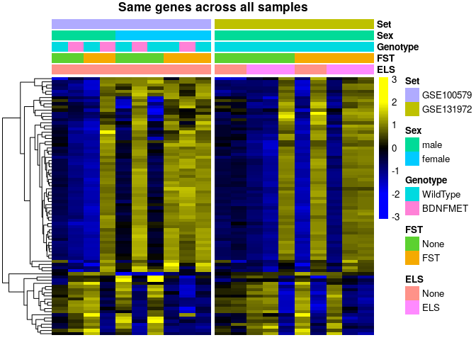
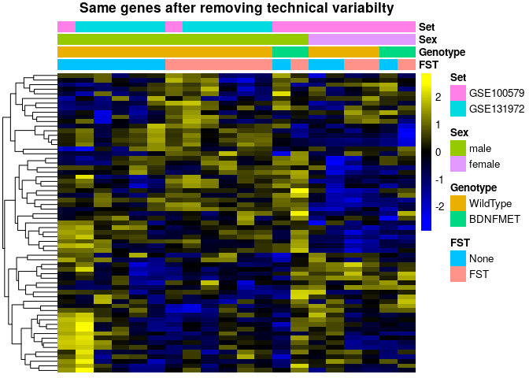
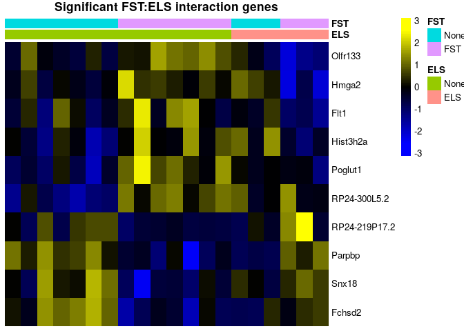

# Reassessing the effects of acute stress on the translatome of hippocampal neurons

## About this re-analysis

Here, we outline the re-analysis of two GEO datasets, [GSE100579](https://www.ncbi.nlm.nih.gov/geo/query/acc.cgi?acc=GSE100579) and [GSE131972](www.ncbi.nlm.nih.gov/geo/query/acc.cgi?acc=GSE131972), both of which are investigating the effect of acute stress on the translatome of CA3 pyramidal neurons in the mouse hippocampus. The exact annotation of the samples is available at [here](metadata/s2c.csv).

These datasets were used for three separate publications:

* [Marrocco J. et al. 2017](https://doi.org/10.1038/s41467-017-01014-4); 
A sexually dimorphic pre-stressed translational signature in CA3 pyramidal neurons of BDNF Val66Met mice; Nature Communications volume 8, Article number: 808 (2017)
* [Gray J. D. et al. 2018](https://dx.doi.org/10.1038%2Fmp.2016.219); 
Translational profiling of stress-induced neuroplasticity in the CA3 pyramidal neurons of BDNF Val66Met mice; Molecular Psychiatry volume 23, pages 904–913
* [Marrocco J. et al. 2019](https://doi.org/10.3389/fnbeh.2019.00157); 
Early Life Stress Restricts Translational Reactivity in CA3 Neurons Associated With Altered Stress Responses in Adulthood; Front. Behav. Neurosci. 

We show that a number of the analyses and claims made in these publications are not supported by the data and not reproducible across the two datasets. The use of appropriate statistical methods to uncover interactions fails to demonstrate significant sexually dimorphic or early-life-dependent responses to stress, highlighting the fact that these studies were seriously underpowered to address such questions.


***
  

# Re-analysis of published results

We first load the necessary packages and the data:


```r
library(edgeR)
library(SEtools)
library(SummarizedExperiment)
library(sva)
library(DESeq2)
source("misc.R")
kallistodata <- readRDS("data/AllData.kallisto.SE.rds")
```

Because we later provide a meta-analysis of the datasets, we will work on a uniform, [kallisto](https://pachterlab.github.io/kallisto/about)-based quantification.
However, the re-assessment of the authors' original claims were also reproduced using an alternative quantification method (see [salmonBased.md](salmonBased.md)).

## Assessment of the reported sex-specific responses from Marrocco et al. 2017

In the 2017 publication the authors claim that numerous genes are differentially regulated between males and females after acute stress. Unfortunately, they do not include a list with all genes in the publication, but [Table 1](https://www.nature.com/articles/s41467-017-01014-4/tables/1) contains a subsets of genes that are reported as differentially regulated between males and females upon acute stress (forced swim test - FST). First, we inspect the expression pattern of these genes across the runs used in the original publication in WildType animals:


```r
se <- kallistodata
se <- subset(se,select  = se$Set == "GSE100579" & se$Genotype == "WildType")
genes <- read.table("metadata/Marrocco2017GenderStressGenes.csv", sep = ";", header = T)$genes
se <- se[,order(se$Sex,se$FST)]
sehm(se, genes, do.scale=T, assayName="logcpm", anno_columns=c("FST","Sex"),
     cluster_rows = T, main = "Genes with reported sex differences in response to acute stress")
```

<!-- -->

Rows in the plot represent the reported genes, while the columns are samples, and the colors represent variance-scaled log-normalized expression values (i.e. row z-scores). From this plot, it indeed looks like these genes have a very different response to FST in males and females. However, 6 samples is severely underpowered to investigate 4 experimental groups.

The same study also includes males and females from a different genotype (BDNF mutants) exposed to stress, and we can inspect the behavior of those genes in these additional samples: 


```r
se <- kallistodata
se <- subset(se,select  = se$Set == "GSE100579")
se <- se[,order(se$Genotype,se$Sex,se$FST)]
sehm(se, genes, do.scale=T, assayName="logcpm", anno_columns=c("FST","Sex","Genotype"),
     cluster_rows = T, main = "Genes with reported sex differences in response to acute stress",
     gaps_at = "Genotype")
```

<!-- -->

We here instead observe that the BDNF mutant males appear to have an expression pattern, for the reported genes, which mimics the wildtype females, while the mutant females not exposed to stress have an expression pattern, for those genes, which resembles that of stressed wildtype females. While it is possible the the mutation entirely reverses the expression pattern of thoses genes, most groups are represented by a single sample, and an equally, or arguably more likely explanation would be that these co-expressed genes are the result of random variation unrelated to the experimental variables. To establish this, we can include the second dataset ([GSE131972](www.ncbi.nlm.nih.gov/geo/query/acc.cgi?acc=GSE131972)):


```r
se <- kallistodata
se <- subset(se,select  = se$ELS == "None" & se$Genotype == "WildType")
se <- se[,order(se$Set,se$Sex,se$FST)]
sehm(se,genes,do.scale = T,anno_columns = c("FST","Sex","Set"), gaps_at = "Set", cluster_rows = T, main =  "Same genes in wild-type samples, including the dataset")
```

```
## Using assay logcpm
```

<!-- -->

Although the second datasets includes only males, one can immediately notice that, upon stress and with respect to the aforementioned genes, some of the males behave exactly like the males of the first dataset, while others behave exactly like females. It becomes clear, therefore, that these genes are co-expressed and highly variable across all samples, independently of sex, and therefore that the reported sex differences in response to stress are most likely erroneous.

If we further visualize these genes across all samples, we find

```r
se <- kallistodata
se <- se[,order(se$Sex,se$FST)]
sehm(se, genes, do.scale=T, assayName="logcpm", cluster_rows = T, gaps_at = "Set",
     anno_columns=c("ELS","FST","Genotype","Sex","Set"), main="Same genes across all samples")
```

<!-- -->

The high co-expression of the reported genes suggests that the variability is the result of a single vector of variation, whih could be either technical, but is in any case unrelated to the experimental design. To investigate this, we attempt to model this vector of variation using Surrogate Variable Analysis ([SVA](https://www.bioconductor.org/packages/release/bioc/html/sva.html) - see the [exact implementation here](misc.R)), and to visualize the reported genes in the corrected data:


```r
se <- dosvacor(se, form = ~ Set + Sex * FST, form0 = ~Set)
```

```
## converting counts to integer mode
```

```
## Number of significant surrogate variables is:  2 
## Iteration (out of 5 ):1  2  3  4  5
```

```r
sehm(se, genes, do.scale=T, assayName="corrected", anno_columns=c("ELS","FST","Genotype","Sex","Set"), 
     cluster_rows=T, main="Same genes after correcting for technical variability")
```

<!-- -->

As we can see, removing technical variability abolishes the effects for the male-female stress difference seen in the single replicate comparisons.

Together, this re-analysis indicates that the reported sex-specific transcriptional responses to stress were wrong. 

<br/><br/>

## Assessment of the reported genotype-dependent sex differences from Gray et al. 2018

A complete assessment of the findings of Gray et al. 2018 is unfortunately not possible since the repository [GSE100579](https://www.ncbi.nlm.nih.gov/geo/query/acc.cgi?acc=GSE100579) is missing crucial samples for the chronic stress model for the BDNF Val66Met genotype and only includes samples of acute stress.

However, the authors claim that many genes are differentially regulated between WildType and BDNF Val66Met animals at baseline. While no complete list of genes has been included in the publication, a subset can be found in the publication's [Table 1](https://www.nature.com/articles/mp2016219/tables/1).

We plot these genes in the GSE100579 data set:


```r
se <- kallistodata
genes <- read.table("metadata/Gray2018GenotypeGenes.csv", sep = ";", header = T)$genes
se <- subset(se,select  = se$Set == "GSE100579" & se$FST == "None")
se <- se[,order(se$Sex,se$Genotype)]
sehm(se, genes, do.scale=T, assayName="logcpm", anno_columns=c("Genotype","Sex"), cluster_rows=T, 
     main="Genes differentially effected by BDNF Val66Met in males and females")
```

<!-- -->

Again, we find that the experimental design was severly underpowered.
We investigate the expression of these genes across all samples from both datasets.

```r
se <- kallistodata
se <- se[,order(se$Sex,se$Genotype,se$FST)]
sehm(se, genes, do.scale=T, assayName="logcpm", anno_columns=c("FST","Genotype","Sex"), cluster_rows=T, 
     main="Same genes across all samples")
```

<!-- -->

We see a similar pattern as for the differences reported in Marrocco et al 2017: the baseline difference are not reproduce the other samples, where these genes instead show high intra-group variability.

Let's again try to eliminate technical variabilty and re-visualize the same genes


```r
se <- dosvacor(se, form = ~Set + Sex + Genotype + FST + ELS, form0 = ~Set)
```

```
## converting counts to integer mode
```

```
## Number of significant surrogate variables is:  2 
## Iteration (out of 5 ):1  2  3  4  5
```

```r
sehm(se, genes, do.scale = T,anno_columns = c("FST","Genotype","Sex","Set"), cluster_rows = T,assayName = "corrected", main = "Same genes after removing technical variabilty")
```

<!-- -->

It becomes apparent that these genes were again the result of variation unrelated to the experimental groups, and that the vast majority of them do not show genotype-dependent differences between males and females at baseline.

<br/><br/>

## Assessment of Marrocco et al. 2019

Here we re-analyse Marrocco et al. 2019 checking for early life stress (ELS) -dependent changes in the acute stress (AS) response. The results presented here are also largely reproduced using a [different quantification](salmonBased.Rmd) and a using [DESeq2 instead of edgeR](DESeq2.Rmd). Although DESeq2 produced more hits, all analyses had similar results, and the core message of the original publication, namely that ELS substantially impacts the transcriptional acute stress response, could not be reproduced with any method.

### Visualization of genes reported in the publication 


```r
se <- kallistodata
se <- se[order(rownames(se)),]
se <- subset(se,select  = se$Set == "GSE131972")
```

In their publications the authors unfortunately do not upload a list with differentially expressed genes. However, in their discussion they mention a number of genes that they claim are differentially expressed between ELS and non-ELS mice after acute stress. We look at the expression of these genes across the very samples used in their study:


```r
sehm(se, c("Grin1","Grin2a","Gabbr2","Gabra1"), do.scale=T, assayName="logcpm",
     anno_columns = c("ELS","FST"),  main = "Reported genes")
```

<!-- -->

In light of the very large intra-group variability of these genes, their any claim on their ELS-dependent activation is dubious.

Further, they claim that a restricted set of genes selectively induced by AS in ELS mice but not non-ELS mice.


```r
sehm(se, c("Per1", "Npy", "Nfkbia", "Penk","Dusp1", "Cst3", "Trib1", "Htra1", "Sdc4", "Plekhf1"), do.scale=T, assayName="logcpm", anno_columns = c("ELS","FST"),  main = "Reported genes")
```

<!-- -->

Once more, this claim does not look very robust: while these genes might be increased in expression in ELS mice upon stress, the variability across samples of the same group prevents use from making clear claims, and especially to claim that these genes are not activated in the non-ELS group, where one of the two samples does appear to show an activation. More refined analysis will be necessary to establish the significance of these patterns (see below).

Finally, the authors claim that there are a number of genes that appear to be induced by AS in both ELS and non ELS mice, including the following:

```r
sehm(se, c("Egr1", "Egr2", "Egr4", "Arc","Fos", "Fosb"), do.scale=T, assayName="logcpm", anno_columns = c("ELS","FST"),  main = "Reported genes")
```

<!-- -->

For these genes, instead, we concur with the authors that these well-known genes appear to show a consistent activation.


### Interaction analysis

To establish whether ELS does impact the transcriptional response to acute stress, it is insufficient to simply analyse the two response separately, as the authors did, and simply substract the sets of significant genes. Instead, we need to rely on linear regression using an interaction term, which is fortunately possible using edgeR's generalized linear models:


```r
#experimental design, interactive model
design <- model.matrix(~se$FST * se$ELS) # identicial to ~FST+ELS+FST:ELS

y <- DGEList(counts=assays(se)$counts)
y <- calcNormFactors(y)
y <- estimateDisp(y,design)

# filter out lowly-expressed genes
y <- y[filterByExpr(y, design),]

Results <- list()
fit <- glmQLFit(y,design)
for(i in colnames(design)[-1]){
  Results[[i]] <- glmQLFTest(fit, i)
}
```

We first ask whether that are genes altered by acute stress:


```r
topTags(Results$`se$FSTFST`)
```

```
## Coefficient:  se$FSTFST 
##              logFC     logCPM        F       PValue       FDR
## Egr4     1.6089789  5.8854438 43.72835 0.0001475057 0.9999096
## Plekhg3 -2.2028996  2.4615140 35.04210 0.0003177739 0.9999096
## Fosb     1.9003789  4.4234011 32.78511 0.0003981112 0.9999096
## Fos      2.0925115  5.1006405 29.09383 0.0005925220 0.9999096
## Nadsyn1  7.7891037 -0.1856326 24.57399 0.0014977229 0.9999096
## Junb     0.9951607  6.8068993 21.51001 0.0015522402 0.9999096
## Egr2     2.2334746  2.4233386 18.61470 0.0024037956 0.9999096
## Mill2    4.0302985 -1.3626955 15.88830 0.0038073742 0.9999096
## Afap1l1 -1.6622411  1.9910872 14.93493 0.0045309194 0.9999096
## Olfm1    0.7872977 10.1569427 13.82364 0.0056050371 0.9999096
```

Even though the data looked promising no genes pass mutliple testing correction, most likely owing to the insufficient sample size.

We next ask whether there are genes altered by early life stress?

```r
topTags(Results$`se$ELSELS`)
```

```
## Coefficient:  se$ELSELS 
##              logFC     logCPM        F       PValue       FDR
## Pcdha4   1.0791635  3.5528592 24.93795 0.0009763957 0.9999737
## Lrrc40   0.9782095  5.7617445 23.18466 0.0012295402 0.9999737
## Nadsyn1  7.7863133 -0.1856326 25.65597 0.0013224044 0.9999737
## Piga    -1.5789586  1.5385751 17.14831 0.0030584387 0.9999737
## Mill2    3.8132281 -1.3626955 15.44373 0.0041253111 0.9999737
## Il10ra  -7.3580467 -1.1359543 17.08481 0.0056541318 0.9999737
## Syt9    -1.4251180  1.2125522 12.81109 0.0068743585 0.9999737
## Ak7     -1.3777222  0.6610638 12.59671 0.0071877797 0.9999737
## Fut9     0.8416052  4.9188926 12.02491 0.0081154865 0.9999737
## Rgma     0.5823202  4.7429735 11.44676 0.0092107896 0.9999737
```

Again, none passes the multiple testing correction.

We finally investigate whether there are genes with a significant interaction:


```r
topTags(Results$`se$FSTFST:se$ELSELS`)
```

```
## Coefficient:  se$FSTFST:se$ELSELS 
##              logFC     logCPM        F       PValue       FDR
## Plekhg3  2.8250888  2.4615140 36.28235 0.0002821862 0.9998703
## Piga     2.6242149  1.5385751 22.15531 0.0014166703 0.9998703
## Nadsyn1 -8.1410422 -0.1856326 21.33174 0.0022370467 0.9998703
## Stard9   5.7102564 -0.4341469 14.37908 0.0050325781 0.9998703
## Mill2   -4.5346274 -1.3626955 14.22887 0.0051798925 0.9998703
## Ctdspl2  1.3933778  3.7103135 11.58590 0.0089310913 0.9998703
## Il10ra   8.2935828 -1.1359543 13.82215 0.0092392980 0.9998703
## Gpr17    2.1181542  2.8256340 11.32726 0.0094597850 0.9998703
## B3gat2  -0.9225449  4.8564532 11.17365 0.0097923640 0.9998703
## Nnt     -1.7460448  3.4884480 10.80847 0.0106437087 0.9998703
```

No genes have a altered acute stress response in ELS vs normal animals. This is stark contrast with the authors' own conclusions, as the original study reported hundereds of genes being as being altered in their FST response following ELS.

A similar analysis using [DESeq2 instead of edgeR](DESeq2.Rmd) reaches similar conclusions.

<br/><br/>

***

# Meta-Analysis of all data

Given that the original studies were too underpowered to support their claims and used inappropriate methods to compare  transcriptional responses, we wought to combine the data from both accessions to try to give more robust answers to the questions raised by the authors, in particular:

1. are genes differentially expressed following forces swim stress?
2. are genes differentially expressed following males and females?
3. are genes differentially expressed in BDNF Val66Met mice?
4. are genes differentially expressed following early life stress
5. are responses of FST genes altered by sex?
6. are responses of FST genes altered by BDNF Val66Met?
7. are responses of FST genes altered by early life stress?

<br/><br/>

## Additive model

Let's run an overarching analysis over all data to determine if there are any significant effects for forces swim stress (=FST), Sex, Genotype or early life stress (=ELS). In the process we also remove technical variabilty to increase the chance of successfully find candidate genes.


```r
se <- kallistodata
se <- dosvacor(se, form = ~FST + Sex + Genotype + Set + ELS, form0 = ~Set)
```

```
## converting counts to integer mode
```

```
## Number of significant surrogate variables is:  3 
## Iteration (out of 5 ):1  2  3  4  5
```

```r
#experimental design, full additive model
design <- model.matrix(~ se$SV1 + se$SV2 + se$FST + se$Sex + 
                         se$Genotype + se$Set + se$ELS )

y <- DGEList(counts=assays(se)$counts)
y <- calcNormFactors(y)
y <- estimateDisp(y,design)
y <- y[filterByExpr(y, design),]

Results <- list()
fit <- glmQLFit(y,design)
for(i in colnames(design)[-1]){
  Results[[i]] <- glmQLFTest(fit, i)
}
```

### Are genes differentially expressed following forces swim stress?

```r
se <- se[,order(se$FST)]
sehm(se, rownames(topTags(Results$`se$FSTFST`,p.value = 0.05, n = 1000)), assayName = "corrected", do.scale = TRUE, anno_columns=c("ELS","FST","Genotype","Sex","Set"), main="Significant FST genes with corrected data")
```

<!-- -->

```r
sehm(se, rownames(topTags(Results$`se$FSTFST`,p.value = 0.05, n = 1000)), assayName = "logcpm", do.scale = TRUE, anno_columns=c("ELS","FST","Genotype","Sex","Set"), main="Significant FST genes with uncorrected data")
```

<!-- -->

```r
topTags(Results$`se$FSTFST`, p.value = 0.05, n = 30)
```

```
## Coefficient:  se$FSTFST 
##                 logFC      logCPM         F       PValue          FDR
## Egr4        1.3909903  5.70016391 248.54276 3.623333e-11 5.385360e-07
## Fosb        1.6205554  4.22458623 180.68613 3.917819e-10 2.911527e-06
## Egr2        2.4712502  2.25407674 169.17155 6.363083e-10 3.152484e-06
## Fos         2.0812762  4.90687320 131.34235 4.001560e-09 1.313097e-05
## Dusp5       0.9239038  5.63316577 129.54470 4.417335e-09 1.313097e-05
## Egr1        0.9820385  8.09767364 107.93448 1.613130e-08 3.995991e-05
## Sik1        1.0261773  3.49221591  86.56453 7.432013e-08 1.578029e-04
## Nr4a1       1.0498061  6.53486269  84.82730 8.532111e-08 1.585160e-04
## Arc         1.1113185  7.61348181  82.44917 1.034763e-07 1.708853e-04
## Junb        0.8974732  6.61591751  62.38975 6.546295e-07 9.729759e-04
## Gadd45b     0.6835718  4.63136704  59.82023 8.578679e-07 1.159135e-03
## Maff        1.5088257 -0.10012265  54.52595 1.544175e-06 1.912590e-03
## Ier2        0.7915193  3.38772570  49.90465 2.679389e-06 3.063366e-03
## Midn        0.4970673  5.65169642  49.04289 2.982349e-06 3.095271e-03
## Fosl2       0.4454683  5.91955449  48.67368 3.123802e-06 3.095271e-03
## Oaz3        1.2618561 -0.90731711  36.60341 1.686336e-05 1.504367e-02
## Spry4       0.4856526  4.09487939  36.40948 1.738104e-05 1.504367e-02
## Npas4       1.2595293  3.31207452  36.10903 1.821880e-05 1.504367e-02
## Errfi1      0.5028256  6.04492498  33.71093 2.680381e-05 2.096763e-02
## Syne2      -0.6283157  2.69171710  32.56750 3.244268e-05 2.324393e-02
## AC123679.2 -0.6227683  3.46040416  32.49527 3.284145e-05 2.324393e-02
## Trib1       0.7179791  3.45505012  31.80138 3.696701e-05 2.497457e-02
## Arl4d       0.8660209  4.16803403  30.48057 4.653866e-05 2.897144e-02
## Csrnp1      0.5147353  3.68885603  30.45115 4.678157e-05 2.897144e-02
## Sgk1        0.6258634  6.67184864  29.54700 5.499126e-05 3.269340e-02
## Klf4        1.1676729 -0.05923409  29.03264 6.037966e-05 3.451626e-02
## Nfil3       0.4235990  4.01220042  27.86773 7.492896e-05 4.124700e-02
```

There are multiple candidate genes that are significantly altered by acute stress across.

### Are genes differentially expressed between males and females?

```r
se <- se[,order(se$Sex)]
sehm(se, rownames(topTags(Results$`se$Sexfemale`,p.value = 0.05, n = 1000)), assayName = "corrected", do.scale = TRUE, anno_columns=c("ELS","FST","Genotype","Sex","Set"), main="Significant sex genes with corrected data")
```

<!-- -->

```r
sehm(se, rownames(topTags(Results$`se$Sexfemale`,p.value = 0.05, n = 1000)), do.scale = TRUE, anno_columns=c("ELS","FST","Genotype","Sex","Set"), main="Significant Sex genes with uncorrected data")
```

```
## Using assay logcpm
```

<!-- -->

```r
topTags(Results$`se$FSTFST`,p.value = 0.05, n = 1000)
```

```
## Coefficient:  se$FSTFST 
##                 logFC      logCPM         F       PValue          FDR
## Egr4        1.3909903  5.70016391 248.54276 3.623333e-11 5.385360e-07
## Fosb        1.6205554  4.22458623 180.68613 3.917819e-10 2.911527e-06
## Egr2        2.4712502  2.25407674 169.17155 6.363083e-10 3.152484e-06
## Fos         2.0812762  4.90687320 131.34235 4.001560e-09 1.313097e-05
## Dusp5       0.9239038  5.63316577 129.54470 4.417335e-09 1.313097e-05
## Egr1        0.9820385  8.09767364 107.93448 1.613130e-08 3.995991e-05
## Sik1        1.0261773  3.49221591  86.56453 7.432013e-08 1.578029e-04
## Nr4a1       1.0498061  6.53486269  84.82730 8.532111e-08 1.585160e-04
## Arc         1.1113185  7.61348181  82.44917 1.034763e-07 1.708853e-04
## Junb        0.8974732  6.61591751  62.38975 6.546295e-07 9.729759e-04
## Gadd45b     0.6835718  4.63136704  59.82023 8.578679e-07 1.159135e-03
## Maff        1.5088257 -0.10012265  54.52595 1.544175e-06 1.912590e-03
## Ier2        0.7915193  3.38772570  49.90465 2.679389e-06 3.063366e-03
## Midn        0.4970673  5.65169642  49.04289 2.982349e-06 3.095271e-03
## Fosl2       0.4454683  5.91955449  48.67368 3.123802e-06 3.095271e-03
## Oaz3        1.2618561 -0.90731711  36.60341 1.686336e-05 1.504367e-02
## Spry4       0.4856526  4.09487939  36.40948 1.738104e-05 1.504367e-02
## Npas4       1.2595293  3.31207452  36.10903 1.821880e-05 1.504367e-02
## Errfi1      0.5028256  6.04492498  33.71093 2.680381e-05 2.096763e-02
## Syne2      -0.6283157  2.69171710  32.56750 3.244268e-05 2.324393e-02
## AC123679.2 -0.6227683  3.46040416  32.49527 3.284145e-05 2.324393e-02
## Trib1       0.7179791  3.45505012  31.80138 3.696701e-05 2.497457e-02
## Arl4d       0.8660209  4.16803403  30.48057 4.653866e-05 2.897144e-02
## Csrnp1      0.5147353  3.68885603  30.45115 4.678157e-05 2.897144e-02
## Sgk1        0.6258634  6.67184864  29.54700 5.499126e-05 3.269340e-02
## Klf4        1.1676729 -0.05923409  29.03264 6.037966e-05 3.451626e-02
## Nfil3       0.4235990  4.01220042  27.86773 7.492896e-05 4.124700e-02
```

There are multiple candidate genes that are significantly different between sexes.

### Are genes differentially expressed in BDNF Val66Met mice?

```r
se <- se[,order(se$Genotype)]
sehm(se, rownames(topTags(Results$`se$GenotypeBDNFMET`)), assayName = "corrected", do.scale = TRUE, anno_columns=c("ELS","FST","Genotype","Sex","Set"), main="Top10 Genotype genes (not significant!)")
```

<!-- -->

```r
topTags(Results$`se$GenotypeBDNFMET`)
```

```
## Coefficient:  se$GenotypeBDNFMET 
##                    logFC     logCPM        F       PValue        FDR
## RP23-142A14.4 -1.8645921  3.4811485 44.06554 5.704946e-06 0.08479262
## Bloc1s6        1.6674696  3.6050358 31.65069 3.793821e-05 0.28193779
## Cd59a         -1.6998055  1.9503644 26.14194 1.043385e-04 0.46767278
## Syne2         -0.8299338  2.6917171 24.66024 1.402535e-04 0.46767278
## Luzp1          0.4310999  7.1665723 23.77862 1.681553e-04 0.46767278
## RP23-78D19.4  -3.1906937 -0.1039192 23.06230 1.954795e-04 0.46767278
## Pagr1a         0.9062183  4.3737664 22.44699 2.229922e-04 0.46767278
## Strc          -1.5909661  0.4515971 21.88973 2.517246e-04 0.46767278
## Acd           -1.2307210  2.5662807 19.99017 3.861265e-04 0.63766646
## Tcp11l1        1.0844059  2.8502768 19.10805 4.748989e-04 0.70584225
```

No genes pass multiple testing correction.

### Are genes differentially expressed following early life stress?

```r
se <- se[,order(se$ELS)]
sehm(se, rownames(topTags(Results$`se$ELSELS`)), assayName = "corrected", do.scale = TRUE, anno_columns=c("ELS","FST","Genotype","Sex","Set"), main="Top10 ELS genes (not significant!)")
```

<!-- -->

```r
topTags(Results$`se$ELSELS`)
```

```
## Coefficient:  se$ELSELS 
##                    logFC    logCPM        F       PValue FDR
## Prl            4.7519341  3.326017 27.64812 7.809371e-05   1
## RP24-235B15.9 -3.3854315 -1.720237 24.51577 1.741350e-04   1
## Ppia           0.4114268  8.713957 20.62432 3.338593e-04   1
## Preb          -0.3006047  6.029369 20.50177 3.433042e-04   1
## Cic           -0.4093224  5.881495 19.99192 3.859701e-04   1
## Gh             4.7488135  3.434262 18.82632 5.079431e-04   1
## Uqcc1          0.7000684  4.324896 18.05231 6.129142e-04   1
## Apol7b        13.7335130 -1.331643 88.04290 7.208234e-04   1
## Srsf3          0.3121362  7.364505 15.82465 1.081133e-03   1
## Slbp           0.4192394  5.175941 15.43295 1.199927e-03   1
```

No genes pass multiple testing correction

## Interactive models

To futher investigate if across all samples there is any variable that interacts with acute stress we will run a series of models that incorporate an interaction term between acute stress and any of the variables

### Is the response to FST significantly different between sexes?

```r
se <- kallistodata
se <- dosvacor(se, form = ~FST + Sex + Genotype + Set + ELS + FST:Sex, form0 = ~Set)
```

```
## converting counts to integer mode
```

```
## Number of significant surrogate variables is:  2 
## Iteration (out of 5 ):1  2  3  4  5
```

```r
#experimental design, full additive model
design <- model.matrix(~ se$SV1 + se$SV2 + se$FST + se$Sex + se$Genotype + se$Set + se$ELS + se$FST:se$Sex)

y <- DGEList(counts=assays(se)$counts)
y <- calcNormFactors(y)
y <- estimateDisp(y,design)
y <- y[filterByExpr(y, design),]

Results <- list()
fit <- glmQLFit(y,design)
for(i in colnames(design)[-1]){
  Results[[i]] <- glmQLFTest(fit, i)
}

se <- se[,order(se$Sex,se$FST)]
sehm(se, rownames(topTags(Results$`se$FSTFST:se$Sexfemale`)), assayName = "corrected", do.scale = TRUE, anno_columns=c("FST","Sex"), main="Top10 Sex:FST interaction genes (not significant!)")
```

<!-- -->

```r
topTags(Results$`se$FSTFST:se$Sexfemale`)
```

```
## Coefficient:  se$FSTFST:se$Sexfemale 
##                     logFC     logCPM        F       PValue       FDR
## Lenep          -14.599213 -0.2170693 67.49934 9.684257e-06 0.1439371
## Khnyn           10.247580 -0.2975998 35.27467 5.005766e-05 0.3720035
## RP23-383I16.10 -15.957452 -2.1382387 30.53578 7.588132e-05 0.3759414
## Gm7334          -6.634124  2.1130987 24.73599 1.687154e-04 0.6269044
## Fam188a          1.381835  4.3913610 21.65483 3.153798e-04 0.8644901
## Ccdc152          3.268591  1.2683459 20.60645 3.952075e-04 0.8644901
## Kif23            4.598597 -1.7584236 19.73581 4.792547e-04 0.8644901
## RP24-212K17.7   18.195142 -2.3507779 28.32483 4.906549e-04 0.8644901
## mt-Nd3          30.084858 -1.5780575 23.13866 5.529028e-04 0.8644901
## Adamts10        28.656276 -1.7537851 24.58872 5.816390e-04 0.8644901
```

No genes pass multiple testing correction

### Is the response to FST significantly altered by BDNF Val66Met?

```r
se <- kallistodata
se <- dosvacor(se, form = ~FST + Sex + Genotype + Set + ELS + FST:Genotype, form0 = ~Set)
```

```
## converting counts to integer mode
```

```
## Number of significant surrogate variables is:  2 
## Iteration (out of 5 ):1  2  3  4  5
```

```r
#experimental design, full additive model
design <- model.matrix(~se$SV1 + se$SV2 + se$FST + se$Sex + se$Genotype + se$Set + se$ELS + se$FST:se$Genotype)

y <- DGEList(counts=assays(se)$counts)
y <- calcNormFactors(y)
y <- estimateDisp(y,design)

#filter out genes that are below 10 counts in more than 75% of samples
keep <- rowSums(y$counts>10) >= (ncol(y) * 0.25)
y <- y[keep, , keep.lib.sizes=FALSE]

Results <- list()
fit <- glmQLFit(y,design)
for(i in colnames(design)[-1]){
  Results[[i]] <- glmQLFTest(fit, i)
}
se <- se[,order(se$Genotype,se$FST)]
sehm(se, rownames(topTags(Results$`se$FSTFST:se$GenotypeBDNFMET`, p.value = 0.05, n = 1000)), assayName = "corrected", do.scale = TRUE, anno_columns=c("FST","Genotype"), main="Significant FST:Genotype interaction genes with corrected data")
```

<!-- -->

```r
sehm(se, rownames(topTags(Results$`se$FSTFST:se$GenotypeBDNFMET`, p.value = 0.05, n = 1000)), do.scale = TRUE, anno_columns=c("FST","Genotype"), main="Significant FST:Genotype interaction genes with uncorrected data")
```

```
## Using assay logcpm
```

<!-- -->

```r
topTags(Results$`se$FSTFST:se$GenotypeBDNFMET`, p.value = 0.05, n = 20)
```

```
## Coefficient:  se$FSTFST:se$GenotypeBDNFMET 
##                 logFC    logCPM        F       PValue        FDR
## Sema5b       1.589504 3.1002778 53.25207 2.662099e-06 0.02402816
## Setx        -1.610772 6.2614093 41.74295 1.087556e-05 0.02402816
## Ylpm1       -1.677711 4.8383259 40.31329 1.321697e-05 0.02402816
## Nav2        -1.826541 4.9077343 40.27779 1.328200e-05 0.02402816
## RP23-35L3.1 -1.499761 5.8201101 39.09743 1.566528e-05 0.02402816
## Gprasp1     -2.167728 8.7920818 38.51978 1.700607e-05 0.02402816
## Synm        -1.205959 5.6141909 36.55174 2.265496e-05 0.02402816
## Tjp1        -1.141106 5.6323973 36.41568 2.311828e-05 0.02402816
## Helz        -1.125346 5.2411185 36.33570 2.339562e-05 0.02402816
## Lman2l       1.521805 4.9305293 35.85896 2.512932e-05 0.02402816
## Arid1a      -1.635696 6.3824389 35.69009 2.577804e-05 0.02402816
## Nefm        -1.389742 8.3417690 35.52163 2.644422e-05 0.02402816
## Akap8       -1.064369 5.1655984 35.15457 2.796445e-05 0.02402816
## Ryr2        -2.202940 7.5287385 35.02007 2.854616e-05 0.02402816
## Lrrcc1      -1.369450 3.8476295 34.86812 2.921994e-05 0.02402816
## Unc13a      -1.710706 8.3814262 34.42316 3.129907e-05 0.02402816
## Hecw1       -1.026059 5.3451302 33.75159 3.476301e-05 0.02402816
## Mdn1        -2.743463 4.5352989 33.71633 3.495658e-05 0.02402816
## Dync1h1     -4.202741 9.2112791 33.61379 3.552643e-05 0.02402816
## Cfap54      -2.706673 0.4676213 33.49677 3.618965e-05 0.02402816
```

There are multiple genes that pass multiple testing correction. However, the data for these still looks noisy and genes that show up are highly co-expressed. The low replicate number might have impaired the ability to remove technical variability sufficiently for the Genotype:FST assessment, so the results should be interpreted with caution and more replicates would be needed.

### Is the response to FST significantly altered by early life stress?

```r
se <- kallistodata
se <- dosvacor(se, form = ~FST + Sex + Genotype + Set + ELS + FST:ELS, form0 = ~Set)
```

```
## converting counts to integer mode
```

```
## Number of significant surrogate variables is:  2 
## Iteration (out of 5 ):1  2  3  4  5
```

```r
#experimental design, full additive model
design <- model.matrix(~se$SV1 + se$SV2 + se$FST + se$Sex + se$Genotype + se$Set + se$ELS + se$FST:se$ELS)

y <- DGEList(counts=assays(se)$counts)
y <- calcNormFactors(y)
y <- estimateDisp(y,design)

#filter out genes that are below 10 counts in more than 75% of samples
keep <- rowSums(y$counts>10) >= (ncol(y) * 0.25)
y <- y[keep, , keep.lib.sizes=FALSE]

Results <- list()
fit <- glmQLFit(y,design)
for(i in colnames(design)[-1]){
  Results[[i]] <- glmQLFTest(fit, i)
}

se <- se[,order(se$ELS,se$FST)]
sehm(se, rownames(topTags(Results$`se$FSTFST:se$ELSELS`)), assayName = "corrected", do.scale = TRUE, anno_columns=c("ELS","FST"), main="Significant FST:ELS interaction genes")
```

<!-- -->

```r
topTags(Results$`se$FSTFST:se$ELSELS`)
```

```
## Coefficient:  se$FSTFST:se$ELSELS 
##                    logFC     logCPM        F      PValue       FDR
## Parpbp         1.9438840 -0.8135980 14.26395 0.001863676 0.9999497
## Flt1          -1.8200424  0.8068718 14.03146 0.001984581 0.9999497
## Snx18          0.6910069  3.8035525 13.53655 0.002272990 0.9999497
## Hmga2         -1.4611426 -0.7556462 12.29637 0.003231691 0.9999497
## Poglut1       -0.7840360  4.3601522 11.89930 0.003630971 0.9999497
## Hist3h2a      -0.4772987  6.0135222 11.79418 0.003745915 0.9999497
## Fchsd2         0.4539088  5.0380513 11.64931 0.003911215 0.9999497
## RP24-219P17.2  4.2635886 -0.7538119 11.43099 0.004176323 0.9999497
## Tpm2          -0.8469294  2.1901141 11.20516 0.004472399 0.9999497
## Kcna6         -3.2721363  2.8552904 11.02094 0.004731772 0.9999497
```

No genes pass multiple testing correction.

<br/><br/>

***

# Conclusion

<br/><br/>

***


```r
sessionInfo()
```

```
## R version 3.6.1 (2019-07-05)
## Platform: x86_64-pc-linux-gnu (64-bit)
## Running under: Ubuntu 18.04.3 LTS
## 
## Matrix products: default
## BLAS:   /usr/lib/x86_64-linux-gnu/openblas/libblas.so.3
## LAPACK: /usr/lib/x86_64-linux-gnu/libopenblasp-r0.2.20.so
## 
## locale:
##  [1] LC_CTYPE=en_US.UTF-8       LC_NUMERIC=C              
##  [3] LC_TIME=de_CH.UTF-8        LC_COLLATE=en_US.UTF-8    
##  [5] LC_MONETARY=de_CH.UTF-8    LC_MESSAGES=en_US.UTF-8   
##  [7] LC_PAPER=de_CH.UTF-8       LC_NAME=C                 
##  [9] LC_ADDRESS=C               LC_TELEPHONE=C            
## [11] LC_MEASUREMENT=de_CH.UTF-8 LC_IDENTIFICATION=C       
## 
## attached base packages:
## [1] parallel  stats4    stats     graphics  grDevices utils     datasets 
## [8] methods   base     
## 
## other attached packages:
##  [1] DESeq2_1.25.10              sva_3.33.1                 
##  [3] genefilter_1.67.1           mgcv_1.8-28                
##  [5] nlme_3.1-142                SummarizedExperiment_1.16.1
##  [7] DelayedArray_0.11.4         BiocParallel_1.19.2        
##  [9] matrixStats_0.55.0          Biobase_2.45.1             
## [11] GenomicRanges_1.38.0        GenomeInfoDb_1.21.1        
## [13] IRanges_2.19.14             S4Vectors_0.23.21          
## [15] BiocGenerics_0.31.5         SEtools_1.2.2              
## [17] edgeR_3.27.13               limma_3.41.15              
## 
## loaded via a namespace (and not attached):
##  [1] Rtsne_0.15             colorspace_1.4-1       rjson_0.2.20          
##  [4] circlize_0.4.7         htmlTable_1.13.1       XVector_0.25.0        
##  [7] GlobalOptions_0.1.0    base64enc_0.1-3        clue_0.3-57           
## [10] rstudioapi_0.10        bit64_0.9-7            AnnotationDbi_1.47.1  
## [13] codetools_0.2-16       splines_3.6.1          geneplotter_1.63.0    
## [16] knitr_1.24             zeallot_0.1.0          Formula_1.2-3         
## [19] jsonlite_1.6           annotate_1.63.0        cluster_2.1.0         
## [22] png_0.1-7              pheatmap_1.0.12        compiler_3.6.1        
## [25] backports_1.1.4        assertthat_0.2.1       Matrix_1.2-17         
## [28] acepack_1.4.1          htmltools_0.3.6        tools_3.6.1           
## [31] gtable_0.3.0           glue_1.3.1             GenomeInfoDbData_1.2.1
## [34] dplyr_0.8.3            V8_2.3                 Rcpp_1.0.4.6          
## [37] vctrs_0.2.0            iterators_1.0.12       xfun_0.9              
## [40] stringr_1.4.0          openxlsx_4.1.0.1       XML_3.98-1.20         
## [43] zlibbioc_1.31.0        scales_1.0.0           TSP_1.1-7             
## [46] RColorBrewer_1.1-2     ComplexHeatmap_2.5.3   yaml_2.2.0            
## [49] curl_4.0               memoise_1.1.0.9000     gridExtra_2.3         
## [52] ggplot2_3.3.0          rpart_4.1-15           latticeExtra_0.6-28   
## [55] stringi_1.4.3          RSQLite_2.1.2          randomcoloR_1.1.0     
## [58] foreach_1.4.7          checkmate_2.0.0        seriation_1.2-8-1     
## [61] zip_2.0.4              shape_1.4.4            rlang_0.4.0           
## [64] pkgconfig_2.0.2        bitops_1.0-6           evaluate_0.14         
## [67] lattice_0.20-38        purrr_0.3.2            htmlwidgets_1.3       
## [70] bit_1.1-14             tidyselect_0.2.5       magrittr_1.5          
## [73] R6_2.4.0               Hmisc_4.2-0            DBI_1.0.0             
## [76] pillar_1.4.2           foreign_0.8-71         survival_2.44-1.1     
## [79] RCurl_1.95-4.12        nnet_7.3-12            tibble_2.1.3          
## [82] crayon_1.3.4           rmarkdown_1.15         GetoptLong_0.1.7      
## [85] locfit_1.5-9.1         grid_3.6.1             data.table_1.12.8     
## [88] blob_1.2.0             digest_0.6.20          xtable_1.8-4          
## [91] munsell_0.5.0          registry_0.5-1
```
