# Reanalysis using salmon-based quantification on the coding transcriptome"

Here we reproduce the re-analysis shown in the [readme](README.md), but using a Rsubreads 2.0.1 alignment to the Ensembl 99 protein-coding transcriptome followed by a salmon 1.3.0 quantification. This further shows that the results are robust to changes in the quantification used.

We first load the necessary packages and the data:


```r
library(edgeR)
library(SEtools)
library(SummarizedExperiment)
library(sva)
source("misc.R")
alldata <- readRDS("data/codingTranscriptome.SE.rds")
set.seed(12345)
```

## Assessment of the reported sex-specific responses from Marrocco et al. 2017


```r
se <- alldata
se <- subset(se,select  = se$Set == "GSE100579" & se$Genotype == "WildType")
genes <- read.table("metadata/Marrocco2017GenderStressGenes.csv", sep = ";", header = T)$genes
se <- se[,order(se$Sex,se$FST)]
sehm(se, genes, do.scale=T, assayName="logcpm", anno_columns=c("FST","Sex"),
     cluster_rows = T, main = "Genes with reported sex differences in response to acute stress")
```

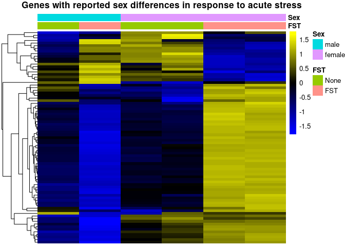<!-- -->

Rows in the plot represent the reported genes, while the columns are samples, and the colors represent variance-scaled log-normalized expression values (i.e. row z-scores). From this plot, it indeed looks like these genes have a very different response to FST in males and females. However, 6 independent samples is insufficient to investigate 4 experimental groups.

The same study also includes males and females from a different genotype (BDNF mutants) exposed to stress, and we can inspect the behavior of those genes in these additional samples: 


```r
se <- alldata
se <- subset(se,select  = se$Set == "GSE100579")
se <- se[,order(se$Genotype,se$Sex,se$FST)]
sehm(se, genes, do.scale=T, assayName="logcpm", anno_columns=c("FST","Sex","Genotype"),
     cluster_rows = T, main = "Genes with reported sex differences in response to acute stress",
     gaps_at = "Genotype")
```

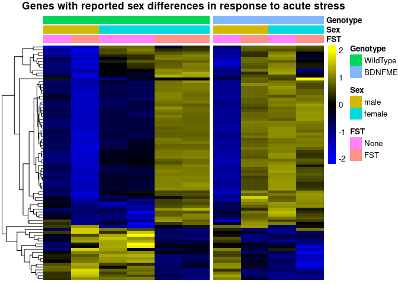<!-- -->

We here observe that the BDNF mutant males appear to have an expression pattern, for the reported genes, which mimics the wildtype females, while the mutant females not exposed to stress have an expression pattern, for those genes, which resembles that of stressed wildtype females. While it is possible that the mutation entirely reverses the expression pattern of those genes, most groups are represented by a single sample, and an arguably more likely explanation would be that these co-expressed genes are the result of random variation unrelated to the experimental variables. To test this, we can include the second dataset ([GSE131972](www.ncbi.nlm.nih.gov/geo/query/acc.cgi?acc=GSE131972)):


```r
se <- alldata
se <- subset(se,select  = se$ELS == "None" & se$Genotype == "WildType")
se <- se[,order(se$Set,se$Sex,se$FST)]
sehm(se,genes,do.scale = T,anno_columns = c("FST","Sex","Set"), gaps_at = "Set", cluster_rows = T, main =  "Same genes in wild-type samples, including the dataset")
```

```
## Using assay logcpm
```

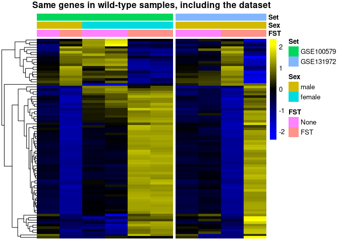<!-- -->

Although the second dataset includes only males, one can immediately notice that, upon stress and with respect to the aforementioned genes, some of the males behave exactly like the males of the first dataset, while others behave exactly like females. It becomes clear, therefore, that these genes are co-expressed and highly variable across all samples, independently of sex.

If we further visualize these genes across all samples, we find

```r
se <- alldata
se <- se[,order(se$Sex,se$FST)]
sehm(se, genes, do.scale=T, assayName="logcpm", cluster_rows = T, gaps_at = "Set",
     anno_columns=c("ELS","FST","Genotype","Sex","Set"), main="Same genes across all samples")
```

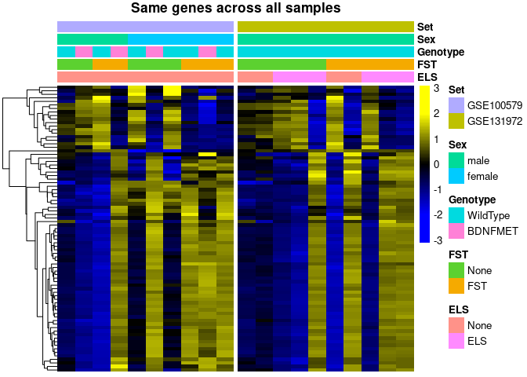<!-- -->

The high co-expression of the reported genes suggests that the variability is the result of a single vector of variation, which could be technical, but is in any case unrelated to the experimental design. To investigate this, we attempt to model this vector of variation using Surrogate Variable Analysis ([SVA](https://www.bioconductor.org/packages/release/bioc/html/sva.html) - see the [exact implementation here](misc.R)), and to visualize the reported genes in the corrected data:


```r
se <- dosvacor(se, form = ~ Set + Sex * FST, form0 = ~Set)
```

```
## converting counts to integer mode
```

```
## Number of significant surrogate variables is:  2 
## Iteration (out of 5 ):1  2  3  4  5
```

```r
sehm(se, genes, do.scale=T, assayName="corrected", anno_columns=c("ELS","FST","Genotype","Sex","Set"), 
     cluster_rows=T, main="Same genes after correcting for technical variability")
```

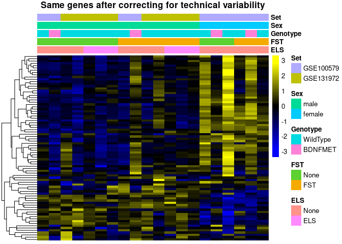<!-- -->

As we can see, removing technical variability abolishes the effects for the male-female stress difference seen in the single replicate comparisons.

Together, this re-analysis indicates that the reported sex-specific transcriptional responses to stress are not supported by the data.

<br/><br/>

## Assessment of the reported genotype-dependent sex differences from Gray et al. 2018

A complete assessment of the findings of Gray et al. 2018 is unfortunately not possible since the repository [GSE100579](https://www.ncbi.nlm.nih.gov/geo/query/acc.cgi?acc=GSE100579) is missing critical samples for the chronic stress model for the BDNF Val66Met genotype and only includes samples of acute stress.

However, the authors claim that many genes are differentially regulated between WildType and BDNF Val66Met animals at baseline, a regulation which is dependent on sex. While no complete list of genes has been included in the publication, a subset can be found in the publication's [Table 1](https://www.nature.com/articles/mp2016219/tables/1).

We plot these genes in the GSE100579 data set:


```r
se <- alldata
genes <- read.table("metadata/Gray2018GenotypeGenes.csv", sep = ";", header = T)$genes
se <- subset(se,select  = se$Set == "GSE100579" & se$FST == "None")
se <- se[,order(se$Sex,se$Genotype)]
sehm(se, genes, do.scale=T, assayName="logcpm", anno_columns=c("Genotype","Sex"), cluster_rows=T, 
     main="Genes differentially effected by BDNF Val66Met in males and females")
```

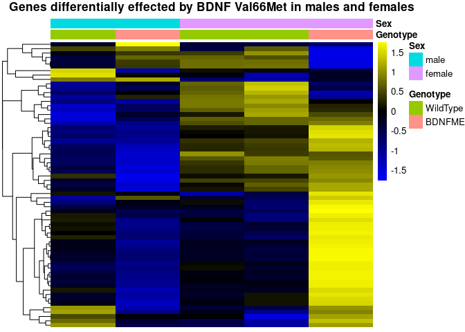<!-- -->

Again, we find that the experimental design was severly underpowered.
We investigate the expression of these genes across all samples from both datasets.

```r
se <- alldata
se <- se[,order(se$Sex,se$Genotype,se$FST)]
sehm(se, genes, do.scale=T, assayName="logcpm", anno_columns=c("FST","Genotype","Sex"), cluster_rows=T, 
     main="Same genes across all samples")
```

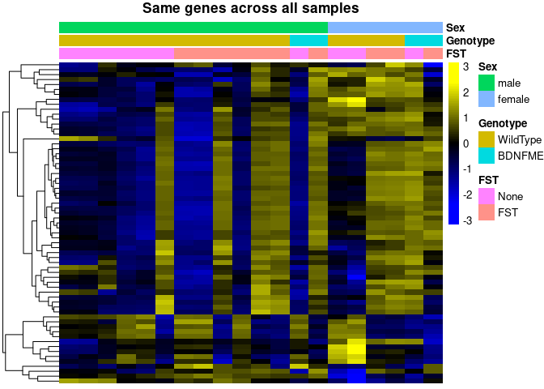<!-- -->

We see a similar pattern as for the differences reported in Marrocco et al 2017: the baseline difference cannot be reproduced in the additional samples, where these genes instead show high intra-group variability.

As described above, we again eliminate technical variabilty and re-visualize the same genes:


```r
se <- dosvacor(se, form = ~Set + Sex + Genotype + FST + ELS, form0 = ~Set)
```

```
## converting counts to integer mode
```

```
## Number of significant surrogate variables is:  3 
## Iteration (out of 5 ):1  2  3  4  5
```

```r
sehm(se, genes, do.scale = T,anno_columns = c("FST","Genotype","Sex","Set"), cluster_rows = T,assayName = "corrected", main = "Same genes after removing technical variabilty")
```

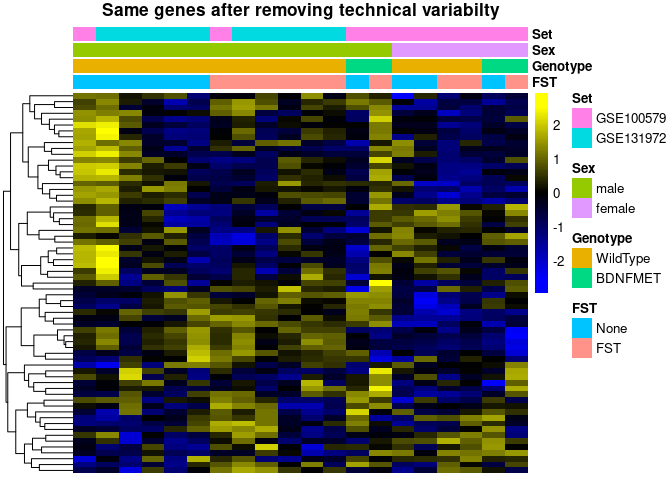<!-- -->

It becomes apparent that these genes were again the result of variation unrelated to the experimental groups, and that the vast majority of them do not show genotype-dependent differences between males and females at baseline.

<br/><br/>

## Assessment of Marrocco et al. 2019

Here we re-analyse Marrocco et al. 2019 checking for early life stress (ELS) -dependent changes in the acute stress (AS) response.

### Visualization of genes reported in the publication 


```r
se <- alldata
se <- se[order(rownames(se)),]
se <- subset(se,select  = se$Set == "GSE131972")
```

In their publications the authors unfortunately do not upload a list with differentially expressed genes. However, in their discussion they mention a number of genes that they thought to be differentially expressed between ELS and non-ELS mice after acute stress. We look at the expression of these genes across the very samples used in their study. They claim that selected genes are only induced in non-ELS mice following FST:


```r
sehm(se, c("Grin1","Grin2a","Gabbr2","Gabra1"), do.scale=T, assayName="logcpm",
     anno_columns = c("ELS","FST"),  main = "Reported genes")
```

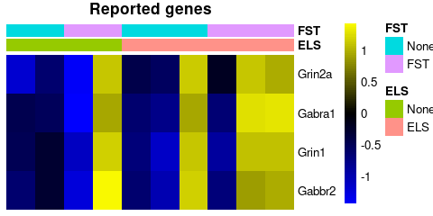<!-- -->

In light of the very large intra-group variability of these genes, it appears unlikely that these genes are indeed only induced in non-ELS treated mice.

Further, they claim that a restricted set of genes is selectively induced by FST in ELS mice but not non-ELS mice.


```r
sehm(se, c("Per1", "Npy", "Nfkbia", "Penk","Dusp1", "Cst3", "Trib1", "Htra1", "Sdc4", "Plekhf1"), do.scale=T, assayName="logcpm", anno_columns = c("ELS","FST"),  main = "Reported genes")
```

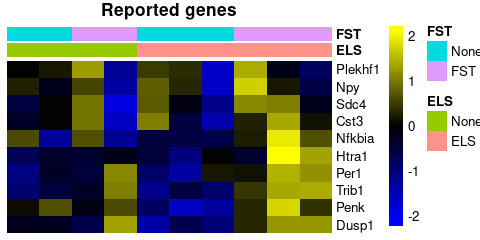<!-- -->

While these genes might be increased in expression in ELS mice upon stress, the variability across samples of the same group prevents strong claims. In particular, the claim that these genes are not activated in the non-ELS group appears questionable, as one of the two non-ELS samples shows an activation of these genes. More refined analysis (see below), as well as a larger sample size, would be needed to address this question with confidence.

Finally, the authors claim that there are a number of genes that appear to be induced by AS in both ELS and non ELS mice, including the following:

```r
sehm(se, c("Egr1", "Egr2", "Egr4", "Arc","Fos", "Fosb"), do.scale=T, assayName="logcpm", anno_columns = c("ELS","FST"),  main = "Reported genes")
```

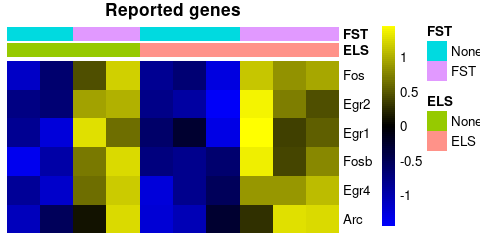<!-- -->

For these well-known genes, indeed, all samples show a consistent increase in response to AS.

### Interaction analysis

To establish whether ELS does impact the translational response to acute stress, the authors analyzed the two response separately and substracted the sets of significant genes. While this practice is widespread, the appropriate analysis is a linear regression using an interaction term, which is fortunately possible using edgeR's generalized linear models. Here we use the standard `glmLRT` which is less stringent and more susceptible to type 1 errors, but has a better sensitivity in low replicate experiments (an analysis with a glmQL model did not yield any significant results).


```r
#experimental design, interactive model
design <- model.matrix(~se$FST * se$ELS) # identicial to ~FST+ELS+FST:ELS

y <- DGEList(counts=assays(se)$counts)
y <- calcNormFactors(y)
y <- estimateDisp(y,design)
y <- y[filterByExpr(y, design),]

Results <- list()
fit <- glmFit(y,design)
for(i in colnames(design)[-1]){
  Results[[i]] <- glmLRT(fit, i)
}
```

We first ask whether that are genes altered by acute stress:


```r
topTags(Results$`se$FSTFST`)
```

```
## Coefficient:  se$FSTFST 
##             logFC    logCPM        LR       PValue        FDR
## Fos      2.059961  5.023564 20.319739 6.552114e-06 0.06227255
## Fosb     1.855390  4.323815 19.902651 8.148724e-06 0.06227255
## Egr4     1.605266  5.778483 18.700165 1.529692e-05 0.07793273
## Egr2     2.211298  2.323555 15.767181 7.163440e-05 0.27371504
## Onecut1 -3.501769 -1.483343 14.787299 1.203433e-04 0.36786547
## Junb     1.005163  6.691377  8.794671 3.021118e-03 0.99968857
## Egr1     1.178971  8.153404  8.379734 3.794280e-03 0.99968857
## Npas4    2.327118  3.079240  8.174076 4.249332e-03 0.99968857
## Daam2   -1.313630  3.388047  8.160504 4.281248e-03 0.99968857
## Arc      1.362124  7.594275  7.277626 6.981876e-03 0.99968857
```

Even though the data looked promising only one gene passes multiple testing correction, most likely owing to the insufficient sample size.

We next ask whether there are genes altered by early life stress?

```r
topTags(Results$`se$ELSELS`)
```

```
## Coefficient:  se$ELSELS 
##                logFC     logCPM        LR       PValue       FDR
## Gm9918     3.1139498 -1.6528755 15.208927 9.624736e-05 0.9999852
## Ecel1     -1.9768536 -0.1506843 12.530791 4.003004e-04 0.9999852
## Acpp      -2.1569905 -1.7377172  8.848386 2.933482e-03 0.9999852
## Wdr63     -2.1287483 -1.3649699  8.252385 4.069850e-03 0.9999852
## Ak7       -1.3098841  0.5469849  7.821001 5.164258e-03 0.9999852
## Vmn2r96    2.3876462 -1.4897519  7.812969 5.187261e-03 0.9999852
## Rtl9      -1.3059162 -0.6353302  6.832433 8.951726e-03 0.9999852
## Tnfrsf13c  1.4596067 -0.7884867  6.560309 1.042782e-02 0.9999852
## Itgbl1     0.9143569  4.2046354  6.055705 1.386144e-02 0.9999852
## Pm20d2    -1.4462354  0.6842647  5.651260 1.744284e-02 0.9999852
```

This time no gene even close to passing multiple testing correction.

We finally investigate whether there are genes with a significant interaction:


```r
topTags(Results$`se$FSTFST:se$ELSELS`)
```

```
## Coefficient:  se$FSTFST:se$ELSELS 
##             logFC     logCPM        LR      PValue       FDR
## Mag      2.468129  4.9651570 10.061412 0.001514072 0.9999936
## Gpr17    2.168585  2.7192243  9.152989 0.002483121 0.9999936
## Unc5b    2.143079  2.7381669  9.135334 0.002507197 0.9999936
## Trf      2.509967  5.7739789  8.112825 0.004395318 0.9999936
## Lum      2.033155 -0.4179990  8.064000 0.004515340 0.9999936
## Sap25   -2.478691  0.1764292  7.983522 0.004720502 0.9999936
## Daam2    1.656712  3.3880471  7.921087 0.004886190 0.9999936
## Abca8a   2.118634  0.9716048  7.834946 0.005124570 0.9999936
## Klk6     3.341566 -1.2527070  7.182483 0.007361875 0.9999936
## Adamts4  2.085342  2.2175568  6.854931 0.008839696 0.9999936
```

No genes have a altered acute stress response in ELS vs normal animals. This is stark contrast with the authors' conclusions, reporting that hundreds of genes show altered expression in response to FST in ELS vs non-ELS groups.
