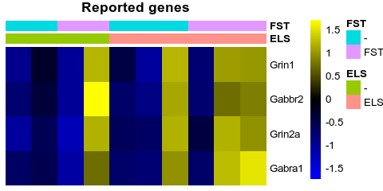
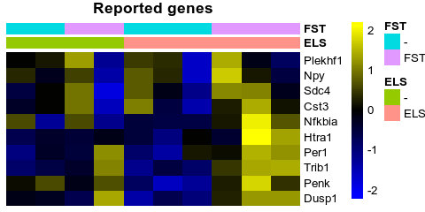

# Salmon-based re-analysis

Here we reproduce the re-analysis of the data from [Marrocco J. et al. 2019](https://doi.org/10.3389/fnbeh.2019.00157) shown in the [readme](README.md), but using, like the authors, a salmon-based quantifications. This shows that the results are robust to changes in the quantification used.

Marrocco et al. 2019 were reporting changes in the acute stress response (forced-swim test, FST) depending on the prior exposure to early life stress (ELS).

### Visualization of genes reported in the publication 


```r
library(edgeR)
library(SEtools)
library(SummarizedExperiment)
library(DESeq2)
source("misc.R")
se <- readRDS("data/GSE131972.salmonv2.SE.rds")
```

The authors claimed that acute stress reduces the expression of Grin1, Grin2a, Gabbr2, and Gabra1 in CA3 neurons of non-ELS mice, but not ELS mice:


```r
assays(se)$logcpm <- log1p(cpm(calcNormFactors(DGEList(assay(se)))))
sehm(se,c("Grin1","Grin2a","Gabbr2","Gabra1"), do.scale=T, anno_columns = c("ELS","FST"), , assayName = "TPM",  main = "Reported genes")
```

<!-- -->

The authors also claim that the following genes are selectively induced by AS in ELS mice, but not non-ELS mice:


```r
sehm(se, c("Per1", "Npy", "Nfkbia", "Penk","Dusp1", "Cst3", "Trib1", "Htra1", "Sdc4", "Plekhf1"), do.scale=T, assayName="logcpm", anno_columns = c("ELS","FST"),  main = "Reported genes")
```

<!-- -->

As with our previous analysis, this claim does not look very robust: while these genes might be increased in expression in ELS mice upon stress, the variability across samples of the same group prevents use from making clear claims, and especially to claim that these genes are not activated in the non-ELS group, where one of the two samples does appear to show an activation.

### Interaction analysis


```r
#experimental design, interactive model
design <- model.matrix(~se$FST * se$ELS) # identicial to ~FST+ELS+FST:ELS

y <- DGEList(counts=assays(se)$counts)
y <- calcNormFactors(y)
y <- estimateDisp(y,design)

# filter out lowly-expressed genes
y <- y[filterByExpr(y, design),]

Results <- list()
fit <- glmQLFit(y,design)
for(i in colnames(design)[-1]){
  Results[[i]] <- glmQLFTest(fit, i)
}
```


We first ask whether that are genes altered by acute stress:


```r
topTags(Results$`se$FSTFST`)
```

```
## Coefficient:  se$FSTFST 
##                    logFC     logCPM        F       PValue FDR
## Egr4           1.6039287  5.7505595 36.01063 0.0002808458   1
## Fosb           1.8118858  4.3293570 33.34351 0.0003653861   1
## Fos            2.0432583  5.0034903 28.86815 0.0005923520   1
## Gm5512        -8.2595418  0.3448037 25.41055 0.0013244881   1
## Junb           0.9982809  6.6687879 20.77168 0.0016938881   1
## Egr2           2.1916366  2.3019725 20.22385 0.0018382971   1
## 1700097M23Rik  4.1300990 -1.6566493 18.81518 0.0022865152   1
## Malat1         1.5995205  5.4088881 17.39457 0.0028849575   1
## Chd9           0.7398379  7.8604379 16.20621 0.0035419740   1
## Gm37913        3.9607607 -1.3931293 15.98508 0.0036841020   1
```

We next ask whether there are genes altered by early life stress?

```r
topTags(Results$`se$ELSELS`)
```

```
## Coefficient:  se$ELSELS 
##                    logFC     logCPM        F      PValue FDR
## Pcdha4         1.0550245  3.4910697 24.51036 0.001008421   1
## Gm44509        0.9347254  4.3961801 18.22551 0.002514138   1
## 1700097M23Rik  3.7970926 -1.6566493 16.97704 0.003096988   1
## Sh2d1a         1.6618272  1.2407670 16.85449 0.003162871   1
## Gm13302        6.3582936 -1.6724716 18.29695 0.003340569   1
## Gm15491       -9.7268711 -0.1405672 30.75497 0.004200699   1
## Dzip1          0.6468364  5.0179805 15.10699 0.004323721   1
## Gm37913        3.5470174 -1.3931293 13.72938 0.005633320   1
## Itgbl1         0.9479399  4.1323647 12.27211 0.007604467   1
## Gm43031        1.4902228 -1.2134523 10.75452 0.010663907   1
```

We finally investigate whether there are genes with a significant interaction:


```r
topTags(Results$`se$FSTFST:se$ELSELS`)
```

```
## Coefficient:  se$FSTFST:se$ELSELS 
##                    logFC     logCPM        F      PValue      FDR
## Gm3005        -7.4613513 -0.6372222 31.40143 0.001174014 0.999994
## Gm26592       -2.1050588  0.5447415 20.68745 0.001715149 0.999994
## Gm5512         8.1622304  0.3448037 19.59602 0.002769207 0.999994
## Malat1        -1.9776139  5.4088881 16.37480 0.003438179 0.999994
## 1700097M23Rik -4.3881985 -1.6566493 15.14313 0.004294784 0.999994
## Gm37913       -4.5852202 -1.3931293 14.86370 0.004524960 0.999994
## Zfp422-ps     14.1595633 -1.3494508 18.06491 0.007138507 0.999994
## Gpr17          2.2466176  2.6906550 12.54177 0.007181525 0.999994
## Grm2           0.8846721  4.4224252 12.45375 0.007316280 0.999994
## Unc5b          2.1887331  2.7225580 12.02135 0.008025991 0.999994
```

No genes have a altered acute stress response in ELS vs normal animals. This is stark contrast with the authors' own conclusions, as the original study reported hundereds of genes being as being altered in their FST response following ELS.

