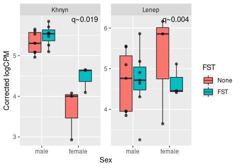
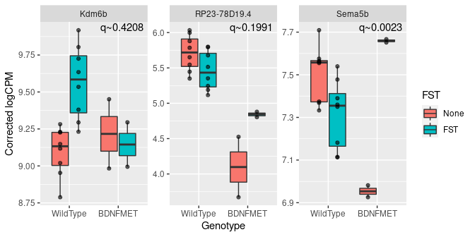

# TRAP meta-analysis using staged FDR

Here we combine the data from both accessions and test for interactions, using the more lenient staged false-discovery rate approach  developed by <a href="https://doi.org/10.1186/s13059-017-1277-0">Van den Berge et al. (2017)</a>.


```r
library(edgeR)
library(SummarizedExperiment)
library(SEtools)
library(stageR)
library(ggplot2)
source("misc.R")

se <- readRDS("data/AllData.kallisto.SE.rds")
se <- dosvacor(se, form = ~FST + Sex + Genotype + Set + ELS, form0 = ~Set)
```

### Is the response to FST significantly different between sexes?

```r
design <- model.matrix(~SV1+SV2+FST+Sex+Genotype+Set+ELS+FST:Sex, data=as.data.frame(colData(se)))

y <- DGEList(counts=assays(se)$counts)
y <- calcNormFactors(y)
y <- estimateDisp(y,design)
y <- y[filterByExpr(y, design),]

fit <- glmQLFit(y,design)

res1 <- glmQLFTest(fit, grep("FST|Sex", colnames(design), value=TRUE))$table
pScreen <- res1$PValue
names(pScreen) <- row.names(res1)

pConf <- as.matrix(glmQLFTest(fit, "FSTFST:Sexfemale")$table[,"PValue",drop=FALSE])
colnames(pConf) <- "FST:Sex"

stageRObj <- stageR(pScreen=pScreen, pConfirmation=pConf, pScreenAdjusted=FALSE)
stageRObj <- stageWiseAdjustment(object=stageRObj, method="none", alpha=0.05)
res <- getAdjustedPValues(stageRObj, onlySignificantGenes=FALSE, order=FALSE)
```

```
## The returned adjusted p-values are based on a stage-wise testing approach and are only valid for the provided target OFDR level of 5%. If a different target OFDR level is of interest,the entire adjustment should be re-run.
```

```r
head(res <- res[order(res[,2]),])
```

```
##         padjScreen     FST:Sex
## Lenep 1.684292e-02 0.004047417
## Khnyn 2.690891e-02 0.018842751
## Arc   1.489192e-04 1.000000000
## Ddx3y 5.724960e-05 1.000000000
## Dusp5 1.948074e-04 1.000000000
## Egr1  1.795534e-05 1.000000000
```

```r
degs <- row.names(res)[which(res[,2]<0.05)]
d1 <- data.frame(feature=degs, q=paste0("q~",format(res[degs,2], digits=2)))
```

Two genes pass FDR:


```r
ggplot(meltSE(se, d1$feature), aes(Sex, corrected)) + geom_boxplot(aes(fill=FST), outlier.shape=NA) + 
  ylab("Corrected logCPM") + facet_wrap(~feature, scale="free_y") + 
  geom_point(position=position_dodge(width=0.75), aes(group=FST), alpha=0.6) +
  geom_text(data=d1, aes(x=Inf, y=Inf, label=q), hjust=1.1, vjust=1.2)
```

<!-- -->


### Is the response to FST significantly altered by BDNF Val66Met?


```r
design <- model.matrix(~SV1+SV2+FST+Sex+Genotype+Set+ELS+Genotype:FST, data=as.data.frame(colData(se)))

y <- DGEList(counts=assays(se)$counts)
y <- calcNormFactors(y)
y <- estimateDisp(y,design)
y <- y[filterByExpr(y, design),]

fit <- glmQLFit(y,design)

res1 <- glmQLFTest(fit, grep("Genotype|FST", colnames(design), value=TRUE))$table
pScreen <- res1$PValue
names(pScreen) <- row.names(res1)

pConf <- as.matrix(glmQLFTest(fit, "FSTFST:GenotypeBDNFMET")$table[,"PValue",drop=FALSE])
colnames(pConf) <- "Genotype:FST"

stageRObj <- stageR(pScreen=pScreen, pConfirmation=pConf, pScreenAdjusted=FALSE)
stageRObj <- stageWiseAdjustment(object=stageRObj, method="none", alpha=0.05)
res <- getAdjustedPValues(stageRObj, onlySignificantGenes=FALSE, order=FALSE)
```

```
## The returned adjusted p-values are based on a stage-wise testing approach and are only valid for the provided target OFDR level of 5%. If a different target OFDR level is of interest,the entire adjustment should be re-run.
```

```r
head(res <- res[order(res[,2]),])
```

```
##                padjScreen Genotype:FST
## Sema5b       0.0307839711   0.00230436
## RP23-78D19.4 0.0077433448   0.19914543
## Kdm6b        0.0256425676   0.42077565
## AC123679.2   0.0488215774   1.00000000
## Arc          0.0008295166   1.00000000
## Dusp5        0.0003720239   1.00000000
```

```r
degs <- row.names(res)[which(res[,2]<0.5)]
d2 <- data.frame(feature=degs, q=paste0("q~",format(res[degs,2], digits=2)))
```

A single gene passes FDR:


```r
ggplot(meltSE(se, d2$feature), aes(Genotype, corrected)) + geom_boxplot(aes(fill=FST), outlier.shape=NA) + 
  ylab("Corrected logCPM") + facet_wrap(~feature, scale="free_y") + 
  geom_point(position=position_dodge(width=0.75), aes(group=FST), alpha=0.6) +
  geom_text(data=d2, aes(x=Inf, y=Inf, label=q), hjust=1.1, vjust=1.2)
```

<!-- -->

### Is the response to FST significantly altered by early life stress?

```r
design <- model.matrix(~SV1+SV2+FST+Sex+Genotype+Set+ELS+ELS:FST, data=as.data.frame(colData(se)))

y <- DGEList(counts=assays(se)$counts)
y <- calcNormFactors(y)
y <- estimateDisp(y,design)
y <- y[filterByExpr(y, design),]

fit <- glmQLFit(y,design)

res1 <- glmQLFTest(fit, grep("ELS|FST", colnames(design), value=TRUE))$table
pScreen <- res1$PValue
names(pScreen) <- row.names(res1)

pConf <- as.matrix(glmQLFTest(fit, "FSTFST:ELSELS")$table[,"PValue",drop=FALSE])
colnames(pConf) <- "ELS:FST"

stageRObj <- stageR(pScreen=pScreen, pConfirmation=pConf, pScreenAdjusted=FALSE)
stageRObj <- stageWiseAdjustment(object=stageRObj, method="none", alpha=0.05)
res <- getAdjustedPValues(stageRObj, onlySignificantGenes=FALSE, order=FALSE)
```

```
## The returned adjusted p-values are based on a stage-wise testing approach and are only valid for the provided target OFDR level of 5%. If a different target OFDR level is of interest,the entire adjustment should be re-run.
```

```r
head(res <- res[order(res[,2],res[,1]),])
```

```
##         padjScreen ELS:FST
## Egr4  3.812542e-05       1
## Fosb  6.892651e-05       1
## Egr2  1.449510e-04       1
## Dusp5 5.890184e-04       1
## Fos   5.890184e-04       1
## Egr1  1.738886e-03       1
```

No gene passes multiple testing correction.
